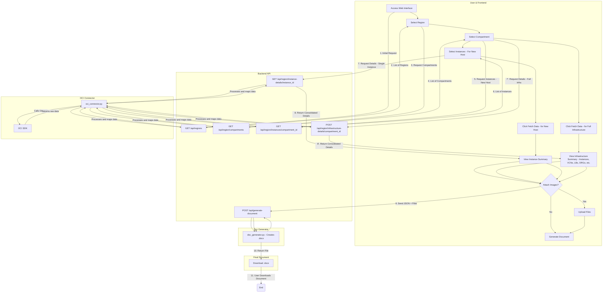

# OCI DocGen: Oracle Cloud Documentation Automation

<p align="center">
  <strong>Generate complete technical documentation of your OCI infrastructure in minutes, not days.</strong>
</p>

<p align="center">
  
  
  
  
</p>

OCI DocGen is a full-stack tool designed to automate the creation of infrastructure documentation on Oracle Cloud Infrastructure (OCI).  
With an intuitive web interface, the tool performs a complete scan in a compartment, collects detailed data about provisioned resources, and generates a standardized, professional `.docx` document.

## Key Features

- **Automatic Discovery**: Maps and hierarchically lists the tenancy’s regions and compartments.  
- **Two Documentation Modes**: Option to generate a document focused only on new instances or a full report of a compartment’s infrastructure.  
- **Comprehensive Data Collection**: Extracts detailed information from multiple OCI services.  
- **Interactive Web Interface**: Clean and responsive frontend that guides the user step by step in the selection process.  
- **Manual Attachments**: Supports uploading architecture diagrams and visual evidence.  
- **Professional Output**: Generates a formatted `.docx` file, ready to deliver to clients or internal audits.  

## OCI Resources Covered

### Compute
- Instances (Shape, OCPUs, Memory, Operating System, IPs)

### Storage
- Boot Volumes and Block Volumes (Size, Backup Policies)  
- Volume Groups (Members, Backup Validation, Cross-Region Replication)  

### Networking
- Virtual Cloud Networks (VCNs)  
- Subnets  
- Security Lists and Route Tables (with all rules)  
- Network Security Groups (NSGs) (with rules and associations)  
- Load Balancers (Listeners, Backend Sets, Health Checkers)  
- Local Peering Gateways (LPGs)  

### Connectivity
- Dynamic Routing Gateways (DRGs) (Attachments and RPCs)  
- Customer-Premises Equipment (CPEs)  
- IPSec Connections (Tunnels, Encryption, BGP)  

## Workflow Diagram



## Technologies Used

### Backend
- Python 3.10+  
- FastAPI (RESTful API)  
- OCI Python SDK (integration with Oracle Cloud API)  
- Pydantic (data validation and serialization)  
- python-docx (generation of `.docx` files)  
- Uvicorn / Gunicorn (ASGI/WSGI servers)  

### Frontend
- HTML5, CSS3, Vanilla JavaScript (ES6)  

## Project Structure
```
    .
    ├── backend/
    │   ├── doc_generator.py     # Logic to create the .docx document
    │   ├── generated_docs/      # Directory where documents are saved
    │   ├── main.py              # FastAPI API (endpoints)
    │   ├── oci_connector.py     # Connection and data retrieval from OCI
    │   ├── requirements.txt     # Python dependencies
    │   └── schemas.py           # Pydantic models
    └── frontend/
        ├── css/
        │   └── style.css        # Styles
        ├── js/
        │   └── app.js           # Frontend logic
        └── index.html           # Main interface
```

---

# 🚀 How to Use

## 🔹 Local Development

### Prerequisites
- Python 3.10+
- Access to an OCI tenancy with read permissions.

### OCI Authentication Setup
1. **API Key (Default):**  
   Valid `~/.oci/config` file with API keys.

2. **Instance Principal:**  
   When running on an OCI instance, set:  
   ```bash
   export OCI_AUTH_METHOD=INSTANCE_PRINCIPAL
   ```

### 1. Backend
```bash
cd backend
python3 -m venv venv
source venv/bin/activate   # macOS/Linux
venv\Scriptsctivate      # Windows (CMD)
.env\Scripts\Activate    # Windows (PowerShell)
pip install -r requirements.txt
uvicorn main:app --reload
```
API available at: `http://127.0.0.1:8000`

### 2. Frontend
```bash
cd frontend
python3 -m http.server 5500
```
Interface available at: `http://127.0.0.1:5500`

---

## 🔹 Production Deployment (VM)

This guide describes the process of hosting **OCI DocGen** on an Ubuntu 24.04 VM in OCI, using **Nginx** as a reverse proxy and **Gunicorn** to run the application.

### 1. System Preparation
```bash
sudo apt update && sudo apt upgrade -y
sudo apt install python3-pip python3-venv nginx git -y
```

### 2. Application Setup
```bash
sudo useradd --system --no-create-home --shell /bin/false docgen_user

sudo mkdir -p /var/www/oci-docgen
cd /var/www/oci-docgen
sudo git clone https://github.com/Pedr0Teixeira/oci-docgen.git .
sudo chown -R docgen_user:docgen_user /var/www/oci-docgen
```

### 3. Python Environment
```bash
cd /var/www/oci-docgen/backend

sudo python3 -m venv venv
source venv/bin/activate
pip install gunicorn
pip install -r requirements.txt
deactivate
```

### 4. Authentication and IAM
It is recommended to use **Instance Principal** authentication.  
Create a **Dynamic Group** with the VM’s OCID and an **IAM Policy** granting read permissions.  
Note: For **NSGs**, use `use`; for most operations, `read` is sufficient.

Reference: [OCI Policy Reference](https://docs.oracle.com/en-us/iaas/Content/Identity/Reference/policyreference.htm#Core_Services)

### 5. systemd Service
Create `/etc/systemd/system/ocidocgen.service`:

```ini
[Unit]
Description=OCI DocGen Gunicorn Service
After=network.target

[Service]
User=docgen_user
Group=docgen_user
WorkingDirectory=/var/www/oci-docgen/backend
Environment="OCI_AUTH_METHOD=INSTANCE_PRINCIPAL"
ExecStart=/var/www/oci-docgen/backend/venv/bin/gunicorn --workers 4 --worker-class uvicorn.workers.UvicornWorker --bind 127.0.0.1:8000 --timeout 120 main:app

[Install]
WantedBy=multi-user.target
```

Enable and start the service:
```bash
sudo systemctl daemon-reload
sudo systemctl enable ocidocgen
sudo systemctl start ocidocgen
```

### 6. Nginx Configuration (Reverse Proxy)
Create `/etc/nginx/sites-available/ocidocgen`:

```nginx
server {
    listen 80;
    server_name YOUR_IP_OR_DOMAIN;

    location / {
        root /var/www/oci-docgen/frontend;
        try_files $uri $uri/ /index.html;
    }

    location /api {
        proxy_pass http://127.0.0.1:8000;
        proxy_set_header Host $host;
        proxy_set_header X-Real-IP $remote_addr;
        proxy_set_header X-Forwarded-For $proxy_add_x_forwarded_for;
        proxy_set_header X-Forwarded-Proto $scheme;
    }
}
```

Enable the configuration and restart Nginx:
```bash
sudo ln -s /etc/nginx/sites-available/ocidocgen /etc/nginx/sites-enabled/
sudo rm /etc/nginx/sites-enabled/default
sudo nginx -t
sudo systemctl restart nginx
```

### 7. Open Port 80
Add an **Ingress Rule** in the VCN’s Security List or NSG to allow TCP traffic on port 80.

---

### 📝 Usage Instructions

1. Select the **Region**.  
2. Choose the **Documentation Type** (New Host or Infrastructure).  
3. Select the **Compartment**.  
4. Choose the **Instances** (if applicable).  
5. Click **Fetch Data**.  
6. (Optional) Attach images/files.  
7. Click **Generate Document (.docx)**.  

---

### Author
Developed by **Pedro Teixeira**