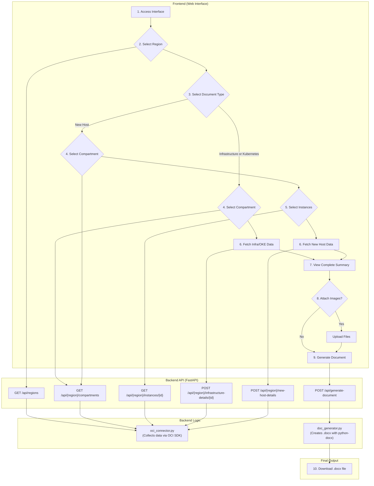

# OCI DocGen: Oracle Cloud Documentation Automation

<p align="center">
  <strong>Generate complete technical documentation of your OCI infrastructure in minutes, not days.</strong>
</p>

<p align="center">
  
  
  
  
</p>

OCI DocGen is a full-stack tool designed to automate the creation of infrastructure documentation on Oracle Cloud Infrastructure (OCI).  
With an intuitive web interface, the tool performs a complete scan in a compartment, collects detailed data about provisioned resources, and generates a standardized, professional `.docx` document.

## Key Features

- **Automatic Discovery**: Maps and hierarchically lists the tenancy’s regions and compartments.  
- **Three Documentation Modes**: Option to generate a document focused on New Hosts, a full report of a compartment’s infrastructure, or specific Kubernetes (OKE) documentation.  
- **Comprehensive Data Collection**: Extracts detailed information from multiple OCI services.  
- **Interactive Web Interface**: Clean and responsive frontend that guides the user step by step in the selection process.  
- **Manual Attachments**: Supports uploading architecture diagrams and visual evidence (e.g., antivirus screenshots).  
- **Professional Output**: Generates a formatted `.docx` file, ready to deliver to clients or internal audits.  

## OCI Resources Covered

### Compute
- Instances: Shape, OCPUs, Memory, Operating System, IPs, State.

### Storage
- Boot Volumes and Block Volumes: Size, Backup Policies.  
- Volume Groups: Members, Backup Policy Validation, Cross-Region Replication.  

### Networking
- Virtual Cloud Networks (VCNs).  
- Subnets.  
- Security Lists and Route Tables (all rules and descriptions).  
- Network Security Groups (NSGs) (rules and associations).  
- Load Balancers (Shape, IPs, Listeners, Backend Sets, Health Checkers).  
- Local Peering Gateways (LPGs).  

### Connectivity
- Dynamic Routing Gateways (DRGs) (attachments and RPCs).  
- Customer-Premises Equipment (CPEs).  
- IPSec Connections (tunnels, encryption phases, status, routing).  

### Containers & Orchestration
- Oracle Kubernetes Engine (OKE): Cluster details, version, associated VCN, API endpoints (Public/Private).  
- Node Pools: Shape, node count, OS image, resources, subnets.  

## Workflow Diagram



## Technologies Used

### Backend
- Python 3.10+  
- FastAPI (RESTful API)  
- OCI Python SDK  
- Pydantic (data validation)  
- python-docx (document generation)  
- Uvicorn / Gunicorn (ASGI/WSGI servers)  

### Frontend
- HTML5, CSS3, Vanilla JavaScript (ES6)  

## Project Structure
```
    .
    ├── backend/
    │   ├── doc_generator.py     # Logic for .docx document generation
    │   ├── generated_docs/      # Directory where documents are saved
    │   ├── main.py              # FastAPI API (endpoints)
    │   ├── oci_connector.py     # OCI integration logic
    │   ├── requirements.txt     # Dependencies
    │   └── schemas.py           # Pydantic models
    └── frontend/
        ├── css/
        │   └── style.css
        ├── js/
        │   └── app.js
        └── index.html
```

## Usage

### Local Development

#### Prerequisites
- Python 3.10+  
- Access to an OCI tenancy with read permissions.

#### OCI Authentication Setup
- **API Key (Default):** Configure `~/.oci/config`.  
- **Instance Principal:**  
  ```bash
  export OCI_AUTH_METHOD=INSTANCE_PRINCIPAL
  ```

#### Backend
```bash
cd backend
python3 -m venv venv
source venv/bin/activate   # macOS/Linux
venv\Scripts\activate    # Windows (CMD)
.\venv\Scripts\Activate # Windows (PowerShell)
pip install -r requirements.txt
uvicorn main:app --reload
```
API available at: `http://127.0.0.1:8000`

#### Frontend
```bash
cd frontend
python3 -m http.server 5500
```
Interface available at: `http://127.0.0.1:5500`

## Configuration for Production Environments

Before deployment, two files must be updated to ensure proper communication between frontend and backend.

### 1. Backend: CORS Policy
Add your production frontend domain to the allowed origins list.

File: `backend/main.py`

```python
origins = [
    "http://localhost",
    "http://localhost:5500",
    "http://127.0.0.1:5500",
    "http://your-production-domain.com",  # <-- ADD HERE
]
```

### 2. Frontend: API URL
Update the frontend so that it calls Nginx instead of `localhost`. The API base URL must be relative.

File: `frontend/js/app.js`

```javascript
// From:
const API_BASE_URL = 'http://127.0.0.1:8000';

// To:
const API_BASE_URL = '';
```

## Production Deployment Guide (Ubuntu VM)

Instructions for deploying OCI DocGen in a VM on OCI using **Nginx** as reverse proxy and **Gunicorn** as backend server.

### 1. System Preparation
```bash
sudo apt update && sudo apt upgrade -y
sudo apt install python3-pip python3-venv nginx git -y
```

### 2. Application Setup
```bash
sudo useradd --system --shell /usr/sbin/nologin --no-create-home docgen_user

sudo git clone https://github.com/Pedr0Teixeira/oci-docgen.git /var/www/oci-docgen
sudo chown -R docgen_user:docgen_user /var/www/oci-docgen
```

### 3. Python Environment
```bash
sudo -u docgen_user python3 -m venv /var/www/oci-docgen/backend/venv
sudo -u docgen_user /var/www/oci-docgen/backend/venv/bin/pip install -r /var/www/oci-docgen/backend/requirements.txt
sudo -u docgen_user /var/www/oci-docgen/backend/venv/bin/pip install gunicorn
```

### 4. systemd Service
File: `/etc/systemd/system/ocidocgen.service`

```ini
[Unit]
Description=OCI DocGen Gunicorn Service
After=network.target

[Service]
User=docgen_user
Group=docgen_user
WorkingDirectory=/var/www/oci-docgen/backend
Environment="OCI_AUTH_METHOD=INSTANCE_PRINCIPAL"
ExecStart=/var/www/oci-docgen/backend/venv/bin/gunicorn --workers 4 --worker-class uvicorn.workers.UvicornWorker --bind 127.0.0.1:8000 --timeout 120 main:app

[Install]
WantedBy=multi-user.target
```

Activate and start:
```bash
sudo systemctl daemon-reload
sudo systemctl enable --now ocidocgen
```

### 5. Nginx Configuration
File: `/etc/nginx/sites-available/ocidocgen`

```nginx
server {
    listen 80;
    server_name your_domain_or_ip;

    location / {
        root /var/www/oci-docgen/frontend;
        try_files $uri $uri/ /index.html;
    }

    location /api {
        proxy_pass http://127.0.0.1:8000;
        proxy_set_header Host $host;
        proxy_set_header X-Real-IP $remote_addr;
        proxy_set_header X-Forwarded-For $proxy_add_x_forwarded_for;
    }
}
```

Enable configuration:
```bash
sudo ln -s /etc/nginx/sites-available/ocidocgen /etc/nginx/sites-enabled/
sudo systemctl restart nginx
```

## Troubleshooting

### Frontend Error: "Failed to fetch"
Possible causes:
- CORS: The frontend domain was not added to the `origins` list in `backend/main.py`.
- API URL: `API_BASE_URL` was not adjusted in `frontend/js/app.js`.
- Nginx vs Backend: Nginx cannot communicate with Gunicorn.

Diagnosis:
```bash
curl http://127.0.0.1:8000/api/regions
```
If it works, the issue is with Nginx. If it fails, the backend service is the problem.

### systemd Service Fails (status=203/EXEC)
- Permissions: Ensure `docgen_user` owns the files.
  ```bash
  sudo chown -R docgen_user:docgen_user /var/www/oci-docgen
  ```
- Incorrect venv path: Ensure the virtual environment exists at `/var/www/oci-docgen/backend/venv`.
- Gunicorn not installed:
  ```bash
  sudo -u docgen_user /var/www/oci-docgen/backend/venv/bin/pip install gunicorn
  ```

## Author
Developed by Pedro Teixeira