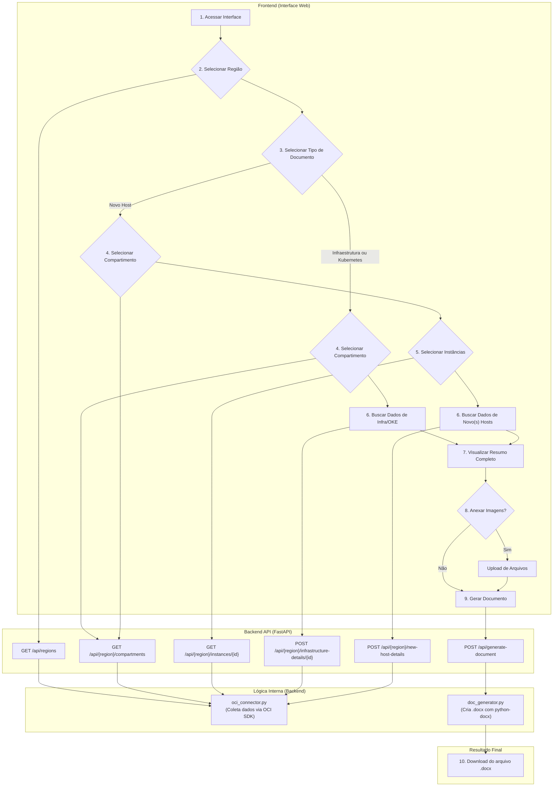

# OCI DocGen: Oracle Cloud Documentation Automation

<p align="center">
  <strong>Generate complete technical documentation of your OCI infrastructure in minutes, not days.</strong>
</p>

<p align="center">
  
  
  
  
</p>

OCI DocGen is a full-stack tool designed to automate the creation of infrastructure documentation on Oracle Cloud Infrastructure (OCI).  
With an intuitive web interface, the tool performs a complete scan in a compartment, collects detailed data about provisioned resources, and generates a standardized, professional `.docx` document.

## Key Features

- **Automatic Discovery**: Maps and hierarchically lists the tenancy’s regions and compartments.  
- **Three Documentation Modes**: Option to generate a document focused on New Hosts, a full report of a compartment’s infrastructure, or specific Kubernetes (OKE) documentation.  
- **Comprehensive Data Collection**: Extracts detailed information from multiple OCI services.  
- **Interactive Web Interface**: Clean and responsive frontend that guides the user step by step in the selection process.  
- **Manual Attachments**: Supports uploading architecture diagrams and visual evidence (e.g., antivirus screenshots).  
- **Professional Output**: Generates a formatted `.docx` file, ready to deliver to clients or internal audits.  

## OCI Resources Covered

### Compute
- Instances: Shape, OCPUs, Memory, Operating System, IPs, State.

### Storage
- Boot Volumes and Block Volumes: Size, Backup Policies.  
- Volume Groups: Members, Backup Policy Validation, Cross-Region Replication.  

### Networking
- Virtual Cloud Networks (VCNs).  
- Subnets.  
- Security Lists and Route Tables (all rules and descriptions).  
- Network Security Groups (NSGs) (rules and associations).  
- Load Balancers (Shape, IPs, Listeners, Backend Sets, Health Checkers).  
- Local Peering Gateways (LPGs).  

### Connectivity
- Dynamic Routing Gateways (DRGs) (attachments and RPCs).  
- Customer-Premises Equipment (CPEs).  
- IPSec Connections (tunnels, encryption phases, status, routing).  

### Containers & Orchestration
- Oracle Kubernetes Engine (OKE): Cluster details, version, associated VCN, API endpoints (Public/Private).  
- Node Pools: Shape, node count, OS image, resources, subnets.  

## Workflow Diagram



## Technologies Used

### Backend
- Python 3.10+  
- FastAPI (RESTful API)  
- OCI Python SDK  
- Pydantic (data validation)  
- python-docx (document generation)  
- Uvicorn / Gunicorn (ASGI/WSGI servers)  

### Frontend
- HTML5, CSS3, Vanilla JavaScript (ES6)  

## Project Structure
```
    .
    ├── backend/
    │   ├── doc_generator.py     # Logic for .docx document generation
    │   ├── generated_docs/      # Directory where documents are saved
    │   ├── main.py              # FastAPI API (endpoints)
    │   ├── oci_connector.py     # OCI integration logic
    │   ├── requirements.txt     # Dependencies
    │   └── schemas.py           # Pydantic models
    └── frontend/
        ├── css/
        │   └── style.css
        ├── js/
        │   └── app.js
        └── index.html
```

## Usage

### Local Development

#### Prerequisites
- Python 3.10+  
- Access to an OCI tenancy with read permissions.

#### OCI Authentication Setup
- **API Key (Default):** Configure `~/.oci/config`.  
- **Instance Principal:**  
  ```bash
  export OCI_AUTH_METHOD=INSTANCE_PRINCIPAL
  ```

#### Backend
```bash
cd backend
python3 -m venv venv
source venv/bin/activate   # macOS/Linux
venv\Scripts\activate    # Windows (CMD)
.\venv\Scripts\Activate # Windows (PowerShell)
pip install -r requirements.txt
uvicorn main:app --reload
```
API available at: `http://127.0.0.1:8000`

#### Frontend
```bash
cd frontend
python3 -m http.server 5500
```
Interface available at: `http://127.0.0.1:5500`

### Production Deployment (VM)

Deployment instructions for Ubuntu VM on OCI, using **Nginx** as reverse proxy and **Gunicorn** for backend.

(Setup, service, and configuration steps follow best practices as described in the original text.)

## Author
Developed by Pedro Teixeira