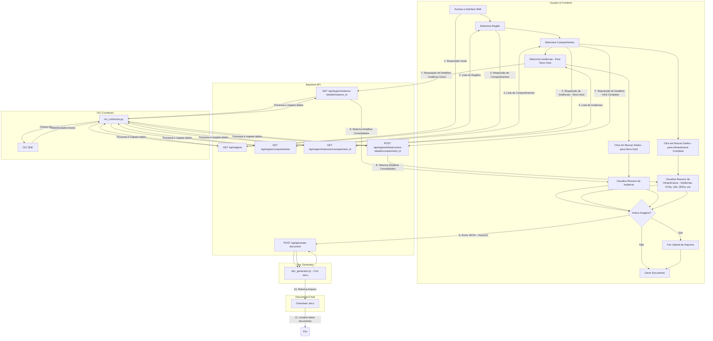

# OCI DocGen: Automação de Documentação para Oracle Cloud

<p align="center">
  <strong>Gere documentação técnica completa da sua infraestrutura OCI em minutos, não em dias.</strong>
</p>

<p align="center">
  
  
  
  
</p>

OCI DocGen é uma ferramenta full-stack projetada para automatizar a criação de documentação de infraestrutura na Oracle Cloud Infrastructure (OCI).  
Com uma interface web intuitiva, a ferramenta realiza uma varredura completa em um compartimento, coleta dados detalhados sobre os recursos provisionados e gera um documento `.docx` padronizado e profissional.

## Principais Funcionalidades

- **Descoberta Automática**: Mapeia e lista hierarquicamente as regiões e compartimentos da tenancy.  
- **Dois Modos de Documentação**: Possibilidade de gerar um documento focado apenas em novas instâncias ou um relatório completo da infraestrutura de um compartimento.  
- **Coleta de Dados Abrangente**: Extrai informações detalhadas de múltiplos serviços da OCI.  
- **Interface Web Interativa**: Frontend limpo e reativo que guia o usuário passo a passo no processo de seleção.  
- **Anexos Manuais**: Suporte a upload de diagramas de arquitetura e evidências visuais.  
- **Saída Profissional**: Geração de arquivo `.docx` formatado, pronto para entrega a clientes ou auditorias internas.  

## Recursos OCI Cobertos

### Compute
- Instâncias (Shape, OCPUs, Memória, Sistema Operacional, IPs)

### Storage
- Boot Volumes e Block Volumes (Tamanho, Políticas de Backup)  
- Volume Groups (Membros, Validação de Backup, Replicação Cross-Region)  

### Networking
- Virtual Cloud Networks (VCNs)  
- Subnets  
- Security Lists e Route Tables (com todas as regras)  
- Network Security Groups (NSGs) (com regras e associações)  
- Load Balancers (Listeners, Backend Sets, Health Checkers)  
- Local Peering Gateways (LPGs)  

### Conectividade
- Dynamic Routing Gateways (DRGs) (Anexos e RPCs)  
- Customer-Premises Equipment (CPEs)  
- IPSec Connections (Túneis, Criptografia, BGP)  

## Diagrama de Funcionamento



## Tecnologias Utilizadas

### Backend
- Python 3.10+  
- FastAPI (API RESTful)  
- OCI Python SDK (integração com API da Oracle Cloud)  
- Pydantic (validação e serialização de dados)  
- python-docx (geração de arquivos `.docx`)  
- Uvicorn / Gunicorn (servidores ASGI/WSGI)  

### Frontend
- HTML5, CSS3, Vanilla JavaScript (ES6)  

## Estrutura do Projeto
```
    .
    ├── backend/
    │   ├── doc_generator.py     # Lógica para criar o documento .docx
    │   ├── generated_docs/      # Diretório onde os documentos são salvos
    │   ├── main.py              # API FastAPI (endpoints)
    │   ├── oci_connector.py     # Conexão e busca de dados da OCI
    │   ├── requirements.txt     # Dependências Python
    │   └── schemas.py           # Modelos Pydantic
    └── frontend/
        ├── css/
        │   └── style.css        # Estilos
        ├── js/
        │   └── app.js           # Lógica do frontend
        └── index.html           # Interface principal
```

---

# 🚀 Como Usar

## 🔹 Desenvolvimento Local

### Pré-requisitos
- Python 3.10+
- Acesso a uma tenancy OCI com permissões de leitura.

### Configuração de Autenticação OCI
1. **API Key (Padrão):**  
   Arquivo `~/.oci/config` válido com chaves de API.

2. **Instance Principal:**  
   Executando em uma instância OCI, defina:  
   ```bash
   export OCI_AUTH_METHOD=INSTANCE_PRINCIPAL
   ```

### 1. Backend
```bash
cd backend
python3 -m venv venv
source venv/bin/activate   # macOS/Linux
.env\Scriptsctivate    # Windows (PowerShell)
venv\Scriptsctivate      # Windows (CMD)
pip install -r requirements.txt
uvicorn main:app --reload
```
API disponível em: `http://127.0.0.1:8000`

### 2. Frontend
```bash
cd frontend
python3 -m http.server 5500
```
Interface disponível em: `http://127.0.0.1:5500`

---

## 🔹 Provisionamento em Produção (VM)

Este guia descreve o processo para hospedar o **OCI DocGen** em uma VM Ubuntu 24.04 na OCI, usando **Nginx** como reverse proxy e **Gunicorn** para rodar a aplicação.

### 1. Preparação do Sistema
```bash
sudo apt update && sudo apt upgrade -y
sudo apt install python3-pip python3-venv nginx git -y
```

### 2. Configuração da Aplicação
```bash
sudo useradd --system --no-create-home --shell /bin/false docgen_user

sudo mkdir -p /var/www/oci-docgen
cd /var/www/oci-docgen
sudo git clone https://github.com/Pedr0Teixeira/oci-docgen.git .
sudo chown -R docgen_user:docgen_user /var/www/oci-docgen
```

### 3. Ambiente Python
```bash
cd /var/www/oci-docgen/backend

sudo python3 -m venv venv
source venv/bin/activate
pip install gunicorn
pip install -r requirements.txt
deactivate
```

### 4. Autenticação e IAM
Recomenda-se a autenticação via **Instance Principal**.  
Crie um **Dynamic Group** com o OCID da VM e uma **Policy de IAM** concedendo permissões de leitura.  
Observação: Para **NSGs**, utilize `use`; para a maioria das operações, `read` é suficiente.

Referência: [OCI Policy Reference](https://docs.oracle.com/en-us/iaas/Content/Identity/Reference/policyreference.htm#Core_Services)

### 5. Serviço com systemd
Crie `/etc/systemd/system/ocidocgen.service`:

```ini
[Unit]
Description=OCI DocGen Gunicorn Service
After=network.target

[Service]
User=docgen_user
Group=docgen_user
WorkingDirectory=/var/www/oci-docgen/backend
Environment="OCI_AUTH_METHOD=INSTANCE_PRINCIPAL"
ExecStart=/var/www/oci-docgen/backend/venv/bin/gunicorn --workers 4 --worker-class uvicorn.workers.UvicornWorker --bind 127.0.0.1:8000 --timeout 120 main:app

[Install]
WantedBy=multi-user.target
```

Ative e inicie o serviço:
```bash
sudo systemctl daemon-reload
sudo systemctl enable ocidocgen
sudo systemctl start ocidocgen
```

### 6. Configuração do Nginx (Reverse Proxy)
Crie `/etc/nginx/sites-available/ocidocgen`:

```nginx
server {
    listen 80;
    server_name SEU_IP_OU_DOMINIO;

    location / {
        root /var/www/oci-docgen/frontend;
        try_files $uri $uri/ /index.html;
    }

    location /api {
        proxy_pass http://127.0.0.1:8000;
        proxy_set_header Host $host;
        proxy_set_header X-Real-IP $remote_addr;
        proxy_set_header X-Forwarded-For $proxy_add_x_forwarded_for;
        proxy_set_header X-Forwarded-Proto $scheme;
    }
}
```

Ative a configuração e reinicie o Nginx:
```bash
sudo ln -s /etc/nginx/sites-available/ocidocgen /etc/nginx/sites-enabled/
sudo rm /etc/nginx/sites-enabled/default
sudo nginx -t
sudo systemctl restart nginx
```

### 7. Liberação da Porta 80
Adicione uma **Ingress Rule** na Security List ou no NSG da VCN para liberar tráfego TCP na porta 80.

---

### 📝 Instruções de Uso

1. Selecione a **Região**.  
2. Escolha o **Tipo de Documentação** (Novo Host ou Infraestrutura).  
3. Selecione o **Compartimento**.  
4. Escolha as **Instâncias** (se aplicável).  
5. Clique em **Buscar Dados**.  
6. (Opcional) Anexe imagens/arquivos.  
7. Clique em **Gerar Documento (.docx)**.  

---

### Autor
Desenvolvido por **Pedro Teixeira**