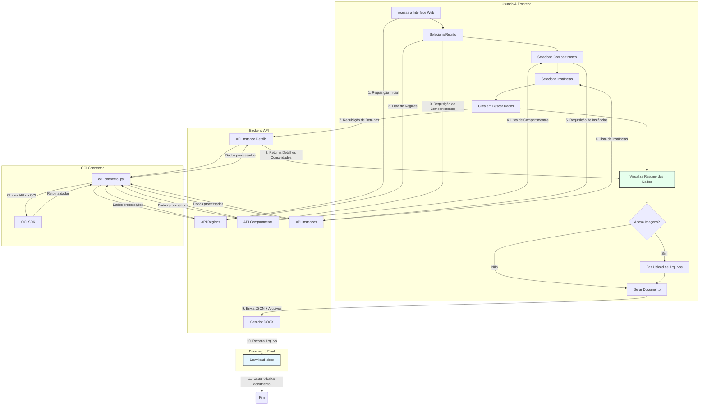

# OCI DocGen

<p align="center">
  
  
  
  
</p>

**OCI DocGen** é uma ferramenta de automação projetada para simplificar e acelerar a criação de documentação de infraestrutura na Oracle Cloud Infrastructure (OCI). Com uma interface web intuitiva, a ferramenta se conecta à sua tenancy OCI, coleta dados detalhados sobre os recursos e gera um documento `.docx` profissional e padronizado com apenas alguns cliques.

## ✨ Principais Funcionalidades

-   **Descoberta Automática:** Mapeia e lista automaticamente as regiões, compartimentos e instâncias disponíveis em sua tenancy.
-   **Coleta de Dados Abrangente:** Extrai informações detalhadas de cada instância, incluindo:
    -   **Computação:** Shape, OCPUs, Memória, Sistema Operacional.
    -   **Armazenamento:** Boot Volume, Block Volumes anexados.
    -   **Rede:** IPs (público e privado), Security Lists, Network Security Groups (NSGs) e Route Tables com suas respectivas regras.
    -   **Backup:** Políticas de backup associadas aos volumes.
-   **Interface Web Interativa:** Um frontend limpo e reativo que guia o usuário passo a passo no processo de seleção.
-   **Geração de Documentos Múltiplos:** Consolida as informações de várias instâncias em um único documento coeso.
-   **Anexos Manuais:** Permite o upload de evidências visuais, como diagramas de arquitetura e prints de configuração de antivírus, que são incorporados diretamente no documento.
-   **Saída Profissional:** Gera um arquivo `.docx` bem formatado, pronto para ser entregue ou arquivado.

##  Diagrama de funcionamento

O fluxograma abaixo ilustra a interação entre o usuário, o frontend, o backend da API e a OCI.



## 🛠️ Tecnologias Utilizadas

-   **Backend:**
    -   **Python 3.8+**
    -   **FastAPI:** Para a criação da API RESTful de alta performance.
    -   **OCI Python SDK:** Para interação segura com a API da Oracle Cloud.
    -   **python-docx:** Para a criação e manipulação de arquivos `.docx`.
    -   **Uvicorn:** Como servidor ASGI para rodar a aplicação FastAPI.
-   **Frontend:**
    -   **HTML5**
    -   **CSS3**
    -   **Vanilla JavaScript (ES6):** Para interatividade e comunicação com o backend, sem a necessidade de frameworks.

## 📂 Estrutura do Projeto
.
├── backend
│   ├── doc_generator.py         # Lógica para criar o documento .docx
│   ├── generated_docs/          # Diretório onde os documentos são salvos
│   ├── main.py                  # Arquivo principal da API FastAPI (endpoints)
│   ├── oci_connector.py         # Módulo para se conectar e buscar dados da OCI
│   ├── requirements.txt         # Dependências Python do backend
│   ├── schemas.py               # Modelos de dados Pydantic para validação
│   └── test_generator.py        # (Opcional) Testes para o gerador de documentos
└── frontend
├── css
│   └── style.css            # Folha de estilos da aplicação
├── index.html               # Estrutura principal da interface
└── js
└── app.js               # Lógica do frontend e manipulação do DOM

## 🚀 Instalação e Execução

Siga os passos abaixo para configurar e executar o OCI DocGen em seu ambiente local.

### Pré-requisitos

1.  **Python 3.8 ou superior:** É necessário ter o Python instalado em seu sistema. Você pode baixá-lo em [python.org](https://www.python.org/downloads/).
2.  **Configuração da OCI CLI:** A ferramenta utiliza as credenciais salvas pelo OCI CLI. Certifique-se de que você já o configurou e que o arquivo `~/.oci/config` existe e está correto.
    -   Siga as [Instruções de configuração do OCI CLI](https://docs.oracle.com/en-us/iaas/Content/API/SDKDocs/cliinstall.htm).

### 1. Configuração do Backend

```bash
# 1. Navegue até o diretório do backend
cd backend

# 2. Crie e ative um ambiente virtual (recomendado)
# No macOS/Linux
python3 -m venv venv
source venv/bin/activate

# No Windows
python -m venv venv
.\\venv\\Scripts\\activate

# 3. Instale as dependências Python
pip install -r requirements.txt

# 4. Inicie o servidor da API
uvicorn main:app --reload

O backend estará em execução em `http://127.0.0.1:8000`.

### 2. Configuração do Frontend

O frontend consiste em arquivos estáticos (HTML, CSS, JS) e precisa ser servido por um servidor web simples.

```bash
# 1. Abra um NOVO terminal e navegue até o diretório do frontend
cd frontend

# 2. Inicie um servidor web local com Python
# (Você pode usar qualquer servidor, como o Live Server do VS Code)
python3 -m http.server 5500
```
A interface do OCI DocGen estará acessível em seu navegador no endereço `http://127.0.0.1:5500`.

## 📖 Instruções de Uso

Com o backend e o frontend em execução, siga os passos na interface:

1.  **Selecione a Região:** A lista de regiões disponíveis na sua tenancy será carregada automaticamente.
2.  **Selecione o Tipo de Documentação:** No momento, "Documentação de Novo Host" está disponível.
3.  **Selecione o Compartimento:** Navegue na estrutura hierárqu-ica e escolha o compartimento que contém as instâncias desejadas.
4.  **Selecione a(s) Instância(s):** Marque uma ou mais instâncias para incluir no documento.
5.  **Buscar Dados:** Clique no botão "Buscar Dados da(s) Instância(s)". A ferramenta irá coletar todas as informações e exibirá um resumo detalhado na tela.
6.  **(Opcional) Anexe Arquivos:** Se necessário, adicione imagens para o desenho da arquitetura e evidências do antivírus. Você pode clicar para selecionar os arquivos ou simplesmente colar imagens da sua área de transferência (Ctrl+V).
7.  **Gerar Documento:** Clique em "Gerar Documento (.docx)". O backend irá processar todos os dados, montar o arquivo e o download iniciará automaticamente no seu navegador.

## 👨‍💻 Autor

-   **Pedro Teixeira**