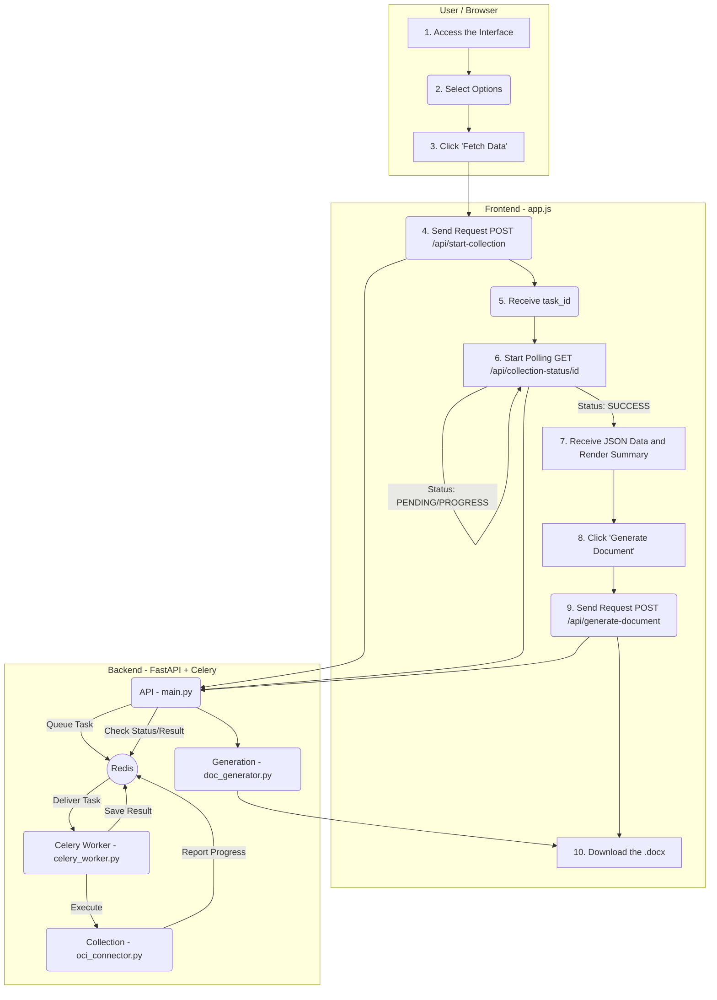

# OCI DocGen: Oracle Cloud Documentation Automation

<p align="center">
  <strong>Generate complete technical documentation of your OCI infrastructure in minutes, not days.</strong>
</p>

<p align="center">
  
  
  
  
  
  
</p>

**OCI DocGen** is a full-stack tool designed to automate the creation of infrastructure documentation on Oracle Cloud Infrastructure (OCI). With an intuitive web interface and a robust asynchronous architecture, the tool performs a complete scan in a compartment, collects detailed data about provisioned resources, and generates a standardized, professional `.docx` document.

## Key Features

- **Automatic Discovery**: Maps and hierarchically lists the tenancy’s regions and compartments.
- **Three Documentation Modes**: Option to generate a document focused on **New Hosts**, a **Full Report** of a compartment’s infrastructure, or specific **Kubernetes (OKE)** documentation.
- **Comprehensive Data Collection**: Extracts detailed information from multiple OCI services in parallel for high performance.
- **Interactive Web Interface**: Clean and responsive frontend that guides the user step-by-step.
- **Real-Time Progress**: The UI provides real-time feedback on the data collection progress, driven by the backend worker.
- **Asynchronous Architecture**: Thanks to Celery and Redis, long-running data collection is executed in the background, providing a smooth, non-blocking user experience without browser timeouts.
- **Manual Attachments**: Supports uploading architecture diagrams and visual evidence (e.g., antivirus screenshots).
- **Professional Output**: Generates a formatted `.docx` file with a clickable table of contents, ready for delivery.

## OCI Resources Covered

| Category | Service | Details Covered |
| :--- | :--- | :--- |
| **Compute** | Instances | Shape, OCPUs, Memory, OS, IPs, State. |
| **Storage** | Boot/Block Volumes | Size, Backup Policies. |
| | Volume Groups | Members, Backup Policy Validation, Cross-Region Replication. |
| **Networking** | VCNs, Subnets | Details, CIDR Blocks. |
| | Security Lists, NSGs | All Ingress/Egress rules, descriptions, and associations. |
| | Route Tables | All routing rules with their targets. |
| | Load Balancers | Shape, IPs, Listeners, Backend Sets, Health Checkers. |
| | Local Peering Gateways (LPGs)| Peering status, advertised CIDRs. |
| **Connectivity**| Dynamic Routing Gateways (DRGs)| Attachments, RPCs, and peering status. |
| | Customer-Premises Equipment (CPEs) | IP Address, Vendor. |
| | IPSec Connections | Tunnels, IKE/IPSec encryption phases, status, BGP/Static routing. |
| **Containers** | Oracle Kubernetes Engine (OKE)| Cluster details, version, VCN, Public/Private API Endpoints. |
| | Node Pools | Shape, node count, OS image, resources (OCPU/Memory), subnets. |

## Architecture Workflow



## Technologies Used

#### Backend
- **Python 3.10+**
- **FastAPI**: High-performance RESTful API framework.
- **Celery**: Distributed task queue for asynchronous processing.
- **Redis**: In-memory data store used as Celery's message broker and result backend.
- **OCI Python SDK**: To interact with the Oracle Cloud API.
- **Pydantic**: Data validation and settings management.
- **python-docx**: Generation of `.docx` files.
- **Uvicorn / Gunicorn**: ASGI/WSGI servers.

#### Frontend
- **HTML5, CSS3, Vanilla JavaScript (ES6)**

## Project Structure
```
.
├── backend/
│   ├── celery_worker.py     # Defines Celery asynchronous tasks
│   ├── doc_generator.py     # Logic for .docx document generation
│   ├── generated_docs/      # Directory where documents are saved
│   ├── main.py              # FastAPI API (endpoints)
│   ├── oci_connector.py     # OCI integration logic
│   ├── requirements.txt     # Python dependencies
│   └── schemas.py           # Pydantic data models
└── frontend/
    ├── css/
    │   └── style.css
    ├── js/
    │   └── app.js
    └── index.html
```

## Usage

### Local Development

#### Prerequisites
- Python 3.10+
- **Redis** installed and running.
- Access to an OCI tenancy with read permissions.

#### OCI Authentication Setup
- **API Key (Default):** Configure your `~/.oci/config` file.
- **Instance Principal (Recommended for OCI VMs):**
  ```bash
  export OCI_AUTH_METHOD=INSTANCE_PRINCIPAL
  ```

#### Running the Application
You will need **3 separate terminal windows** open in the project's root directory.

- **Terminal 1: Start Redis** (if not already running as a service)
  ```bash
  redis-server
  ```

- **Terminal 2: Start the Backend API**
  ```bash
  cd backend
  python3 -m venv venv
  source venv/bin/activate   # macOS/Linux
  pip install -r requirements.txt
  uvicorn main:app --reload
  ```
  The API will be available at: `http://127.0.0.1:8000`

- **Terminal 3: Start the Celery Worker**
  ```bash
  cd backend
  source venv/bin/activate   # macOS/Linux
  celery -A celery_worker.celery_app worker --loglevel=info
  ```

- **Accessing the Frontend:** Open the `frontend/index.html` file in your web browser.

## Production Deployment Guide (Ubuntu VM)

#### 1. System Preparation
```bash
sudo apt update && sudo apt upgrade -y
sudo apt install python3-pip python3-venv nginx git redis-server -y
sudo systemctl enable --now redis-server
```

#### 2. Application Setup
```bash
# Create a service user for the application
sudo useradd --system --shell /usr/sbin/nologin --no-create-home docgen_user

# Clone the repository and set permissions
sudo git clone [https://github.com/Pedr0Teixeira/oci-docgen.git](https://github.com/Pedr0Teixeira/oci-docgen.git) /var/www/oci-docgen
sudo chown -R docgen_user:docgen_user /var/www/oci-docgen
```

#### 3. Python Environment
```bash
sudo -u docgen_user python3 -m venv /var/www/oci-docgen/backend/venv
sudo -u docgen_user /var/www/oci-docgen/backend/venv/bin/pip install -r /var/www/oci-docgen/backend/requirements.txt
sudo -u docgen_user /var/www/oci-docgen/backend/venv/bin/pip install gunicorn
```

#### 4. systemd Service for Gunicorn API
Create the file `/etc/systemd/system/ocidocgen-api.service`:
```ini
[Unit]
Description=OCI DocGen Gunicorn API Service
After=network.target

[Service]
User=docgen_user
Group=docgen_user
WorkingDirectory=/var/www/oci-docgen/backend
Environment="OCI_AUTH_METHOD=INSTANCE_PRINCIPAL"
ExecStart=/var/www/oci-docgen/backend/venv/bin/gunicorn --workers 4 --worker-class uvicorn.workers.UvicornWorker --bind 127.0.0.1:8000 --timeout 300 main:app
Restart=always

[Install]
WantedBy=multi-user.target
```

#### 5. systemd Service for Celery Worker
Create the file `/etc/systemd/system/ocidocgen-worker.service`:
```ini
[Unit]
Description=OCI DocGen Celery Worker
After=network.target redis-server.service

[Service]
User=docgen_user
Group=docgen_user
WorkingDirectory=/var/www/oci-docgen/backend
Environment="OCI_AUTH_METHOD=INSTANCE_PRINCIPAL"
ExecStart=/var/www/oci-docgen/backend/venv/bin/celery -A celery_worker.celery_app worker --loglevel=INFO
Restart=always

[Install]
WantedBy=multi-user.target
```

#### 6. Enable Services
```bash
sudo systemctl daemon-reload
sudo systemctl enable --now ocidocgen-api
sudo systemctl enable --now ocidocgen-worker
```

#### 7. Nginx Configuration
Create the file `/etc/nginx/sites-available/ocidocgen`:
```nginx
server {
    listen 80;
    server_name your_domain_or_ip;

    # Serve static files from the frontend
    location / {
        root /var/www/oci-docgen/frontend;
        try_files $uri $uri/ /index.html;
    }

    # Proxy /api calls to the FastAPI backend
    location /api {
        # Standard proxy headers to pass original client info
        proxy_set_header Host $host;
        proxy_set_header X-Real-IP $remote_addr;
        proxy_set_header X-Forwarded-For $proxy_add_x_forwarded_for;
        proxy_set_header X-Forwarded-Proto $scheme;

        # Address of our Gunicorn server
        proxy_pass [http://127.0.0.1:8000](http://127.0.0.1:8000);

        # Generous but not excessive timeouts for an API
        proxy_read_timeout 120s;
        proxy_connect_timeout 75s;
    }
}
```
Enable the configuration:
```bash
sudo ln -s /etc/nginx/sites-available/ocidocgen /etc/nginx/sites-enabled/
sudo nginx -t # Test the configuration
sudo systemctl restart nginx
```

## Author
Developed by Pedro Teixeira