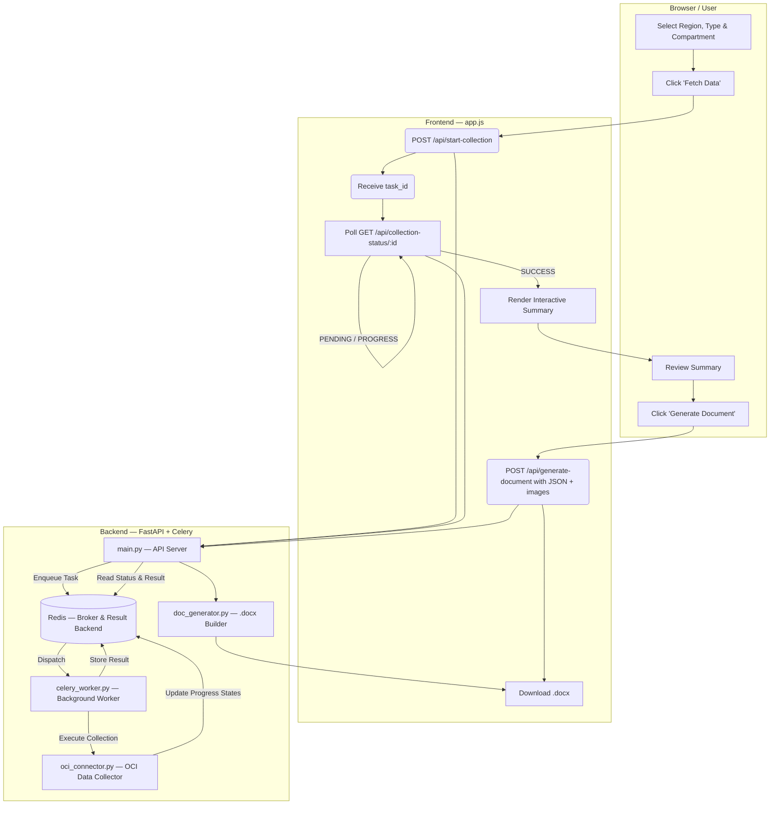

# OCI DocGen: Oracle Cloud Documentation Automation

<p align="center">
  <strong>Generate complete, professional technical documentation of your OCI infrastructure in minutes, not days.</strong>
</p>

<p align="center">
  
  
  
  
  
  
  
</p>

---

**OCI DocGen** is an open-source, full-stack tool that automates the creation of technical infrastructure documentation on Oracle Cloud Infrastructure (OCI). It performs a deep scan of a compartment, collects detailed data across compute, networking, storage, security, and application services, and assembles it into a structured, formatted `.docx` document — ready for delivery.

---

## Table of Contents

- [Key Features](#key-features)
- [OCI Resources Covered](#oci-resources-covered)
- [Documentation Modes](#documentation-modes)
- [Architecture](#architecture)
- [Technologies Used](#technologies-used)
- [Project Structure](#project-structure)
- [Getting Started (Local Development)](#getting-started-local-development)
- [Production Deployment (Ubuntu VM)](#production-deployment-ubuntu-vm)
- [OCI IAM Permissions](#oci-iam-permissions)
- [Load Balancer SSL/TLS Configuration](#load-balancer-ssltls-configuration)
- [Contributing](#contributing)
- [Author](#author)

---

## Key Features

- **Four Documentation Modes**: Tailored document types for **New Hosts**, complete **Compartment Infrastructure**, **Kubernetes (OKE)** clusters, and **WAF / Security** reports.
- **Comprehensive Automatic Discovery**: Maps regions, compartments, and all provisioned resources hierarchically from the tenancy root.
- **WAF & Certificate Coverage**: Fully documents Web Application Firewall policies, firewall instances, Load Balancer integrations, Access Control rules, Rate Limiting, Protection Rules, and OCI Certificates Service (TLS/SSL lifecycle, SANs, associations).
- **Asynchronous Architecture**: Celery + Redis handle long-running collections in the background, preventing browser timeouts and providing smooth, non-blocking UX.
- **Real-Time Progress Feedback**: The frontend polls the backend and renders a live progress bar and step-by-step status during data collection.
- **Interactive Infrastructure Summary**: Before generating the document, the full collected dataset is rendered in an interactive, collapsible summary in the browser — allowing review and validation.
- **Multi-Language Support (i18n)**: The interface, progress messages, and the generated `.docx` document are fully bilingual (Portuguese / English), with instant language switching.
- **Manual Attachments**: Supports uploading architecture diagrams and visual evidence (e.g., antivirus screenshots) to be embedded in the generated document.
- **Professional Document Output**: Generates a formatted `.docx` with a clickable Table of Contents, structured headings, styled tables, and a responsible party signature section.
- **Dual Authentication**: Supports both `API Key` (local dev via `~/.oci/config`) and `Instance Principal` (production on OCI VMs) with zero code changes.

---

## OCI Resources Covered

| Category | Service | Details Collected |
| :--- | :--- | :--- |
| **Compute** | Instances | Shape, OCPUs, Memory, OS image, Lifecycle state, Private/Public IPs |
| **Storage** | Boot Volumes | Size (GB), Backup policy |
| | Block Volumes | Size (GB), Backup policy, Attachment type |
| | Volume Groups | Member volumes, Backup policy validation, Cross-region replication target |
| **Networking** | VCNs | Display name, CIDR block |
| | Subnets | Name, CIDR block |
| | Security Lists | All Ingress/Egress rules with protocol, ports, source/destination, description |
| | Network Security Groups (NSGs) | All rules with full detail, NSG name resolution |
| | Route Tables | All rules with target entity name resolution (IGW, NAT, SGW, LPG, DRG) |
| | Local Peering Gateways (LPGs) | Peering status, advertised CIDRs, cross-tenancy flag |
| **Load Balancing** | Load Balancers (LBaaS) | Shape, IPs (public/private), Listeners, Backend Sets, Health Checkers, backends |
| | Virtual Hostnames | All configured virtual hostnames |
| **Security** | OCI Certificates Service | Full certificate lifecycle: Common Name, SANs, key/signature algorithms, validity dates, stages, version, serial number, deletion schedule, resource associations |
| | WAF Policies | Actions, Access Control rules, Rate Limiting rules, Protection Rules with capabilities |
| | Web App Firewalls | Firewall instance, backend type, Load Balancer binding |
| **Connectivity** | Dynamic Routing Gateways (DRGs) | Attachments, route table bindings, RPCs with peering status |
| | Customer-Premises Equipment (CPEs) | IP address, vendor |
| | IPSec VPN Connections | Phase 1 (IKE) & Phase 2 encryption details, Oracle compliance validation, tunnel status, BGP session info |
| **Containers** | OKE Clusters | Kubernetes version, VCN, public/private API endpoints, LB subnet |
| | Node Pools | Shape, OCPU/Memory, OS image, node count, boot volume size, subnet |

---

## Documentation Modes

OCI DocGen generates four types of documents, each scoped to include only the relevant resources:

| Mode | `doc_type` | Description |
| :--- | :--- | :--- |
| **New Host** | `new_host` | Focuses on one or more specific compute instances: shape, volumes, OS, network rules. Ideal for onboarding documentation. |
| **Full Infrastructure** | `infrastructure` | Complete compartment report: VCN topology, IPSec, DRGs, Load Balancers, OKE clusters, volume groups, and all instances. |
| **Kubernetes (OKE)** | `kubernetes` | Dedicated OKE report: cluster details, node pools, networking, and API endpoints. |
| **WAF Report** | `waf_report` | Security-focused report: WAF policies, firewalls, Load Balancer integration, TLS/SSL certificates with full lifecycle detail, and the associated VCN topology. |

---

## Architecture

### Request & Data Flow


```mermaid
graph TD
    subgraph "Browser / User"
        A[Select Region, Type & Compartment] --> B[Click 'Fetch Data']
        G[Review Summary] --> H[Click 'Generate Document']
    end

    subgraph "Frontend — app.js"
        B --> C(POST /api/start-collection)
        C --> D(Receive task_id)
        D --> E[Poll GET /api/collection-status/:id]
        E -->|PENDING / PROGRESS| E
        E -->|SUCCESS| F[Render Interactive Summary]
        F --> G
        H --> I(POST /api/generate-document with JSON + images)
        I --> J[Download .docx]
    end

    subgraph "Backend — FastAPI + Celery"
        K[main.py — API Server]
        L[celery_worker.py — Background Worker]
        M[(Redis — Broker & Result Backend)]
        N[oci_connector.py — OCI Data Collector]
        O[doc_generator.py — .docx Builder]

        C --> K
        K -->|Enqueue Task| M
        M -->|Dispatch| L
        L -->|Execute Collection| N
        N -->|Update Progress States| M
        L -->|Store Result| M
        E --> K
        K -->|Read Status & Result| M
        I --> K
        K --> O
    end

    O --> J
```

### Key Design Decisions

- **Celery for async collection**: OCI API calls across a large compartment can take 30–120+ seconds. Running them synchronously in FastAPI would cause browser timeouts and poor UX. Celery offloads this entirely to background workers.
- **Redis as both broker and result backend**: Simplifies infrastructure — a single Redis instance handles task queuing and result storage, with no external database dependency.
- **Parallel instance collection**: `ThreadPoolExecutor` is used inside the collection worker to fetch multiple instance details concurrently, reducing total time proportionally to instance count.
- **`getattr()` over `to_dict()` for OCI SDK objects**: Some OCI SDK versions return model objects that do not implement `to_dict()`. Using `getattr()` throughout the certificate collection pipeline ensures compatibility across SDK versions.
- **Certificates stored as `dict`**: OCI certificate structure varies by type (`IMPORTED`, `MANAGED_INTERNALLY`, `ISSUED_BY_INTERNAL_CA`). Storing as raw dicts in `InfrastructureData` preserves all fields without forcing a rigid Pydantic schema onto a variable structure.

---

## Technologies Used

### Backend

| Technology | Role |
| :--- | :--- |
| **Python 3.10+** | Core language |
| **FastAPI** | High-performance ASGI REST API |
| **Celery** | Distributed asynchronous task queue |
| **Redis** | Message broker and Celery result backend |
| **OCI Python SDK** | Oracle Cloud Infrastructure API client |
| **Pydantic v2** | Data validation, serialization, and schema definition |
| **python-docx** | Programmatic `.docx` file generation |
| **Uvicorn / Gunicorn** | ASGI server (dev / production) |

### Frontend

| Technology | Role |
| :--- | :--- |
| **HTML5 / CSS3** | Structure and styling |
| **Vanilla JavaScript (ES6+)** | Application logic, API communication, DOM rendering |
| **JSON i18n** | File-based internationalization for PT-BR and EN |

---

## Project Structure

```
oci-docgen/
├── backend/
│   ├── main.py                  # FastAPI application — REST endpoints
│   ├── celery_worker.py         # Celery task definitions
│   ├── oci_connector.py         # OCI SDK integration and data collection
│   ├── doc_generator.py         # .docx generation engine (i18n-aware)
│   ├── schemas.py               # Pydantic data models (full type contract)
│   ├── requirements.txt         # Python dependencies
│   └── generated_docs/          # Runtime output directory (gitignored)
└── frontend/
    ├── index.html               # Single-page application shell
    ├── css/
    │   └── style.css            # Complete design system
    ├── js/
    │   └── app.js               # Frontend logic, rendering, API calls
    └── locales/
        ├── pt.json              # Portuguese (PT-BR) translations
        └── en.json              # English translations
```

---

## Getting Started (Local Development)

### Prerequisites

- **Python 3.10+**
- **Redis** installed and running locally
- An **OCI tenancy** with read permissions and a configured `~/.oci/config` file

### OCI Authentication

**API Key (default — for local development):**
```bash
# Ensure ~/.oci/config is configured with your credentials
# Reference: https://docs.oracle.com/en-us/iaas/Content/API/Concepts/sdkconfig.htm
oci setup config
```

**Instance Principal (recommended for production on OCI VMs):**
```bash
export OCI_AUTH_METHOD=INSTANCE_PRINCIPAL
```

### Running Locally

You need **three terminal windows** open from the project root.

**Terminal 1 — Redis**
```bash
redis-server
```

**Terminal 2 — FastAPI Backend**
```bash
cd backend
python3 -m venv venv
source venv/bin/activate        # macOS / Linux
# venv\Scripts\activate         # Windows
pip install -r requirements.txt
uvicorn main:app --reload --port 8000
```
API available at: `http://127.0.0.1:8000`
Interactive API docs: `http://127.0.0.1:8000/docs`

**Terminal 3 — Celery Worker**
```bash
cd backend
source venv/bin/activate
celery -A celery_worker.celery_app worker --loglevel=info
```

**Access the Frontend**

Open `frontend/index.html` directly in your browser, or serve it with any static server:
```bash
cd frontend
python3 -m http.server 5500
# Then open: http://localhost:5500
```

---

## Production Deployment (Ubuntu VM)

### 1. System Preparation

```bash
sudo apt update && sudo apt upgrade -y
sudo apt install python3-pip python3-venv nginx git redis-server -y
sudo systemctl enable --now redis-server
```

### 2. Application Setup

```bash
# Create a dedicated system user with no login shell for security isolation
sudo useradd --system --shell /usr/sbin/nologin --no-create-home docgen_user

# Clone the repository
sudo git clone https://github.com/Pedr0Teixeira/oci-docgen.git /var/www/oci-docgen
sudo chown -R docgen_user:docgen_user /var/www/oci-docgen

# Create the runtime output directory
sudo -u docgen_user mkdir -p /var/www/oci-docgen/backend/generated_docs
```

### 3. Python Environment

```bash
sudo -u docgen_user python3 -m venv /var/www/oci-docgen/backend/venv
sudo -u docgen_user /var/www/oci-docgen/backend/venv/bin/pip install -r /var/www/oci-docgen/backend/requirements.txt
sudo -u docgen_user /var/www/oci-docgen/backend/venv/bin/pip install gunicorn
```

### 4. systemd Service — Gunicorn API

Create `/etc/systemd/system/ocidocgen-api.service`:

```ini
[Unit]
Description=OCI DocGen — Gunicorn API Service
After=network.target redis-server.service

[Service]
User=docgen_user
Group=docgen_user
WorkingDirectory=/var/www/oci-docgen/backend
Environment="OCI_AUTH_METHOD=INSTANCE_PRINCIPAL"
ExecStart=/var/www/oci-docgen/backend/venv/bin/gunicorn \
    --workers 4 \
    --worker-class uvicorn.workers.UvicornWorker \
    --bind 127.0.0.1:8000 \
    --timeout 300 \
    main:app
Restart=always
RestartSec=5

[Install]
WantedBy=multi-user.target
```

### 5. systemd Service — Celery Worker

Create `/etc/systemd/system/ocidocgen-worker.service`:

```ini
[Unit]
Description=OCI DocGen — Celery Worker
After=network.target redis-server.service

[Service]
User=docgen_user
Group=docgen_user
WorkingDirectory=/var/www/oci-docgen/backend
Environment="OCI_AUTH_METHOD=INSTANCE_PRINCIPAL"
ExecStart=/var/www/oci-docgen/backend/venv/bin/celery \
    -A celery_worker.celery_app worker \
    --loglevel=INFO \
    --concurrency=4
Restart=always
RestartSec=10

[Install]
WantedBy=multi-user.target
```

### 6. Enable Services

```bash
sudo systemctl daemon-reload
sudo systemctl enable --now ocidocgen-api
sudo systemctl enable --now ocidocgen-worker

# Verify services are running
sudo systemctl status ocidocgen-api
sudo systemctl status ocidocgen-worker
```

### 7. Nginx Configuration

Create `/etc/nginx/sites-available/ocidocgen`:

```nginx
server {
    listen 80;
    server_name your_domain_or_ip;

    # Frontend — static files
    location / {
        root /var/www/oci-docgen/frontend;
        try_files $uri $uri/ /index.html;
    }

    # Backend API — proxy to Gunicorn
    location /api {
        proxy_pass http://127.0.0.1:8000;
        proxy_set_header Host $host;
        proxy_set_header X-Real-IP $remote_addr;
        proxy_set_header X-Forwarded-For $proxy_add_x_forwarded_for;
        proxy_set_header X-Forwarded-Proto $scheme;
        proxy_read_timeout 120s;
        proxy_connect_timeout 75s;
        # Required for large .docx downloads
        proxy_buffer_size 128k;
        proxy_buffers 4 256k;
    }
}
```

```bash
sudo ln -s /etc/nginx/sites-available/ocidocgen /etc/nginx/sites-enabled/
sudo nginx -t && sudo systemctl restart nginx
```

> **HTTPS**: For production use, it is strongly recommended to configure TLS via [Let's Encrypt / Certbot](https://certbot.eff.org/) using the `--nginx` plugin:
> ```bash
> sudo apt install certbot python3-certbot-nginx -y
> sudo certbot --nginx -d your_domain.com
> sudo systemctl reload nginx
> ```

---

## Load Balancer SSL/TLS Configuration

When the infrastructure being documented includes Load Balancers with HTTPS listeners, understanding the three SSL/TLS termination modes is essential for correctly interpreting the documentation output.

OCI Load Balancer supports three distinct SSL traffic handling patterns. The WAF Report and Infrastructure documentation modes collect and display the listener protocol, SSL configuration, and bound certificates precisely because each mode has different security implications.

### SSL Termination

```
Client ──[HTTPS/TLS]──► Load Balancer ──[HTTP]──► Backend
```

The SSL connection terminates at the Load Balancer. Traffic between the Load Balancer and the backend servers is **unencrypted**. The Load Balancer holds the TLS certificate and private key.

- **Use case**: Backends are internal services not requiring encryption; the Load Balancer handles all certificate management.
- **Listener config**: Protocol `HTTPS`, port `443`, with a certificate bundle attached.
- **Backend Set config**: Protocol `HTTP`, port `80`, SSL **disabled**.
- **In OCI DocGen output**: The Listeners table will show `HTTPS` with a certificate name in the **Certificado TLS** column. Backend Sets will show `HTTP:80`.

### SSL Tunneling

```
Client ──[HTTPS/TLS]──────────────────────────────► Backend
                    Load Balancer (TCP passthrough)
```

The Load Balancer operates at the TCP level and forwards the encrypted stream without inspection. The SSL connection is established **end-to-end between the client and the backend**.

- **Use case**: End-to-end encryption where the Load Balancer must not see request contents. HTTP-level features (session persistence, header manipulation) are unavailable.
- **Listener config**: Protocol `TCP`, port `443`, SSL **disabled** on the listener.
- **Backend Set config**: Port `443`, SSL **disabled** on the backend set.
- **In OCI DocGen output**: The Listeners table will show `TCP` on port `443`, with no certificate listed — which is expected and correct for this mode.

### End-to-End SSL

```
Client ──[HTTPS/TLS]──► Load Balancer ──[HTTPS/TLS]──► Backend
```

SSL terminates at the Load Balancer, which then initiates a **new** SSL connection to the backend. This allows the Load Balancer to inspect and manipulate HTTP headers while keeping backend traffic encrypted.

- **Use case**: Environments requiring backend traffic encryption (compliance) while still needing Load Balancer-level HTTP header processing or WAF inspection.
- **Listener config**: Protocol `HTTPS`, port `443`, certificate on the listener.
- **Backend Set config**: SSL **enabled** on the backend set, pointing to the backend certificate.
- **In OCI DocGen output**: Both the Listeners table and Backend Set configuration will reflect SSL usage, and the WAF Report will show the certificate association.

### OCI Certificates Service Integration

For production environments, OCI recommends managing TLS certificates through the **OCI Certificates Service** rather than uploading raw PEM bundles directly to the Load Balancer. This provides:

- Centralized lifecycle management (automatic renewal for managed certificates)
- Certificate versioning and stage tracking (`CURRENT`, `PENDING`, `FAILED`, `DEPRECATED`, `DELETED`)
- Audit trail of rotations and associations
- Cross-resource association visibility

OCI DocGen's WAF Report captures this full lifecycle, including certificate stages, validity window, scheduled deletion date, and every resource the certificate is bound to. This makes it straightforward to identify expiring certificates and their blast radius across the infrastructure.

> **Reference**: For a detailed technical walkthrough of all three SSL modes on OCI Load Balancer, see the official Oracle A-Team article:
> [Load Balancing SSL Traffic in OCI — Oracle A-Team Chronicles](https://www.ateam-oracle.com/load-balancing-ssl-traffic-in-oci)

---

## OCI IAM Permissions

The application requires **read-only** permissions across OCI services. For production VMs, the recommended approach is **Instance Principal** authentication, which eliminates the need to store API keys on disk.

### Step 1 — Create a Dynamic Group

Navigate to: **Identity & Security → Dynamic Groups → Create Dynamic Group**

Name: `oci-docgen-dg`

Matching rule (replace with your VM's OCID):
```
All {instance.id = 'ocid1.instance.oc1..[YOUR_VM_OCID]'}
```

Or to grant all instances in a compartment:
```
All {instance.compartment.id = 'ocid1.compartment.oc1..[YOUR_COMPARTMENT_OCID]'}
```

### Step 2 — Create IAM Policies

Navigate to: **Identity & Security → Policies → Create Policy**

```text
allow dynamic-group 'oci-docgen-dg' to read compartments in tenancy
allow dynamic-group 'oci-docgen-dg' to read instance-family in tenancy
allow dynamic-group 'oci-docgen-dg' to read volume-family in tenancy
allow dynamic-group 'oci-docgen-dg' to read virtual-network-family in tenancy
allow dynamic-group 'oci-docgen-dg' to read load-balancers in tenancy
allow dynamic-group 'oci-docgen-dg' to read cluster-family in tenancy
allow dynamic-group 'oci-docgen-dg' to read drg-family in tenancy
allow dynamic-group 'oci-docgen-dg' to read ipsec-connections in tenancy
allow dynamic-group 'oci-docgen-dg' to read cpes in tenancy
allow dynamic-group 'oci-docgen-dg' to read waf-family in tenancy
allow dynamic-group 'oci-docgen-dg' to read leaf-certificate-family in tenancy
allow dynamic-group 'oci-docgen-dg' to use network-security-groups in tenancy where any {
    request.permission='NETWORK_SECURITY_GROUP_LIST_SECURITY_RULES',
    request.permission='NETWORK_SECURITY_GROUP_LIST_MEMBERS'
}
```

> **Principle of Least Privilege**: All permissions above use `read` or restricted `use` verbs. The application never creates, modifies, or deletes any OCI resource.

### IAM Policy Reference

For full documentation on OCI IAM policy verbs and resource types:
[Oracle Cloud Infrastructure IAM Policy Reference](https://docs.oracle.com/en-us/iaas/Content/Identity/Reference/policyreference.htm)

---

## Contributing

Contributions, bug reports, and feature requests are welcome.

1. Fork the repository
2. Create a feature branch: `git checkout -b feature/your-feature-name`
3. Commit your changes: `git commit -m 'feat: add some feature'`
4. Push to your branch: `git push origin feature/your-feature-name`
5. Open a Pull Request

Please ensure your code follows the existing structure and includes bilingual comments (PT-BR + EN) for any new logic, consistent with the project's documentation standard.

---

## Author

Developed by **Pedro Teixeira**

---

<p align="center">
  <sub>OCI DocGen is an independent open-source project and is not affiliated with or endorsed by Oracle Corporation.</sub>
</p>