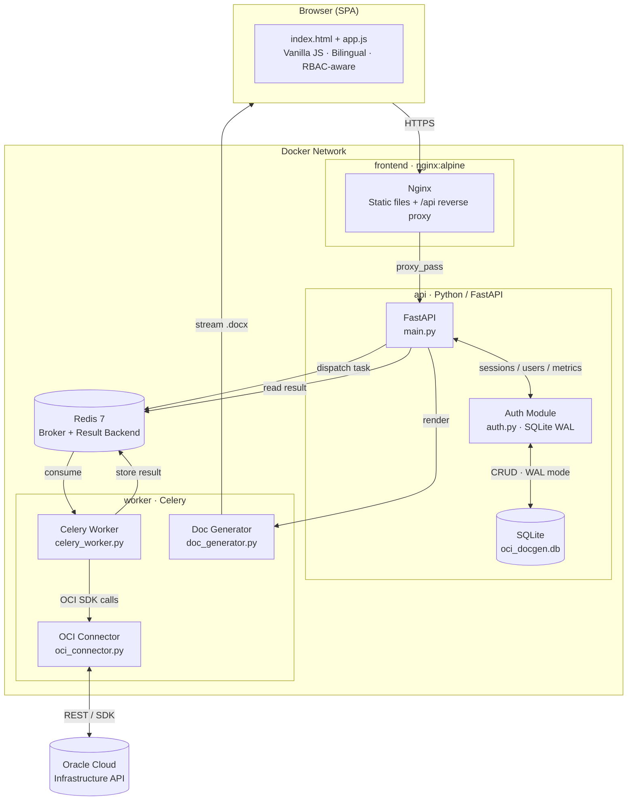
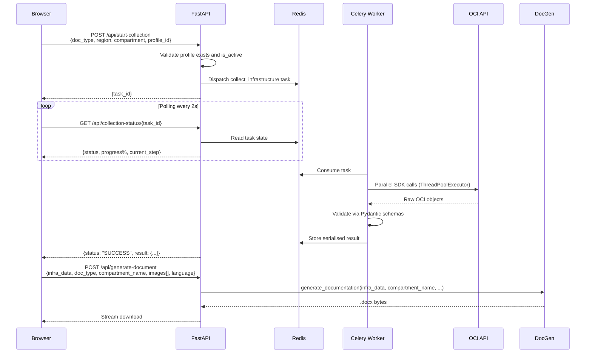
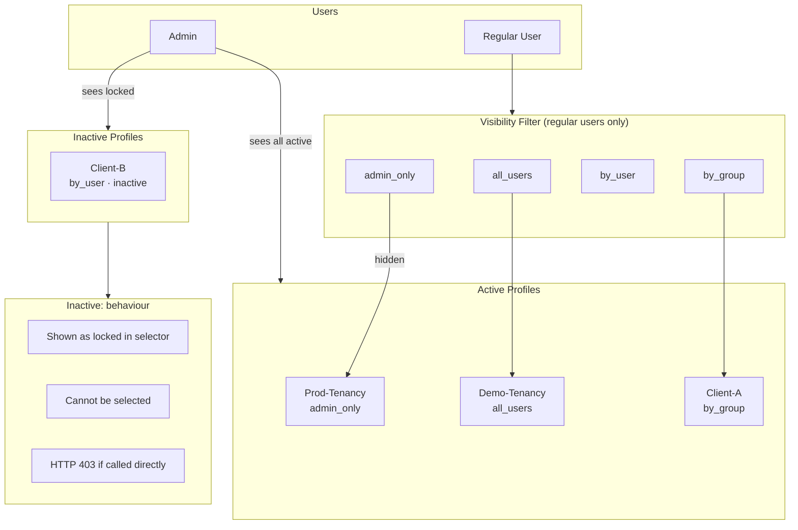
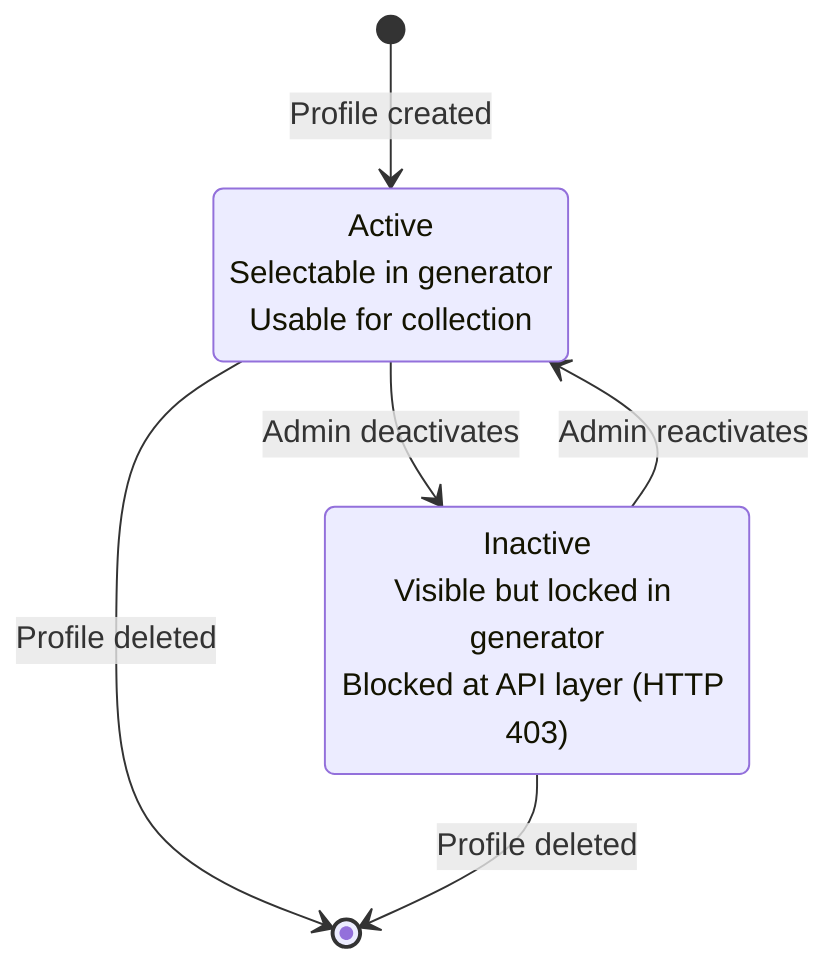
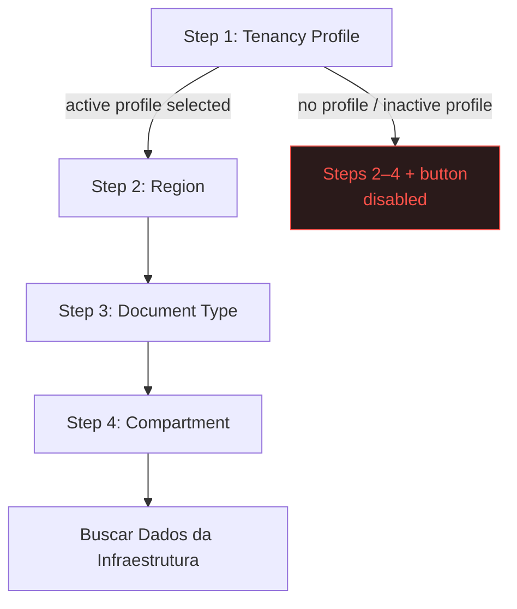
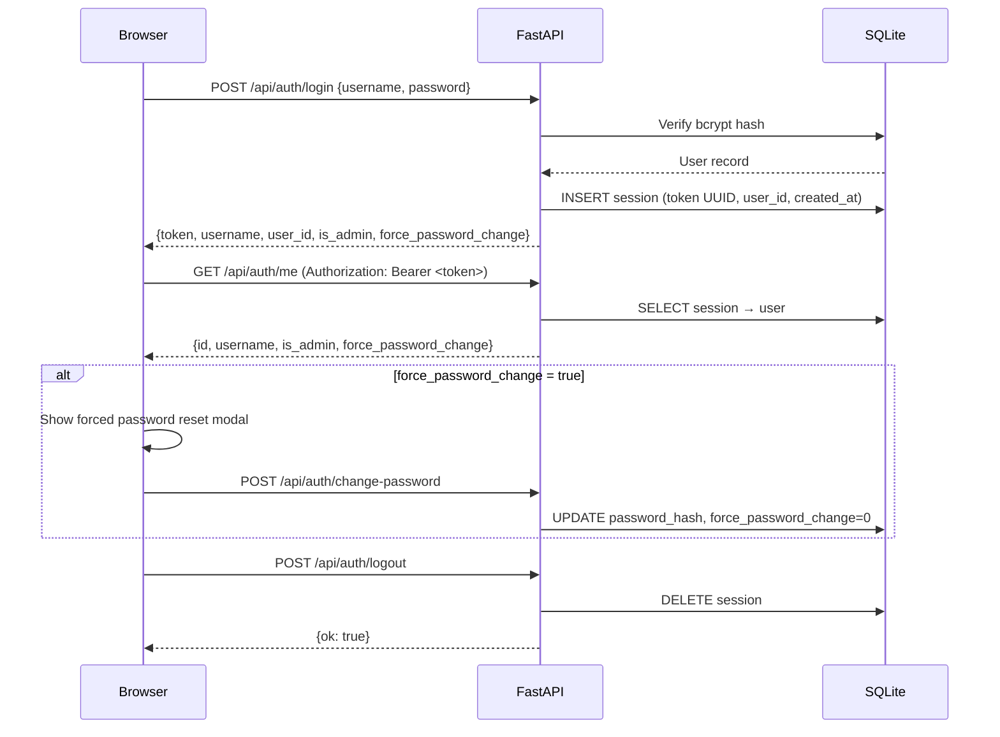

# OCI DocGen

<p align="center">
  <strong>Automated technical documentation for Oracle Cloud Infrastructure.</strong><br/>
  <sub>Multi-tenant · Bilingual (PT-BR / EN) · Async collection · Role-based access</sub>
</p>

<p align="center">
  
  
  
  
  
  
  
</p>

---

**OCI DocGen** is a full-stack web application that automates the creation of technical infrastructure documentation for Oracle Cloud Infrastructure. It performs a full compartment scan, collects data across compute, networking, storage, security, and connectivity resources, and produces a formatted `.docx` document ready for delivery — all from a clean browser interface, without requiring any local OCI tooling on the end user's machine.

Credentials are stored encrypted server-side as **Tenancy Profiles**, allowing a single OCI DocGen instance to serve multiple tenancies, teams, and clients — each with its own access controls.

---

## Table of Contents

- [Features](#features)
- [Documentation Modes](#documentation-modes)
- [OCI Resources Covered](#oci-resources-covered)
- [Architecture](#architecture)
- [System Overview](#system-overview)
- [Async Collection Pipeline](#async-collection-pipeline)
- [Tenancy Profile Access Model](#tenancy-profile-access-model)
- [Profile Lifecycle and Active State](#profile-lifecycle-and-active-state)
- [Generator Wizard — Step Dependency Model](#generator-wizard--step-dependency-model)
- [Authentication & Session Flow](#authentication--session-flow)
- [Data Model](#data-model)
- [Project Structure](#project-structure)
- [Local Setup](#local-setup)
- [Production Deployment](#production-deployment)
- [Docker (Recommended)](#docker-recommended)
- [Bare VM](#bare-vm)
- [Admin Guide](#admin-guide)
- [First Login](#first-login)
- [Tenancy Profiles](#tenancy-profiles)
- [Groups & Permissions](#groups--permissions)
- [User Management](#user-management)
- [OCI IAM Permissions](#oci-iam-permissions)
- [API Reference](#api-reference)
- [SSL/TLS Reference](#ssltls-reference)
- [Engineering Notes](#engineering-notes)
- [Contributing](#contributing)

---

## Features

- **Four document modes** — New Host, Full Infrastructure, Kubernetes (OKE), and WAF Report, each scoped to a specific set of OCI resources.
- **Tenancy Profiles** — Admins register OCI credentials (API Key or Instance Principal) as named profiles, encrypted at rest with Fernet (AES-128-CBC). Users never handle raw keys.
- **Profile active/inactive state** — Profiles can be deactivated without deletion. Inactive profiles appear as locked items in the generator selector and are blocked from use at both the UI and API layers.
- **4-tier visibility model** — Each profile can be scoped to `admin_only`, `all_users`, specific groups (`by_group`), or individually assigned users (`by_user`).
- **Wizard step dependency enforcement** — Generator steps for region, document type, and compartment are locked until an active profile is selected. Selecting an inactive profile clears downstream state immediately.
- **Asynchronous collection** — Celery and Redis execute OCI API calls in the background, with real-time progress feedback via polling. No page refresh needed.
- **Interactive summary** — Before generating, the collected dataset is rendered in a collapsible panel for review and validation.
- **Visual state indicators** — Lifecycle states (`TERMINATED`, `STOPPED`, `PENDING_DELETION`) are highlighted with color in both the interface and the generated document.
- **VPN tunnel status** — `DOWN` tunnels flagged in amber; `UP` tunnels in soft green.
- **Full DRG and VPN coverage** — Dynamic Routing Gateways with VCN name resolution on attachments, RPCs, CPEs, and IPSec tunnels with Phase 1/2, IKE, BGP, and Oracle compliance validation.
- **WAF and Certificates** — Full WAF policies: actions, access control, rate limiting, protection rules, firewall bindings, and complete TLS certificate lifecycle (SANs, validity, stages, associations).
- **Bilingual (PT-BR / EN)** — Interface, progress messages, and generated document are fully bilingual with instant switching.
- **Image attachments** — Upload diagrams or screenshots to embed in the document before or after the infrastructure section.
- **Role-based access control** — Admins manage users, groups, and profiles. Regular users only see what they are permitted to see and generate.
- **Generation history** — Per-user log of all generated documents: type, compartment, region, and timestamp.
- **Metrics dashboard** — Time-series chart (spline/bar/pie) of generation volume by type, KPIs, and per-user breakdown. Visible to admins only.
- **Feedback system** — Built-in bug/suggestion reporting, accessible to all users. Admins can triage and change the status of each entry.
- **Announcements** — Admins can publish system-wide pinned notifications with optional expiry. Visible to all authenticated users via the topbar bell and megaphone buttons.
- **Force password change** — Admins can require a user to reset their password on next login.

---

## Documentation Modes

| Mode                    | `doc_type`   | Scope                                                                                            |
| :---------------------- | :----------- | :----------------------------------------------------------------------------------------------- |
| **New Host**            | `new_host`   | Specific instances: shape, volumes, OS, network rules.                                           |
| **Full Infrastructure** | `full_infra` | Complete report: instances, volumes, VCN, load balancers, certificates, WAF, DRG, VPN, OKE.      |
| **Kubernetes (OKE)**    | `kubernetes` | OKE clusters, node pools, networking, and API endpoints.                                         |
| **WAF Report**          | `waf_report` | WAF policies, firewalls, LB binding, certificates (full lifecycle), and associated VCN topology. |

---

## OCI Resources Covered

| Category           | Resource          | Collected Details                                              |
| :----------------- | :---------------- | :------------------------------------------------------------- |
| **Compute**        | Instances         | Shape, OCPUs, memory, OS, lifecycle state, private/public IPs  |
| **Storage**        | Boot Volumes      | Size, backup policy                                            |
|                    | Block Volumes     | Size, backup policy, attachment status                         |
|                    | Volume Groups     | Members, policy validation, replication target                 |
| **Networking**     | VCNs              | CIDR, subnets, security lists, route tables, NSGs, LPGs        |
|                    | Security Lists    | Ingress/egress rules with protocol, ports, source/destination  |
|                    | NSGs              | Rules with name resolution                                     |
|                    | Route Tables      | Rules with target entity resolution (IGW, NAT, SGW, LPG, DRG)  |
|                    | LPGs              | Peering status, advertised CIDR, cross-tenancy flag            |
| **Load Balancing** | Load Balancers    | Shape, IPs, listeners, backend sets, health checkers, backends |
| **Security**       | WAF Policies      | Actions, access control, rate limiting, protection rules       |
|                    | Web App Firewalls | Instance, LB binding, enforcement point                        |
|                    | OCI Certificates  | Common name, SANs, algorithms, validity, stages, associations  |
| **Connectivity**   | DRGs              | Attachments (with resolved VCN name), route tables, RPCs       |
|                    | CPEs              | IP address, vendor                                             |
|                    | IPSec VPN         | Tunnels, Phase 1/2, IKE, BGP, Oracle compliance validation     |
| **Containers**     | OKE Clusters      | Kubernetes version, VCN, endpoint visibility, LB subnet        |
|                    | Node Pools        | Shape, OCPU/memory, OS, node count, boot volume, subnet        |

---

## Architecture

### System Overview


```mermaid
flowchart TD
  subgraph Browser["Browser (SPA)"]
    UI["index.html + app.js<br/>Vanilla JS · Bilingual · RBAC-aware"]
  end

  subgraph DockerNetwork["Docker Network"]
    subgraph Frontend["frontend · nginx:alpine"]
      Nginx["Nginx<br/>Static files + /api reverse proxy"]
    end

    subgraph API["api · Python / FastAPI"]
      FastAPI["FastAPI<br/>main.py"]
      Auth["Auth Module<br/>auth.py · SQLite WAL"]
      SQLite[("SQLite<br/>oci_docgen.db")]
    end

    subgraph Worker["worker · Celery"]
      Celery["Celery Worker<br/>celery_worker.py"]
      Connector["OCI Connector<br/>oci_connector.py"]
      DocGen["Doc Generator<br/>doc_generator.py"]
    end

    Redis[("Redis 7<br/>Broker + Result Backend")]
  end

  OCI_API[("Oracle Cloud<br/>Infrastructure API")]

  Browser -->|"HTTPS"| Nginx
  Nginx -->|"proxy_pass"| FastAPI
  FastAPI <-->|"sessions / users / metrics"| Auth
  Auth <-->|"CRUD · WAL mode"| SQLite
  FastAPI -->|"dispatch task"| Redis
  Redis -->|"consume"| Celery
  Celery -->|"OCI SDK calls"| Connector
  Connector <-->|"REST / SDK"| OCI_API
  Celery -->|"store result"| Redis
  FastAPI -->|"read result"| Redis
  FastAPI -->|"render"| DocGen
  DocGen -->|"stream .docx"| Browser
```

### Async Collection Pipeline


```mermaid
sequenceDiagram
  participant B as Browser
  participant A as FastAPI
  participant R as Redis
  participant C as Celery Worker
  participant O as OCI API

  B->>A: POST /api/start-collection<br/>{doc_type, region, compartment, profile_id}
  A->>A: Validate profile exists and is_active
  A->>R: Dispatch collect_infrastructure task
  A-->>B: {task_id}

  loop Polling every 2s
    B->>A: GET /api/collection-status/{task_id}
    A->>R: Read task state
    A-->>B: {status, progress%, current_step}
  end

  C->>R: Consume task
  C->>O: Parallel SDK calls (ThreadPoolExecutor)
  O-->>C: Raw OCI objects
  C->>C: Validate via Pydantic schemas
  C->>R: Store serialised result

  A-->>B: {status: "SUCCESS", result: {...}}

  B->>A: POST /api/generate-document<br/>{infra_data, doc_type, compartment_name, images[], language}
  A->>DocGen: generate_documentation(infra_data, compartment_name, ...)
  DocGen-->>A: .docx bytes
  A-->>B: Stream download
```

### Tenancy Profile Access Model

Admins create **Tenancy Profiles** — named credential sets (OCI API Key or Instance Principal) encrypted at rest. Each profile has a **visibility** tier that controls which users can select it in the generator, and an **active state** that controls whether it can be used at all.


```mermaid
flowchart TD
  subgraph Users["Users"]
    Admin["Admin"]
    Regular["Regular User"]
  end

  subgraph Visibility["Visibility Filter (regular users only)"]
    V_all["all_users"]
    V_group["by_group"]
    V_user["by_user"]
    V_admin["admin_only"]
  end

  subgraph ActiveProfiles["Active Profiles"]
    P1["Prod-Tenancy<br/>admin_only"]
    P2["Demo-Tenancy<br/>all_users"]
    P3["Client-A<br/>by_group"]
  end

  subgraph InactiveProfiles["Inactive Profiles"]
    P4["Client-B<br/>by_user · inactive"]
  end

  subgraph InactiveHandling["Inactive: behaviour"]
    I1["Shown as locked in selector"]
    I2["Cannot be selected"]
    I3["HTTP 403 if called directly"]
  end

  Admin -->|"sees all active"| ActiveProfiles
  Admin -->|"sees locked"| InactiveProfiles
  Regular --> Visibility
  V_all --> P2
  V_group --> P3
  V_admin -->|"hidden"| P1
  InactiveProfiles --> InactiveHandling
```

**Credential fields per profile:**

| Field          | Description                                           |
| :------------- | :---------------------------------------------------- |
| `auth_method`  | `API_KEY` or `INSTANCE_PRINCIPAL`                     |
| `tenancy_ocid` | OCI Tenancy OCID                                      |
| `user_ocid`    | OCI User OCID (API Key only)                          |
| `fingerprint`  | Key fingerprint (API Key only)                        |
| `private_key`  | PEM private key — **stored encrypted (Fernet/AES)**   |
| `region`       | Home region override                                  |
| `visibility`   | `admin_only` · `all_users` · `by_group` · `by_user`   |
| `is_active`    | `true` / `false` — controls usability, not visibility |

---

### Profile Lifecycle and Active State

A Tenancy Profile can be **deactivated** without being deleted. This is useful when credentials need to be temporarily suspended — for example, during a key rotation — without losing the profile configuration or group/user assignments.


```mermaid
stateDiagram-v2
  [*] --> Active: Profile created
  Active --> Inactive: Admin deactivates
  Inactive --> Active: Admin reactivates
  Active --> [*]: Profile deleted
  Inactive --> [*]: Profile deleted

  Active: Active<br/>Selectable in generator<br/>Usable for collection
  Inactive: Inactive<br/>Visible but locked in generator<br/>Blocked at API layer (HTTP 403)
```

**Behaviour when a profile is inactive:**

- The `/api/profiles` endpoint returns inactive profiles with `is_active: false`. They are included so the generator UI can display them as disabled items rather than silently omitting them.
- In the generator wizard, inactive profiles appear at the bottom of the profile selector with a lock icon and the label `Name — Inativo`. They cannot be selected.
- If a profile is deactivated after the user has already loaded the page (and it was previously selected), attempting to start a collection will receive an HTTP 403 response. The frontend automatically reloads the profile selector and clears the stale selection.
- At the API layer, `/api/start-collection` validates `is_active` before dispatching any Celery task, regardless of how the request was issued.

---

### Generator Wizard — Step Dependency Model

The generator is a sequential wizard. Steps 2–4 (Region, Document Type, Compartment) are disabled until a valid active profile is selected in Step 1. This prevents incomplete requests and avoids misleading data being fetched under an invalid context.


```mermaid
flowchart TD
  S1["Step 1: Tenancy Profile"]
  S2["Step 2: Region"]
  S3["Step 3: Document Type"]
  S4["Step 4: Compartment"]
  BTN["Buscar Dados da Infraestrutura"]

  S1 -->|"active profile selected"| S2
  S1 -->|"no profile / inactive profile"| LOCK["Steps 2–4 + button<br/>disabled"]
  S2 --> S3
  S3 --> S4
  S4 --> BTN

  classDef locked fill:#2a1a1a,stroke:#f85149,color:#f85149
  class LOCK locked
```

**Step locking rules:**

- On page load, if all visible profiles are inactive (or no profile matches the saved session), steps 2–4 are disabled immediately without making any API calls.
- When the user selects a profile, steps 2–4 are disabled while the selection is being validated. If the profile is active, they are re-enabled and `fetchRegions()` is called. If inactive, the selection is rejected with a toast message and steps remain locked.
- The fetch button performs a final validation before dispatching: it checks that `selectedProfileId` is set and that the corresponding profile in the local list is active. This is a fast, local check that runs before any network request.

---

### Authentication & Session Flow


```mermaid
sequenceDiagram
  participant B as Browser
  participant A as FastAPI
  participant DB as SQLite

  B->>A: POST /api/auth/login {username, password}
  A->>DB: Verify bcrypt hash
  DB-->>A: User record
  A->>DB: INSERT session (token UUID, user_id, created_at)
  A-->>B: {token, username, user_id, is_admin, force_password_change}

  B->>A: GET /api/auth/me (Authorization: Bearer <token>)
  A->>DB: SELECT session → user
  A-->>B: {id, username, is_admin, force_password_change}

  alt force_password_change = true
    B->>B: Show forced password reset modal
    B->>A: POST /api/auth/change-password
    A->>DB: UPDATE password_hash, force_password_change=0
  end

  B->>A: POST /api/auth/logout
  A->>DB: DELETE session
  A-->>B: {ok: true}
```

Session tokens are Bearer tokens sent in the `Authorization` header. The `force_password_change` flag is set by admins and enforced on the frontend before any other action is permitted.

---

## Data Model


```mermaid
erDiagram
  users {
    int id PK
    text username
    text password_hash
    text created_at
    int is_admin
    int force_password_change
  }
  sessions {
    text token PK
    int user_id FK
    text created_at
  }
  user_profiles {
    int user_id PK
    text first_name
    text last_name
    text email
    text phone
    text notes
  }
  groups {
    int id PK
    text name
    text allowed_doc_types
  }
  user_groups {
    int user_id FK
    int group_id FK
  }
  tenancy_profiles {
    int id PK
    text name
    text auth_method
    text tenancy_name
    text tenancy_ocid
    text user_ocid
    text fingerprint
    text private_key_encrypted
    text region
    int is_active
    text visibility
    int created_by FK
    text created_at
  }
  group_profiles {
    int group_id FK
    int profile_id FK
  }
  user_profile_assignments {
    int user_id FK
    int profile_id FK
  }
  doc_generations {
    int id PK
    int user_id FK
    text doc_type
    text compartment
    text region
    text generated_at
  }
  feedback {
    int id PK
    int user_id FK
    text category
    text message
    text status
    text created_at
  }
  announcements {
    int id PK
    text title
    text message
    text type
    text expires_at
    int created_by FK
    text created_at
    int is_active
  }

  users ||--o{ sessions : "has"
  users ||--o| user_profiles : "has"
  users ||--o{ user_groups : "belongs to"
  users ||--o{ doc_generations : "generates"
  users ||--o{ feedback : "submits"
  users ||--o{ user_profile_assignments : "assigned"
  groups ||--o{ user_groups : "contains"
  groups ||--o{ group_profiles : "accesses"
  tenancy_profiles ||--o{ group_profiles : "granted to"
  tenancy_profiles ||--o{ user_profile_assignments : "assigned to"
  tenancy_profiles }o--|| users : "created_by"
  announcements }o--|| users : "created_by"
```

---

## Project Structure

```
oci-docgen/
├── backend/
│   ├── Dockerfile
│   ├── main.py              # FastAPI — all REST endpoints
│   ├── celery_worker.py     # Celery tasks: OCI collection (full_infra, new_host, waf_report)
│   ├── oci_connector.py     # OCI SDK integration (parallel, profile-aware)
│   ├── doc_generator.py     # .docx rendering engine (bilingual, compartment-aware)
│   ├── auth.py              # Auth, sessions, RBAC, tenancy profiles, metrics, announcements
│   ├── schemas.py           # Pydantic models (data contract between API, Celery, DocGen)
│   ├── requirements.txt
│   └── generated_docs/      # Runtime output directory (gitignored)
├── frontend/
│   ├── Dockerfile
│   ├── index.html           # SPA shell
│   ├── css/
│   │   └── style.css        # Design system (dark/light mode, bilingual tooltips)
│   ├── js/
│   │   └── app.js           # Frontend logic — wizard, rendering, API calls, UI state
│   └── locales/
│       ├── pt.json          # PT-BR translations
│       └── en.json          # EN translations
├── docker-compose.yml
├── nginx.conf
└── .env                     # SECRET_KEY, OCI_AUTH_METHOD, etc. (not committed)
```

---

## Local Setup

### Prerequisites

- Python 3.10+
- Redis running locally (`redis-server`)
- OCI tenancy with read permissions and `~/.oci/config` configured

### Environment Variables

Create a `.env` file at the project root:

```env
SECRET_KEY=your-random-secret-key-min-32-chars
OCI_AUTH_METHOD=API_KEY
REDIS_URL=redis://localhost:6379/0
FRONTEND_URL=http://localhost:3000
```

> `SECRET_KEY` is used to derive the Fernet encryption key for tenancy profile credentials. Use a strong random value and keep it consistent — changing it will invalidate all stored PEM keys.

### OCI Authentication

**API Key** (default — local development):

```bash
oci setup config
# https://docs.oracle.com/en-us/iaas/Content/API/Concepts/sdkconfig.htm
```

**Instance Principal** (production on OCI VMs):

```bash
export OCI_AUTH_METHOD=INSTANCE_PRINCIPAL
```

### Running

Three terminals are required from the project root.

**Terminal 1 — Redis**

```bash
redis-server
```

**Terminal 2 — FastAPI**

```bash
cd backend
python -m venv .venv && source .venv/bin/activate
pip install -r requirements.txt
uvicorn main:app --reload --port 8000
```

**Terminal 3 — Celery Worker**

```bash
cd backend
source .venv/bin/activate
celery -A celery_worker.celery_app worker --loglevel=info
```

**Frontend**

```bash
python -m http.server 3000 --directory frontend
# Open http://localhost:3000
```

---

## Production Deployment

### Docker (Recommended)

#### Prerequisites

- Docker 24+ and Docker Compose v2+
- OCI credentials on the host (`~/.oci/config` or Instance Principal on OCI VMs)

#### 1. Configuration

Create `.env` at the project root:

```env
SECRET_KEY=your-strong-random-secret-key
OCI_AUTH_METHOD=API_KEY
FRONTEND_PORT=80
FRONTEND_URL=http://your-domain-or-ip
```

#### 2. `Dockerfile` (backend)

```dockerfile
FROM python:3.11-slim

WORKDIR /app

RUN apt-get update && apt-get install -y --no-install-recommends \
    gcc libffi-dev && \
    rm -rf /var/lib/apt/lists/*

COPY requirements.txt .
RUN pip install --no-cache-dir -r requirements.txt gunicorn

COPY . .
RUN mkdir -p generated_docs

EXPOSE 8000

CMD ["gunicorn", \
     "--workers", "4", \
     "--worker-class", "uvicorn.workers.UvicornWorker", \
     "--bind", "0.0.0.0:8000", \
     "--timeout", "300", \
     "main:app"]
```

#### 3. `docker-compose.yml`

```yaml
services:
  redis:
    image: redis:7-alpine
    restart: unless-stopped
    volumes:
      - redis_data:/data
    healthcheck:
      test: ["CMD", "redis-cli", "ping"]
      interval: 10s
      timeout: 5s
      retries: 5

  api:
    build:
      context: ./backend
      dockerfile: Dockerfile
    restart: unless-stopped
    env_file: .env
    environment:
      REDIS_URL: redis://redis:6379/0
      DATA_DIR: /app/data
    volumes:
      - db_data:/app/data
      - ~/.oci:/root/.oci:ro # remove if using Instance Principal
    depends_on:
      redis:
        condition: service_healthy

  worker:
    build:
      context: ./backend
      dockerfile: Dockerfile
    restart: unless-stopped
    command: celery -A celery_worker.celery_app worker --loglevel=info --concurrency=4
    env_file: .env
    environment:
      REDIS_URL: redis://redis:6379/0
      DATA_DIR: /app/data
    volumes:
      - db_data:/app/data
      - ~/.oci:/root/.oci:ro # remove if using Instance Principal
    depends_on:
      redis:
        condition: service_healthy
      api:
        condition: service_healthy

  frontend:
    build:
      context: ./frontend
      dockerfile: Dockerfile
    restart: unless-stopped
    ports:
      - "${FRONTEND_PORT:-80}:80"
    depends_on:
      - api

volumes:
  redis_data:
  db_data:
```

#### 4. `nginx.conf`

```nginx
server {
    listen 80;

    location / {
        root /usr/share/nginx/html;
        try_files $uri $uri/ /index.html;
    }

    location /api {
        proxy_pass http://api:8000;
        proxy_set_header Host $host;
        proxy_set_header X-Real-IP $remote_addr;
        proxy_set_header X-Forwarded-For $proxy_add_x_forwarded_for;
        proxy_set_header X-Forwarded-Proto $scheme;
        proxy_read_timeout 120s;
        proxy_connect_timeout 75s;
        proxy_buffer_size 128k;
        proxy_buffers 4 256k;
    }
}
```

#### 5. Build and start

```bash
docker compose up -d --build
docker compose logs -f
```

#### 6. Verify

```bash
docker compose ps
curl http://localhost:8000/docs
```

#### Useful commands

```bash
# Rebuild only the frontend (after HTML/CSS/JS changes)
docker compose build --no-cache frontend
docker compose up -d frontend

# Rebuild only the backend (after Python changes)
docker compose build --no-cache api worker
docker compose up -d api worker

# Full rebuild
docker compose down
docker compose build --no-cache
docker compose up -d

# Open a shell inside the API container
docker compose exec api bash

# Remove containers and volumes (full reset)
docker compose down -v
```

> **Important:** HTML, CSS, and JS files are baked into the `frontend` image at build time. Copying files to the host folder has **no effect** on a running container. Always rebuild the frontend image after static file changes.

> **Instance Principal:** Remove the `~/.oci:/root/.oci:ro` volume mounts and set `OCI_AUTH_METHOD=INSTANCE_PRINCIPAL`. The containers will use the VM's instance principal credentials automatically.

---

### Bare VM

#### 1. System user and directories

```bash
sudo useradd --system --shell /usr/sbin/nologin --home /var/www/oci-docgen docgen_user
sudo mkdir -p /var/www/oci-docgen
sudo chown -R docgen_user:docgen_user /var/www/oci-docgen
```

#### 2. Application setup

```bash
sudo -u docgen_user python3 -m venv /var/www/oci-docgen/backend/venv
sudo -u docgen_user /var/www/oci-docgen/backend/venv/bin/pip install -r /var/www/oci-docgen/backend/requirements.txt
sudo -u docgen_user /var/www/oci-docgen/backend/venv/bin/pip install gunicorn
```

#### 3. systemd — API

`/etc/systemd/system/ocidocgen-api.service`:

```ini
[Unit]
Description=OCI DocGen - API
After=network.target redis-server.service

[Service]
User=docgen_user
Group=docgen_user
WorkingDirectory=/var/www/oci-docgen/backend
EnvironmentFile=/var/www/oci-docgen/.env
ExecStart=/var/www/oci-docgen/backend/venv/bin/gunicorn \
    --workers 4 \
    --worker-class uvicorn.workers.UvicornWorker \
    --bind 127.0.0.1:8000 \
    --timeout 300 \
    main:app
Restart=always
RestartSec=5

[Install]
WantedBy=multi-user.target
```

#### 4. systemd — Celery Worker

`/etc/systemd/system/ocidocgen-worker.service`:

```ini
[Unit]
Description=OCI DocGen - Celery Worker
After=network.target redis-server.service

[Service]
User=docgen_user
Group=docgen_user
WorkingDirectory=/var/www/oci-docgen/backend
EnvironmentFile=/var/www/oci-docgen/.env
ExecStart=/var/www/oci-docgen/backend/venv/bin/celery \
    -A celery_worker.celery_app worker \
    --loglevel=INFO \
    --concurrency=4
Restart=always
RestartSec=10

[Install]
WantedBy=multi-user.target
```

```bash
sudo systemctl daemon-reload
sudo systemctl enable --now ocidocgen-api ocidocgen-worker
sudo systemctl status ocidocgen-api ocidocgen-worker
```

#### 5. Nginx

`/etc/nginx/sites-available/ocidocgen`:

```nginx
server {
    listen 80;
    server_name your_domain_or_ip;

    location / {
        root /var/www/oci-docgen/frontend;
        try_files $uri $uri/ /index.html;
    }

    location /api {
        proxy_pass http://127.0.0.1:8000;
        proxy_set_header Host $host;
        proxy_set_header X-Real-IP $remote_addr;
        proxy_set_header X-Forwarded-For $proxy_add_x_forwarded_for;
        proxy_set_header X-Forwarded-Proto $scheme;
        proxy_read_timeout 120s;
        proxy_connect_timeout 75s;
        proxy_buffer_size 128k;
        proxy_buffers 4 256k;
    }
}
```

```bash
sudo ln -s /etc/nginx/sites-available/ocidocgen /etc/nginx/sites-enabled/
sudo nginx -t && sudo systemctl restart nginx
```

> **HTTPS** with Let's Encrypt:
>
> ```bash
> sudo apt install certbot python3-certbot-nginx -y
> sudo certbot --nginx -d your_domain.com
> ```

---

## Admin Guide

### First Login

On first startup, OCI DocGen automatically seeds an admin account:

| Username | Password      |
| :------- | :------------ |
| `admin`  | `Admin@1234!` |

**You will be required to change this password on first login.** Do it before registering any other users.

### Tenancy Profiles

Tenancy Profiles are the core of multi-tenancy support. Each profile stores a complete set of OCI credentials, encrypted at rest, that the collection worker uses when contacting OCI APIs.

**To create a profile:**

1. Log in as admin → **Administração** → **Tenancy Profiles** → **+ Novo Tenancy Profile**
2. Fill in the profile name, auth method, and credential fields.
3. For API Key: paste or upload the PEM private key. It is encrypted before storage and never returned in plaintext to the frontend (only an admin can view it via the key preview button).
4. Set the **visibility** tier.
5. Save. The profile appears in the generator dropdown for permitted users immediately.

**Visibility tiers:**

| Tier         | Who can use the profile                     |
| :----------- | :------------------------------------------ |
| `admin_only` | Admins only — hidden from all regular users |
| `all_users`  | Any authenticated user                      |
| `by_group`   | Members of groups explicitly assigned       |
| `by_user`    | Users explicitly assigned to the profile    |

**Deactivating a profile:**

Use the toggle button in the Tenancy Profiles table to deactivate a profile without deleting it. Deactivated profiles are shown to users as locked/disabled items in the generator selector. They retain all their group and user assignments and can be reactivated at any time.

> Deactivating a profile is the preferred approach when rotating credentials. Deactivate the old profile, create and validate the new one, then delete the old profile once the new one is confirmed working.

### Groups & Permissions

Groups control two independent dimensions:

1. **Document type access** — which `doc_type` values a group member can generate (New Host, Full Infra, Kubernetes, WAF).
2. **Tenancy Profile access** — which tenancy profiles are visible to group members (when a profile's visibility is `by_group`).

A user can belong to multiple groups. Their effective permissions are the **union** of all groups they belong to.

### User Management

Admins can:

- Create, edit, and delete users via **Administração → Usuários**.
- Assign users to groups.
- Reset any user's password.
- Force a password change on next login.
- Assign tenancy profiles directly to a user (bypassing group membership) when visibility is `by_user`.
- Promote users to admin or demote admins to regular users.

The built-in `admin` account cannot be deleted.

### Announcements

Admins can publish system-wide announcements via **Administração → Avisos**. Announcements appear in the topbar for all authenticated users. Each announcement has a type (`info`, `warning`, `danger`), an optional expiry date, and can be activated or deactivated independently.

---

## OCI IAM Permissions

The application requires **read-only** access to OCI resources. In production, use **Instance Principal** to avoid storing API keys on disk.

### Dynamic Group

**Identity & Security → Dynamic Groups → Create Dynamic Group**

```
All {instance.id = 'ocid1.instance.oc1..[INSTANCE_OCID]'}
```

Or for all instances in a compartment:

```
All {instance.compartment.id = 'ocid1.compartment.oc1..[COMPARTMENT_OCID]'}
```

### IAM Policies

**Identity & Security → Policies → Create Policy**

```
allow dynamic-group 'oci-docgen-dg' to read compartments in tenancy
allow dynamic-group 'oci-docgen-dg' to read instance-family in tenancy
allow dynamic-group 'oci-docgen-dg' to read volume-family in tenancy
allow dynamic-group 'oci-docgen-dg' to read virtual-network-family in tenancy
allow dynamic-group 'oci-docgen-dg' to read load-balancers in tenancy
allow dynamic-group 'oci-docgen-dg' to read cluster-family in tenancy
allow dynamic-group 'oci-docgen-dg' to read drg-family in tenancy
allow dynamic-group 'oci-docgen-dg' to read ipsec-connections in tenancy
allow dynamic-group 'oci-docgen-dg' to read cpes in tenancy
allow dynamic-group 'oci-docgen-dg' to read waf-family in tenancy
allow dynamic-group 'oci-docgen-dg' to read leaf-certificate-family in tenancy
allow dynamic-group 'oci-docgen-dg' to use network-security-groups in tenancy where any {
  request.permission='NETWORK_SECURITY_GROUP_LIST_SECURITY_RULES',
  request.permission='NETWORK_SECURITY_GROUP_LIST_MEMBERS'
}
```

> All verbs are `read` or restricted `use`. The application never creates, modifies, or deletes OCI resources.

Reference: [OCI IAM Policy Reference](https://docs.oracle.com/en-us/iaas/Content/Identity/Reference/policyreference.htm)

---

## API Reference

All endpoints are prefixed with `/api`. Authentication uses a Bearer token sent in the `Authorization` header, obtained from `/api/auth/login`.

### Auth

| Method | Path                    | Auth Required | Description                   |
| :----- | :---------------------- | :------------ | :---------------------------- |
| POST   | `/auth/register`        | —             | Create a new account          |
| POST   | `/auth/login`           | —             | Log in, receive session token |
| POST   | `/auth/logout`          | User          | Invalidate session            |
| GET    | `/auth/me`              | User          | Current session info          |
| POST   | `/auth/change-password` | User          | Change own password           |

### Users & Profiles

| Method | Path             | Auth Required | Description                                 |
| :----- | :--------------- | :------------ | :------------------------------------------ |
| GET    | `/users/profile` | User          | Get own profile (name, email, phone, notes) |
| PUT    | `/users/profile` | User          | Update own profile                          |

### Generator

| Method | Path                                | Auth Required | Description                                                                           |
| :----- | :---------------------------------- | :------------ | :------------------------------------------------------------------------------------ |
| GET    | `/my-permissions`                   | User          | Permitted doc types + profile list                                                    |
| GET    | `/profiles`                         | User          | Tenancy profiles visible to this user, including inactive (marked `is_active: false`) |
| GET    | `/{region}/compartments`            | User          | List compartments (via selected profile)                                              |
| GET    | `/{region}/instances/{compartment}` | User          | List instances for New Host mode                                                      |
| POST   | `/start-collection`                 | User          | Start async OCI data collection. Returns HTTP 403 if the profile is inactive.         |
| GET    | `/collection-status/{task_id}`      | User          | Poll collection progress                                                              |
| POST   | `/generate-document`                | User          | Render and download `.docx`                                                           |

### Admin

| Method | Path                                  | Auth Required | Description                                |
| :----- | :------------------------------------ | :------------ | :----------------------------------------- |
| GET    | `/admin/users`                        | Admin         | List all users                             |
| POST   | `/admin/users` (via `/auth/register`) | Admin         | Create user                                |
| PATCH  | `/admin/users/{id}/role`              | Admin         | Promote/demote user                        |
| PATCH  | `/admin/users/{id}/password`          | Admin         | Reset user password                        |
| DELETE | `/admin/users/{id}`                   | Admin         | Delete user                                |
| GET    | `/admin/users/{id}/logs`              | Admin         | Generation history for a user              |
| GET    | `/admin/groups`                       | Admin         | List groups                                |
| POST   | `/admin/groups`                       | Admin         | Create group                               |
| DELETE | `/admin/groups/{id}`                  | Admin         | Delete group                               |
| PUT    | `/admin/groups/{id}/permissions`      | Admin         | Set allowed doc types                      |
| POST   | `/admin/groups/{id}/users/{uid}`      | Admin         | Add user to group                          |
| DELETE | `/admin/groups/{id}/users/{uid}`      | Admin         | Remove user from group                     |
| GET    | `/admin/groups/{id}/profiles`         | Admin         | Profiles assigned to a group               |
| PUT    | `/admin/groups/{id}/profiles`         | Admin         | Set profiles assigned to a group           |
| GET    | `/admin/profiles`                     | Admin         | List all tenancy profiles (inc. inactive)  |
| POST   | `/admin/profiles`                     | Admin         | Create tenancy profile                     |
| PATCH  | `/admin/profiles/{id}`                | Admin         | Update tenancy profile (incl. `is_active`) |
| DELETE | `/admin/profiles/{id}`                | Admin         | Delete tenancy profile                     |
| GET    | `/admin/profiles/{id}/key`            | Admin         | Retrieve decrypted PEM key (audit log)     |
| GET    | `/admin/profiles/{id}/users`          | Admin         | Users directly assigned to a profile       |
| PUT    | `/admin/profiles/{id}/users`          | Admin         | Set users directly assigned to a profile   |
| GET    | `/metrics`                            | Admin         | Generation metrics time-series + KPIs      |
| GET    | `/feedback`                           | Admin         | List all feedback entries                  |
| PATCH  | `/feedback/{id}`                      | Admin         | Update feedback status                     |
| GET    | `/admin/announcements`                | Admin         | List all announcements                     |
| POST   | `/admin/announcements`                | Admin         | Create announcement                        |
| PATCH  | `/admin/announcements/{id}`           | Admin         | Update announcement                        |
| DELETE | `/admin/announcements/{id}`           | Admin         | Delete announcement                        |
| GET    | `/announcements`                      | User          | List active, non-expired announcements     |

### Feedback

| Method | Path        | Auth Required | Description           |
| :----- | :---------- | :------------ | :-------------------- |
| POST   | `/feedback` | Optional      | Submit feedback entry |

---

## SSL/TLS Reference

OCI Load Balancer supports three SSL modes. Understanding which is in use is necessary to correctly interpret the generated documentation.

| Mode                | Client → LB             | LB → Backend | LB holds certificate |
| :------------------ | :---------------------- | :----------- | :------------------- |
| **SSL Termination** | HTTPS                   | HTTP         | Yes                  |
| **SSL Tunneling**   | HTTPS (TCP passthrough) | HTTPS        | No                   |
| **End-to-End SSL**  | HTTPS                   | HTTPS        | Yes (both sides)     |

**How to identify in the generated document:**

- **Listeners** table: protocol and associated TLS certificate.
- **Backend Sets** table: indicates whether SSL is active on the backend.
- In SSL Tunneling, the listener appears as `TCP:443` with no certificate — this is expected and correct behavior.

> Reference: [Load Balancing SSL Traffic in OCI — Oracle A-Team](https://www.ateam-oracle.com/load-balancing-ssl-traffic-in-oci)

---

## Engineering Notes

**Collection and data pipeline**

- **Parallel collection:** `ThreadPoolExecutor` in `oci_connector.py` fetches instance details concurrently. Tune `MAX_WORKERS_FOR_DETAILS` if OCI API throttling occurs (HTTP 429).
- **Profile-scoped collection:** Every `start-collection` request carries a `profile_id`. The Celery worker resolves and decrypts the profile's credentials inside the task, so the OCI SDK is initialised per-task with the correct identity.
- **Redis as broker and result backend:** A single Redis instance manages both the task queue and task results. No external database is involved in the collection pipeline.
- **`getattr()` instead of `to_dict()`:** OCI SDK certificate objects do not always implement `to_dict()`. The entire certificate pipeline uses `getattr()` for cross-version SDK compatibility.
- **Certificates as `dict`:** Structure varies by certificate type (`IMPORTED`, `MANAGED_INTERNALLY`, `ISSUED_BY_INTERNAL_CA`). Stored as raw dicts to avoid a rigid Pydantic schema.
- **Certificate version attribute naming:** `list_certificates` exposes `.current_version_summary`; `get_certificate` exposes `.current_version` — different names for the same concept. Handled in `_get_compartment_certificates`.
- **WAF backward compatibility:** `WafPolicyData.integration` holds the first firewall integration; `WafPolicyData.integrations` holds the full list. Both fields are maintained to avoid breaking existing flows.

**Document generation**

- **Compartment name resolution:** `generate_documentation()` accepts an explicit `compartment_name` parameter passed from the API request. This is used as the primary source for the "Cliente" field in the document header, ensuring it is always populated correctly regardless of which resource types exist in the collected data. The previous fallback logic (deriving the name from `instances[0].compartment_name`) remains as a secondary option for backwards compatibility.

**Database**

- **SQLite WAL mode:** The database runs in Write-Ahead Logging mode to support concurrent reads from multiple API worker processes without blocking.
- **Schema migrations:** `auth.init_db()` runs all `ALTER TABLE` migrations wrapped individually so a column-already-exists error on one statement does not prevent the remaining migrations from running.

**Security**

- **Fernet key derivation:** The `SECRET_KEY` env variable is SHA-256 hashed and base64url-encoded to produce a valid 32-byte Fernet key, regardless of the original key length.
- **Profile active state enforcement (dual-layer):** At the API layer, `/api/start-collection` validates `is_active` before dispatching any Celery task and returns HTTP 403 if the profile is inactive. At the frontend layer, inactive profiles are shown as locked items and wizard steps are disabled, preventing the request from being formed in the first place. Both layers are required: the API guard protects against direct API calls and stale browser state; the UI guard provides immediate feedback.

**Frontend**

- **Wizard step dependency model:** The `setDownstreamStepsState(enabled)` function controls the `disabled` CSS class on the region, doc-type, and compartment select containers. It is called whenever the profile selection changes and on page load. Disabled selects are visually distinct and non-interactive via the existing `.disabled` class contract in `createCustomSelect`.
- **Tooltip direction for topbar buttons:** `applyTooltips()` detects whether a button is inside `#app-topbar` and assigns `data-tooltip-pos="bottom"` automatically, so tooltips open downward and are never clipped by the top edge of the viewport.
- **Admin table hover effects:** `transform: scale()` on action icon buttons was replaced with `filter: brightness() + box-shadow` because `scale` causes Chromium to include the transformed paint bounds in the overflow scroll calculation of the parent container, triggering a spurious horizontal scrollbar. `box-shadow` does not affect layout bounds.
- **CSS tooltip overflow in tables:** The `::after` tooltip pseudo-element on action buttons is anchored to `right: 0` so it opens leftward from the button's right edge. This prevents the tooltip from extending beyond the right boundary of the table wrapper and triggering horizontal scroll.

---

## Contributing

1. Fork the repository
2. Create a branch: `git checkout -b feature/feature-name`
3. Commit: `git commit -m 'feat: description'`
4. Push and open a Pull Request

---

Developed by **Pedro Teixeira** · [github.com/Pedr0Teixeira/oci-docgen](https://github.com/Pedr0Teixeira/oci-docgen)

<sub>OCI DocGen is an independent open-source project, not affiliated with or endorsed by Oracle Corporation.</sub>
