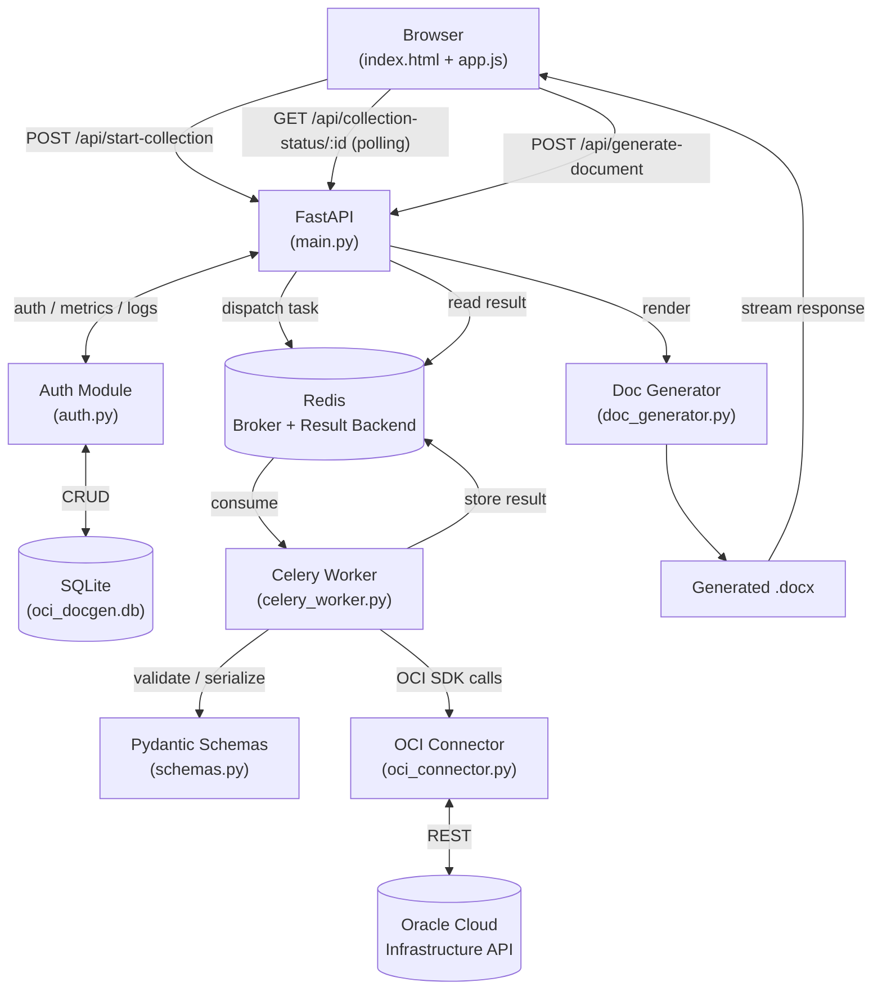

# OCI DocGen

<p align="center">
  <strong>Automated technical documentation for Oracle Cloud Infrastructure.</strong>
</p>

<p align="center">
  
  
  
  
  
  
  
</p>

---

**OCI DocGen** is a full-stack web application that automates the creation of technical infrastructure documentation for Oracle Cloud Infrastructure. It performs a full compartment scan, collects data across compute, networking, storage, security, and connectivity resources, and produces a formatted `.docx` document ready for delivery.

---

## Table of Contents

- [Features](#features)
- [Documentation Modes](#documentation-modes)
- [OCI Resources Covered](#oci-resources-covered)
- [Architecture](#architecture)
- [Project Structure](#project-structure)
- [Local Setup](#local-setup)
- [Production Deployment](#production-deployment)
  - [Docker](#docker)
  - [Bare VM](#bare-vm)
- [OCI IAM Permissions](#oci-iam-permissions)
- [SSL/TLS Reference](#ssltls-reference)
- [Contributing](#contributing)

---

## Features

- **Four document modes** — New Host, Full Infrastructure, Kubernetes (OKE), and WAF Report, each with a specific resource scope.
- **Asynchronous collection** — Celery and Redis execute OCI API calls in the background, with real-time progress feedback in the browser via polling.
- **Interactive summary** — Before generating, the collected dataset is rendered in a collapsible panel for user review and validation.
- **Visual state indicators** — Lifecycle states (TERMINATED, STOPPED, PENDING_DELETION) are highlighted with color in both the interface and the generated document.
- **VPN tunnel status** — DOWN tunnels flagged in amber; UP tunnels in soft green. Subtle enough to remain clean in documents with many tunnels.
- **Full DRG and VPN coverage** — Dynamic Routing Gateways with VCN name resolution on attachments, RPCs, CPEs, and IPSec tunnels with Phase 1/2, IKE, BGP, and Oracle compliance validation.
- **WAF and Certificates** — Full WAF policies: actions, access control, rate limiting, protection rules, firewall bindings, and complete TLS certificate lifecycle (SANs, validity, stages, associations).
- **Bilingual (PT-BR / EN)** — Interface, progress messages, and generated document are fully bilingual with instant switching.
- **Image attachments** — Upload diagrams or screenshots to embed in the document before or after the infrastructure section.
- **User management** — Multi-user authentication with role-based access control (admin / regular), groups with per-document-type permissions, per-user generation history, and a metrics dashboard.
- **Metrics dashboard** — Time-series chart (spline/bar/pie) of generation volume by type, KPIs, and per-user breakdown.

---

## Documentation Modes

| Mode                    | `doc_type`   | Scope                                                                                            |
| :---------------------- | :----------- | :----------------------------------------------------------------------------------------------- |
| **New Host**            | `new_host`   | Specific instances: shape, volumes, OS, network rules.                                           |
| **Full Infrastructure** | `full_infra` | Complete report: instances, volumes, VCN, load balancers, certificates, WAF, DRG, VPN, OKE.      |
| **Kubernetes (OKE)**    | `kubernetes` | OKE clusters, node pools, networking, and API endpoints.                                         |
| **WAF Report**          | `waf_report` | WAF policies, firewalls, LB binding, certificates (full lifecycle), and associated VCN topology. |

---

## OCI Resources Covered

| Category           | Resource          | Collected Details                                              |
| :----------------- | :---------------- | :------------------------------------------------------------- |
| **Compute**        | Instances         | Shape, OCPUs, memory, OS, lifecycle state, private/public IPs  |
| **Storage**        | Boot Volumes      | Size, backup policy                                            |
|                    | Block Volumes     | Size, backup policy, attachment status                         |
|                    | Volume Groups     | Members, policy validation, replication target                 |
| **Networking**     | VCNs              | CIDR, subnets, security lists, route tables, NSGs, LPGs        |
|                    | Security Lists    | Ingress/egress rules with protocol, ports, source/destination  |
|                    | NSGs              | Rules with name resolution                                     |
|                    | Route Tables      | Rules with target entity resolution (IGW, NAT, SGW, LPG, DRG)  |
|                    | LPGs              | Peering status, advertised CIDR, cross-tenancy flag            |
| **Load Balancing** | Load Balancers    | Shape, IPs, listeners, backend sets, health checkers, backends |
| **Security**       | WAF Policies      | Actions, access control, rate limiting, protection rules       |
|                    | Web App Firewalls | Instance, LB binding, enforcement point                        |
|                    | OCI Certificates  | Common name, SANs, algorithms, validity, stages, associations  |
| **Connectivity**   | DRGs              | Attachments (with resolved VCN name), route tables, RPCs       |
|                    | CPEs              | IP address, vendor                                             |
|                    | IPSec VPN         | Tunnels, Phase 1/2, IKE, BGP, Oracle compliance validation     |
| **Containers**     | OKE Clusters      | Kubernetes version, VCN, endpoint visibility, LB subnet        |
|                    | Node Pools        | Shape, OCPU/memory, OS, node count, boot volume, subnet        |

---

## Architecture


```mermaid
flowchart TD
    Browser["Browser\n(index.html + app.js)"]
    FastAPI["FastAPI\n(main.py)"]
    Auth["Auth Module\n(auth.py)"]
    SQLite[("SQLite\n(oci_docgen.db)")]
    Redis[("Redis\nBroker + Result Backend")]
    Celery["Celery Worker\n(celery_worker.py)"]
    Schemas["Pydantic Schemas\n(schemas.py)"]
    OCI["OCI Connector\n(oci_connector.py)"]
    DocGen["Doc Generator\n(doc_generator.py)"]
    OCI_API[("Oracle Cloud\nInfrastructure API")]
    DOCX["Generated .docx"]

    Browser -->|"POST /api/start-collection"| FastAPI
    FastAPI -->|"dispatch task"| Redis
    Redis -->|"consume"| Celery
    Celery -->|"validate / serialize"| Schemas
    Celery -->|"OCI SDK calls"| OCI
    OCI <-->|"REST"| OCI_API
    Celery -->|"store result"| Redis
    Browser -->|"GET /api/collection-status/:id (polling)"| FastAPI
    FastAPI -->|"read result"| Redis
    Browser -->|"POST /api/generate-document"| FastAPI
    FastAPI -->|"render"| DocGen
    DocGen --> DOCX
    DOCX -->|"stream response"| Browser
    FastAPI <-->|"auth / metrics / logs"| Auth
    Auth <-->|"CRUD"| SQLite
```

**Maintenance notes:**

- **Parallel collection**: `ThreadPoolExecutor` in `oci_connector.py` fetches instance details concurrently. Tune `MAX_WORKERS_FOR_DETAILS` if OCI API throttling occurs (HTTP 429).
- **`getattr()` instead of `to_dict()`**: OCI SDK certificate objects do not always implement `to_dict()`. The entire certificate pipeline uses `getattr()` for cross-version SDK compatibility.
- **Certificates as `dict`**: Structure varies by certificate type (`IMPORTED`, `MANAGED_INTERNALLY`, `ISSUED_BY_INTERNAL_CA`). Stored as raw dicts to avoid a rigid Pydantic schema.
- **Certificate version attribute naming**: `list_certificates` exposes `.current_version_summary`; `get_certificate` exposes `.current_version` — different names for the same concept. Handled in `_get_compartment_certificates`.
- **Redis as broker and result backend**: A single Redis instance manages both the task queue and task results. No external database is involved in the collection pipeline.
- **WAF backward compatibility**: `WafPolicyData.integration` holds the first firewall integration; `WafPolicyData.integrations` holds the full list. Both fields are maintained to avoid breaking existing flows.

---

## Project Structure

```
oci-docgen/
├── backend/
│   ├── main.py              # FastAPI — all REST endpoints
│   ├── celery_worker.py     # Celery task definitions
│   ├── oci_connector.py     # OCI SDK integration and data collection
│   ├── doc_generator.py     # .docx generation engine (i18n-aware)
│   ├── auth.py              # Authentication, sessions, metrics, groups
│   ├── schemas.py           # Pydantic models (data contract)
│   ├── requirements.txt     # Python dependencies
│   └── generated_docs/      # Runtime output directory (gitignored)
└── frontend/
    ├── index.html           # SPA shell
    ├── css/style.css        # Design system
    ├── js/app.js            # Frontend logic — rendering, API calls, UI state
    └── locales/
        ├── pt.json          # PT-BR translations
        └── en.json          # EN translations
```

---

## Local Setup

### Prerequisites

- Python 3.10+
- Redis running locally
- OCI tenancy with read permissions and `~/.oci/config` configured

### OCI Authentication

**API Key** (default — local development):

```bash
oci setup config
# https://docs.oracle.com/en-us/iaas/Content/API/Concepts/sdkconfig.htm
```

**Instance Principal** (production on OCI VMs):

```bash
export OCI_AUTH_METHOD=INSTANCE_PRINCIPAL
```

### Running

Three terminals are required from the project root.

**Terminal 1 — Redis**

```bash
redis-server
```

**Terminal 2 — FastAPI**

```bash
cd backend
python -m venv .venv && source .venv/bin/activate
pip install -r requirements.txt
uvicorn main:app --reload --port 8000
```

**Terminal 3 — Celery Worker**

```bash
cd backend
source .venv/bin/activate
celery -A celery_worker.celery_app worker --loglevel=info
```

**Frontend**

Open `frontend/index.html` directly in the browser, or serve it with:

```bash
python -m http.server 3000 --directory frontend
```

---

## Production Deployment

Two deployment strategies are documented: **Docker** (recommended for portability and quick setup) and **Bare VM** (for environments where container runtimes are not available or not desired).

---

## Docker

### Prerequisites

- Docker 24+ and Docker Compose v2+
- OCI credentials available on the host (`~/.oci/config` for API Key, or Instance Principal if running on an OCI VM)

### 1. Project files

Create the following files at the project root.

**`Dockerfile`** — builds the backend image:

```dockerfile
FROM python:3.11-slim

WORKDIR /app

RUN apt-get update && apt-get install -y --no-install-recommends \
    gcc libffi-dev && \
    rm -rf /var/lib/apt/lists/*

COPY backend/requirements.txt .
RUN pip install --no-cache-dir -r requirements.txt gunicorn

COPY backend/ .

RUN mkdir -p generated_docs

EXPOSE 8000

CMD ["gunicorn", \
     "--workers", "4", \
     "--worker-class", "uvicorn.workers.UvicornWorker", \
     "--bind", "0.0.0.0:8000", \
     "--timeout", "300", \
     "main:app"]
```

**`docker-compose.yml`**:

```yaml
services:
  redis:
    image: redis:7-alpine
    restart: unless-stopped
    volumes:
      - redis_data:/data

  api:
    build: .
    restart: unless-stopped
    ports:
      - "8000:8000"
    environment:
      - OCI_AUTH_METHOD=API_KEY # or INSTANCE_PRINCIPAL
      - CELERY_BROKER_URL=redis://redis:6379/0
      - CELERY_RESULT_BACKEND=redis://redis:6379/0
    volumes:
      - ~/.oci:/root/.oci:ro # remove if using Instance Principal
      - app_data:/app/generated_docs
      - db_data:/app
    depends_on:
      - redis

  worker:
    build: .
    restart: unless-stopped
    command:
      [
        "celery",
        "-A",
        "celery_worker.celery_app",
        "worker",
        "--loglevel=INFO",
        "--concurrency=4",
      ]
    environment:
      - OCI_AUTH_METHOD=API_KEY # or INSTANCE_PRINCIPAL
      - CELERY_BROKER_URL=redis://redis:6379/0
      - CELERY_RESULT_BACKEND=redis://redis:6379/0
    volumes:
      - ~/.oci:/root/.oci:ro # remove if using Instance Principal
      - app_data:/app/generated_docs
      - db_data:/app
    depends_on:
      - redis

  frontend:
    image: nginx:alpine
    restart: unless-stopped
    ports:
      - "80:80"
    volumes:
      - ./frontend:/usr/share/nginx/html:ro
      - ./nginx.conf:/etc/nginx/conf.d/default.conf:ro
    depends_on:
      - api

volumes:
  redis_data:
  app_data:
  db_data:
```

**`nginx.conf`**:

```nginx
server {
    listen 80;

    location / {
        root /usr/share/nginx/html;
        try_files $uri $uri/ /index.html;
    }

    location /api {
        proxy_pass http://api:8000;
        proxy_set_header Host $host;
        proxy_set_header X-Real-IP $remote_addr;
        proxy_set_header X-Forwarded-For $proxy_add_x_forwarded_for;
        proxy_set_header X-Forwarded-Proto $scheme;
        proxy_read_timeout 120s;
        proxy_connect_timeout 75s;
        proxy_buffer_size 128k;
        proxy_buffers 4 256k;
    }
}
```

### 2. Build and start

```bash
docker compose up -d --build
docker compose logs -f          # follow logs across all services
```

### 3. Verify

```bash
docker compose ps                         # all services should show "running"
curl http://localhost:8000/health         # API health check
```

### 4. Useful commands

```bash
# Restart only the worker after a code change
docker compose up -d --build worker

# Open a shell inside the API container
docker compose exec api bash

# Stop and remove all containers (data volumes are preserved)
docker compose down

# Stop and remove containers AND volumes (full reset)
docker compose down -v
```

> **Instance Principal on OCI VM**: Remove the `~/.oci:/root/.oci:ro` volume mounts and set `OCI_AUTH_METHOD=INSTANCE_PRINCIPAL`. The containers will automatically use the VM's instance principal credentials.

---

## Bare VM

### 1. System user and directories

```bash
sudo useradd --system --shell /usr/sbin/nologin --home /var/www/oci-docgen docgen_user
sudo mkdir -p /var/www/oci-docgen
sudo chown -R docgen_user:docgen_user /var/www/oci-docgen
```

### 2. Application setup

```bash
sudo -u docgen_user python3 -m venv /var/www/oci-docgen/backend/venv
sudo -u docgen_user /var/www/oci-docgen/backend/venv/bin/pip install -r /var/www/oci-docgen/backend/requirements.txt
sudo -u docgen_user /var/www/oci-docgen/backend/venv/bin/pip install gunicorn
```

### 3. systemd — API

`/etc/systemd/system/ocidocgen-api.service`:

```ini
[Unit]
Description=OCI DocGen - API
After=network.target redis-server.service

[Service]
User=docgen_user
Group=docgen_user
WorkingDirectory=/var/www/oci-docgen/backend
Environment="OCI_AUTH_METHOD=INSTANCE_PRINCIPAL"
ExecStart=/var/www/oci-docgen/backend/venv/bin/gunicorn \
    --workers 4 \
    --worker-class uvicorn.workers.UvicornWorker \
    --bind 127.0.0.1:8000 \
    --timeout 300 \
    main:app
Restart=always
RestartSec=5

[Install]
WantedBy=multi-user.target
```

### 4. systemd — Celery Worker

`/etc/systemd/system/ocidocgen-worker.service`:

```ini
[Unit]
Description=OCI DocGen - Celery Worker
After=network.target redis-server.service

[Service]
User=docgen_user
Group=docgen_user
WorkingDirectory=/var/www/oci-docgen/backend
Environment="OCI_AUTH_METHOD=INSTANCE_PRINCIPAL"
ExecStart=/var/www/oci-docgen/backend/venv/bin/celery \
    -A celery_worker.celery_app worker \
    --loglevel=INFO \
    --concurrency=4
Restart=always
RestartSec=10

[Install]
WantedBy=multi-user.target
```

```bash
sudo systemctl daemon-reload
sudo systemctl enable --now ocidocgen-api ocidocgen-worker
sudo systemctl status ocidocgen-api ocidocgen-worker
```

### 5. Nginx

`/etc/nginx/sites-available/ocidocgen`:

```nginx
server {
    listen 80;
    server_name your_domain_or_ip;

    location / {
        root /var/www/oci-docgen/frontend;
        try_files $uri $uri/ /index.html;
    }

    location /api {
        proxy_pass http://127.0.0.1:8000;
        proxy_set_header Host $host;
        proxy_set_header X-Real-IP $remote_addr;
        proxy_set_header X-Forwarded-For $proxy_add_x_forwarded_for;
        proxy_set_header X-Forwarded-Proto $scheme;
        proxy_read_timeout 120s;
        proxy_connect_timeout 75s;
        proxy_buffer_size 128k;
        proxy_buffers 4 256k;
    }
}
```

```bash
sudo ln -s /etc/nginx/sites-available/ocidocgen /etc/nginx/sites-enabled/
sudo nginx -t && sudo systemctl restart nginx
```

> **HTTPS** with Let's Encrypt:
>
> ```bash
> sudo apt install certbot python3-certbot-nginx -y
> sudo certbot --nginx -d your_domain.com
> ```

---

## OCI IAM Permissions

The application requires **read-only** access. In production, use **Instance Principal**.

### Dynamic Group

**Identity & Security > Dynamic Groups > Create Dynamic Group**

```
All {instance.id = 'ocid1.instance.oc1..[INSTANCE_OCID]'}
```

Or for all instances in a compartment:

```
All {instance.compartment.id = 'ocid1.compartment.oc1..[COMPARTMENT_OCID]'}
```

### IAM Policies

**Identity & Security > Policies > Create Policy**

```
allow dynamic-group 'oci-docgen-dg' to read compartments in tenancy
allow dynamic-group 'oci-docgen-dg' to read instance-family in tenancy
allow dynamic-group 'oci-docgen-dg' to read volume-family in tenancy
allow dynamic-group 'oci-docgen-dg' to read virtual-network-family in tenancy
allow dynamic-group 'oci-docgen-dg' to read load-balancers in tenancy
allow dynamic-group 'oci-docgen-dg' to read cluster-family in tenancy
allow dynamic-group 'oci-docgen-dg' to read drg-family in tenancy
allow dynamic-group 'oci-docgen-dg' to read ipsec-connections in tenancy
allow dynamic-group 'oci-docgen-dg' to read cpes in tenancy
allow dynamic-group 'oci-docgen-dg' to read waf-family in tenancy
allow dynamic-group 'oci-docgen-dg' to read leaf-certificate-family in tenancy
allow dynamic-group 'oci-docgen-dg' to use network-security-groups in tenancy where any {
    request.permission='NETWORK_SECURITY_GROUP_LIST_SECURITY_RULES',
    request.permission='NETWORK_SECURITY_GROUP_LIST_MEMBERS'
}
```

> All verbs are `read` or restricted `use`. The application never creates, modifies, or deletes OCI resources.

Reference: [OCI IAM Policy Reference](https://docs.oracle.com/en-us/iaas/Content/Identity/Reference/policyreference.htm)

---

## SSL/TLS Reference

OCI Load Balancer supports three SSL modes. Understanding which is in use is necessary to correctly interpret the generated documentation.

| Mode                | Client to LB            | LB to Backend | LB holds certificate |
| :------------------ | :---------------------- | :------------ | :------------------- |
| **SSL Termination** | HTTPS                   | HTTP          | Yes                  |
| **SSL Tunneling**   | HTTPS (TCP passthrough) | HTTPS         | No                   |
| **End-to-End SSL**  | HTTPS                   | HTTPS         | Yes (both sides)     |

**How to identify in the generated document:**

- **Listeners** table: protocol and associated TLS certificate.
- **Backend Sets** table: indicates whether SSL is active on the backend.
- In SSL Tunneling, the listener appears as `TCP:443` with no certificate — this is expected and correct behavior.

> Reference: [Load Balancing SSL Traffic in OCI — Oracle A-Team](https://www.ateam-oracle.com/load-balancing-ssl-traffic-in-oci)

---

## Contributing

1. Fork the repository
2. Create a branch: `git checkout -b feature/feature-name`
3. Commit: `git commit -m 'feat: description'`
4. Push and open a Pull Request

---

Developed by **Pedro Teixeira** · [github.com/Pedr0Teixeira/oci-docgen](https://github.com/Pedr0Teixeira/oci-docgen)

<sub>OCI DocGen is an independent open-source project, not affiliated with or endorsed by Oracle Corporation.</sub>
