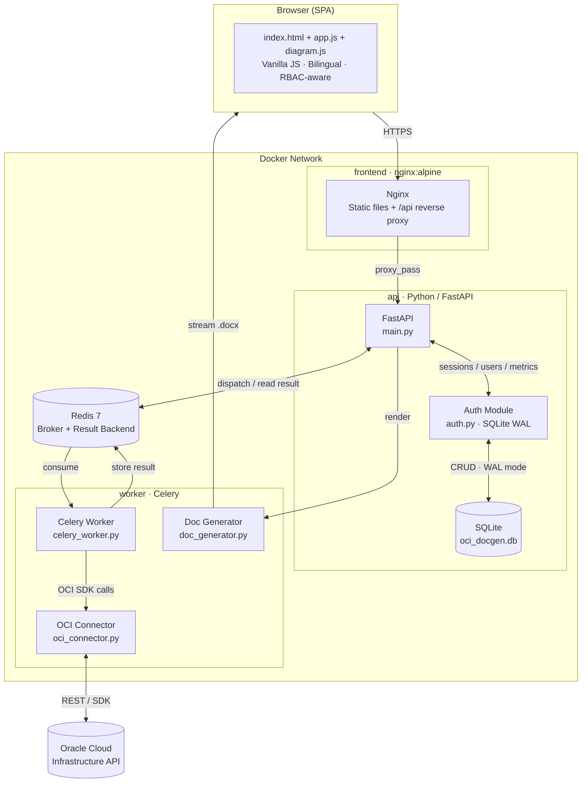
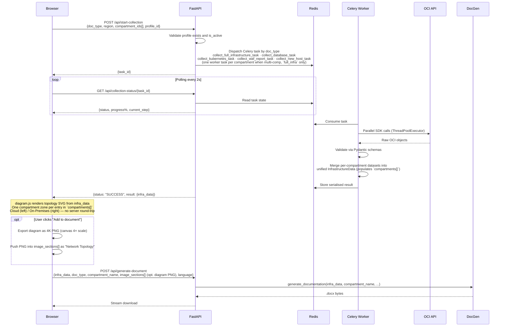
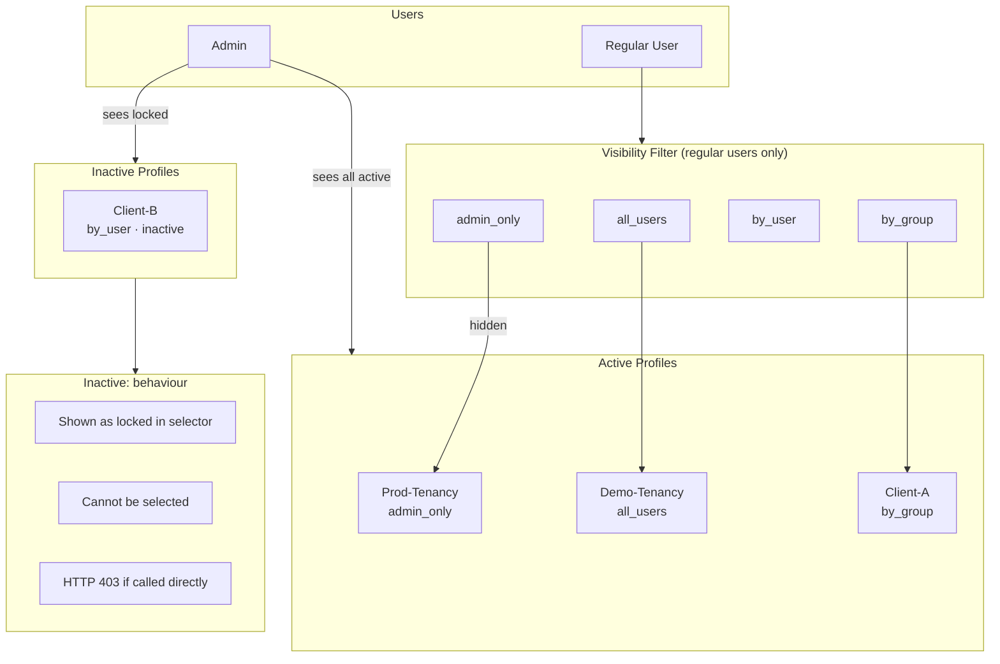
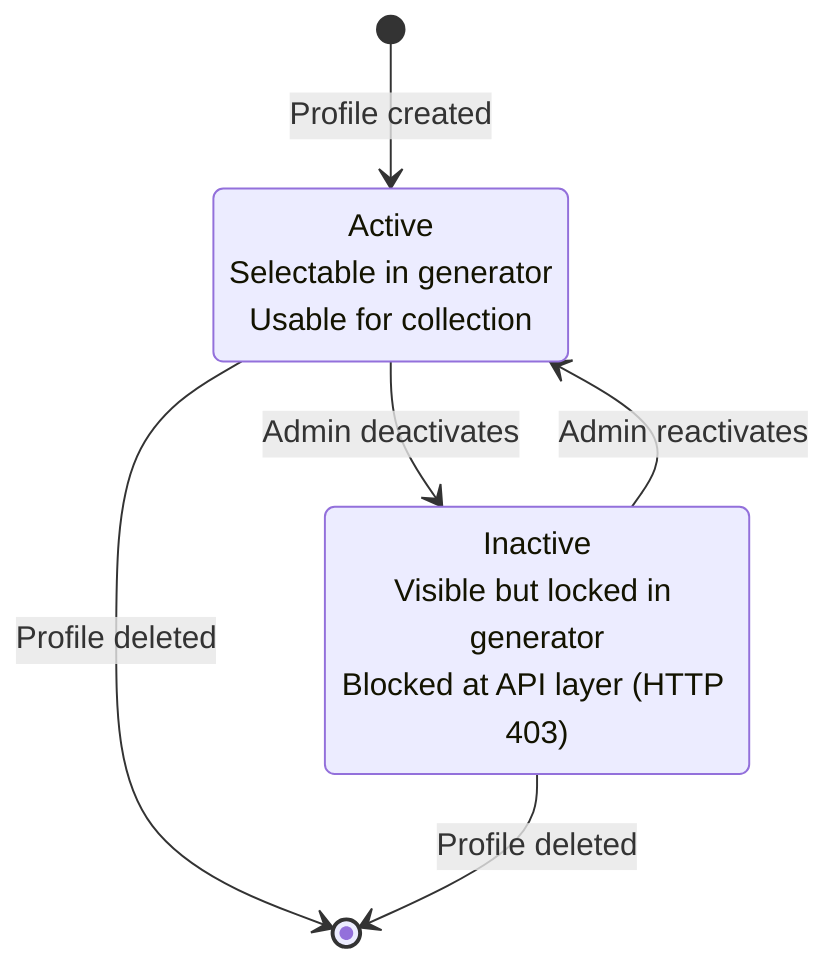
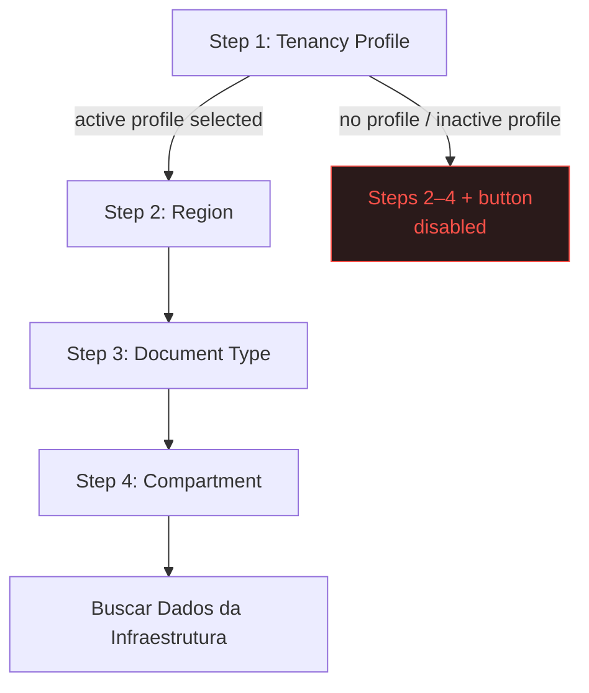
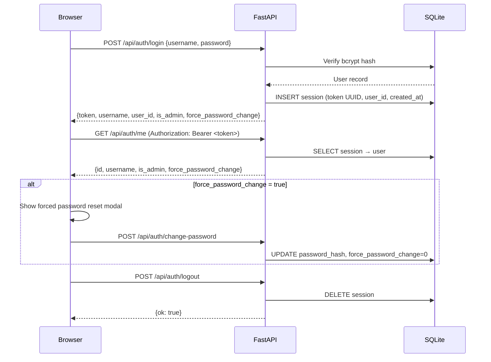
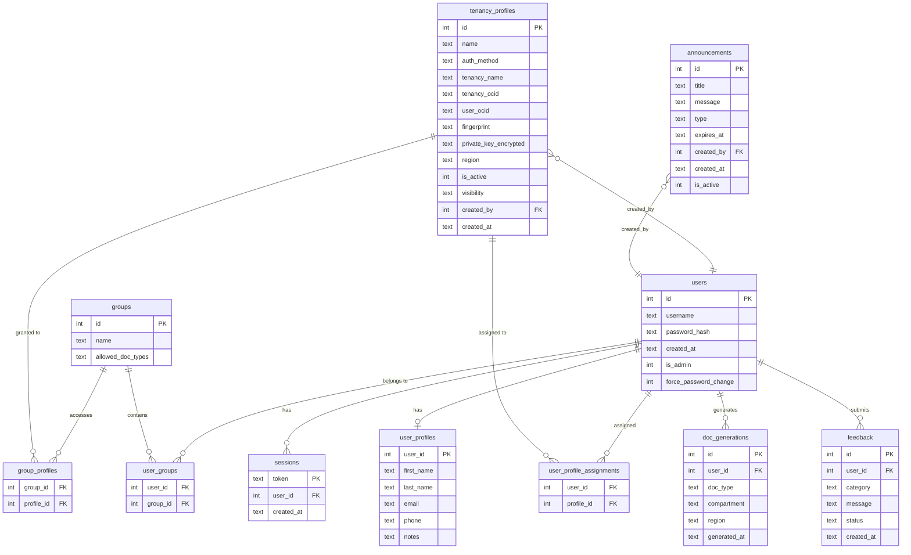
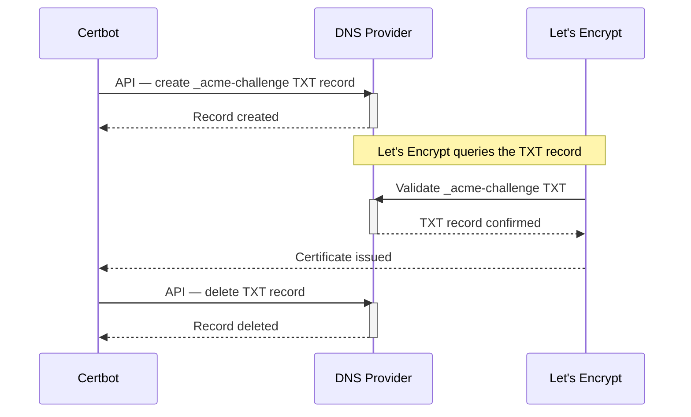
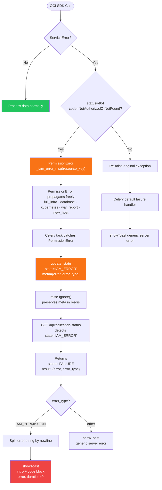

# OCI DocGen

<p align="center">
  <strong>Automated technical documentation for Oracle Cloud Infrastructure.</strong><br/>
  <sub>Multi-tenant · Bilingual (PT-BR / EN) · Async collection · Role-based access</sub>
</p>

<p align="center">
  
  
  
  
  
  
  
</p>

---

**OCI DocGen** is a full-stack web application that automates the creation of technical infrastructure documentation for Oracle Cloud Infrastructure. It performs a full compartment scan, collects data across compute, networking, storage, security, and connectivity resources, and produces a formatted `.docx` document ready for delivery — all from a clean browser interface, without requiring any local OCI tooling on the end user's machine.

Credentials are stored encrypted server-side as **Tenancy Profiles**, allowing a single OCI DocGen instance to serve multiple tenancies, teams, and clients — each with its own access controls.

---

## Table of Contents

- [Features](#features)
- [Documentation Modes](#documentation-modes)
- [OCI Resources Covered](#oci-resources-covered)
- [Architecture](#architecture)
- [System Overview](#system-overview)
- [Async Collection Pipeline](#async-collection-pipeline)
- [Tenancy Profile Access Model](#tenancy-profile-access-model)
- [Profile Lifecycle and Active State](#profile-lifecycle-and-active-state)
- [Generator Wizard — Step Dependency Model](#generator-wizard--step-dependency-model)
- [Authentication & Session Flow](#authentication--session-flow)
- [Data Model](#data-model)
- [Project Structure](#project-structure)
- [Local Setup](#local-setup)
- [Production Deployment](#production-deployment)
- [Docker (Recommended)](#docker-recommended)
- [Bare VM](#bare-vm)
- [HTTPS with Let's Encrypt](#https-with-lets-encrypt)
  - [How it works](#how-it-works)
  - [Step 1 — Install Certbot and the DNS plugin](#step-1--install-certbot-and-the-dns-plugin)
  - [Step 2 — Configure DNS credentials](#step-2--configure-dns-credentials)
  - [Step 3 — Obtain the certificate](#step-3--obtain-the-certificate)
  - [Step 4 — Enable HTTPS in the frontend container](#step-4--enable-https-in-the-frontend-container)
  - [Step 5 — Update `.env`](#step-5--update-env)
  - [Step 6 — Rebuild and verify](#step-6--rebuild-and-verify)
  - [Step 7 — Automatic renewal hook](#step-7--automatic-renewal-hook)
  - [DNS Provider Reference](#dns-provider-reference)
- [Admin Guide](#admin-guide)
- [First Login](#first-login)
- [Tenancy Profiles](#tenancy-profiles)
- [Groups & Permissions](#groups--permissions)
- [User Management](#user-management)
- [OCI IAM Permissions](#oci-iam-permissions)
- [API Reference](#api-reference)
- [Swagger UI](#swagger-ui)
- [SSL/TLS Reference](#ssltls-reference)
- [Engineering Notes](#engineering-notes)
- [Contributing](#contributing)

---

## Features

- **Five document modes** — New Host, Full Infrastructure, Database (DBaaS), Kubernetes (OKE), and WAF Report, each scoped to a specific set of OCI resources.
- **Tenancy Profiles** — Admins register OCI credentials (API Key or Instance Principal) as named profiles, encrypted at rest with Fernet (AES-128-CBC). Users never handle raw keys.
- **Profile active/inactive state** — Profiles can be deactivated without deletion. Inactive profiles appear as locked items in the generator selector and are blocked from use at both the UI and API layers.
- **4-tier visibility model** — Each profile can be scoped to `admin_only`, `all_users`, specific groups (`by_group`), or individually assigned users (`by_user`).
- **Wizard step dependency enforcement** — Generator steps for region, document type, and compartment are locked until an active profile is selected. Selecting an inactive profile clears downstream state immediately.
- **Asynchronous collection** — Celery and Redis execute OCI API calls in the background, with real-time progress feedback via polling. No page refresh needed.
- **Multi-compartment collection** — A single collection request can target one or more compartments. Resources are aggregated into a unified dataset, the diagram renders a distinct zone per compartment, and the generated document header uses a `Compartimento` / `Compartimentos` label that pluralizes automatically based on the number of selected compartments.
- **Interactive summary** — Before generating, the collected dataset is rendered in a collapsible panel for review and validation. In multi-compartment mode, every resource card (instances, volumes, LBs, OKE, etc.) carries a color-coded compartment badge so users can tell at a glance where each resource lives; in single-compartment mode the badges are hidden to keep the view clean.
- **Network topology diagram** — After collection, a live SVG architecture diagram is rendered directly in the browser with a horizontal flow layout (Cloud on the left, On-Premises on the right). It renders every collected compartment as its own zone, VCNs with subnets and gateways, instances with shape/private IP/public IP labels and NSG badges, Volume Groups as container cards with a tree-style list of member volumes and a prominent backup-policy indicator, DB Systems with edition/OCPUs/storage/nodes, Local Peering Gateways with same-tenancy peer-name resolution or a cross-tenancy globe icon for peerings across tenancies, subnet→gateway arrows with collapsed `N rotas` badges for dense routing, and IPSec tunnels to the on-premises zone. The diagram supports interactive zoom (mouse wheel / pinch), drag-to-pan, and touch gestures. It can be exported as a 4K PNG or added to the document as a "Network Topology" section with a single click.
- **Visual state indicators** — Lifecycle states (`TERMINATED`, `STOPPED`, `PENDING_DELETION`) are highlighted with color in both the interface and the generated document.
- **VPN tunnel status** — `DOWN` tunnels flagged in amber; `UP` tunnels in soft green.
- **Full DRG and VPN coverage** — Dynamic Routing Gateways with VCN name resolution on attachments, RPCs, CPEs, and IPSec tunnels with Phase 1/2, IKE, BGP, and Oracle compliance validation.
- **Database (DBaaS) coverage** — Bare-metal and VM DB Systems with full drill-down: DB nodes (hostname, state, fault domain), DB Homes, individual databases, PDB names, connection strings, character sets, workload type, and backup configuration (retention, window, destination). Available as a dedicated `database` document mode and also surfaced inside `full_infra` reports.
- **WAF and Certificates** — Full WAF policies: actions, access control, rate limiting, protection rules, firewall bindings, and complete TLS certificate lifecycle (SANs, validity, stages, associations).
- **Bilingual (PT-BR / EN)** — Interface, progress messages, and generated document are fully bilingual with instant switching.
- **Image attachments & letterhead** — Upload diagrams or screenshots to embed in the document. Admins can configure a custom letterhead (header, footer, and cover page images) and the document font via the admin panel.
- **Role-based access control** — Admins manage users, groups, and profiles. Regular users only see what they are permitted to see and generate.
- **Generation history** — Per-user log of all generated documents: type, compartment, region, and timestamp.
- **Metrics dashboard** — Time-series chart (spline/bar/pie) of generation volume by type, KPIs, and per-user breakdown. Visible to admins only.
- **Feedback system** — Built-in bug/suggestion reporting, accessible to all users. Admins can triage and change the status of each entry.
- **Announcements** — Admins can publish system-wide pinned notifications with optional expiry. Visible to all authenticated users via the topbar bell and megaphone buttons.
- **Force password change** — Admins can require a user to reset their password on next login.

---

## Documentation Modes

| Mode                    | `doc_type`   | Scope                                                                                                                    |
| :---------------------- | :----------- | :----------------------------------------------------------------------------------------------------------------------- |
| **New Host**            | `new_host`   | Specific instances: shape, volumes, OS, network rules.                                                                   |
| **Full Infrastructure** | `full_infra` | Complete report: instances, volumes, VCN, load balancers, certificates, WAF, DRG, VPN, OKE, DB Systems.                  |
| **Database (DBaaS)**    | `database`   | DB Systems, DB Homes, databases, DB Nodes, backup configuration, connection strings, and associated VCN/subnet topology. |
| **Kubernetes (OKE)**    | `kubernetes` | OKE clusters, node pools, networking, and API endpoints.                                                                 |
| **WAF Report**          | `waf_report` | WAF policies, firewalls, LB binding, certificates (full lifecycle), and associated VCN topology.                         |

---

## OCI Resources Covered

| Category           | Resource          | Collected Details                                                                                                                               |
| :----------------- | :---------------- | :---------------------------------------------------------------------------------------------------------------------------------------------- |
| **Compute**        | Instances         | Shape, OCPUs, memory, OS, lifecycle state, private/public IPs                                                                                   |
| **Storage**        | Boot Volumes      | Size, backup policy                                                                                                                             |
|                    | Block Volumes     | Size, backup policy, attachment status                                                                                                          |
|                    | Volume Groups     | Members, policy validation, replication target                                                                                                  |
| **Networking**     | VCNs              | CIDR, subnets, security lists, route tables, NSGs, LPGs                                                                                         |
|                    | Security Lists    | Ingress/egress rules with protocol, ports, source/destination                                                                                   |
|                    | NSGs              | Rules with name resolution                                                                                                                      |
|                    | Route Tables      | Rules with target entity resolution (IGW, NAT, SGW, LPG, DRG)                                                                                   |
|                    | LPGs              | Peering status, advertised CIDR, cross-tenancy flag, peer VCN name                                                                              |
| **Load Balancing** | Load Balancers    | Shape, IPs, listeners, backend sets, health checkers, backends                                                                                  |
| **Security**       | WAF Policies      | Actions, access control, rate limiting, protection rules                                                                                        |
|                    | Web App Firewalls | Instance, LB binding, enforcement point                                                                                                         |
|                    | OCI Certificates  | Common name, SANs, algorithms, validity, stages, associations                                                                                   |
| **Connectivity**   | DRGs              | Attachments (with resolved VCN name), route tables, RPCs                                                                                        |
|                    | CPEs              | IP address, vendor                                                                                                                              |
|                    | IPSec VPN         | Tunnels, Phase 1/2, IKE, BGP, Oracle compliance validation                                                                                      |
| **Containers**     | OKE Clusters      | Kubernetes version, VCN, endpoint visibility, LB subnet                                                                                         |
|                    | Node Pools        | Shape, OCPU/memory, OS, node count, boot volume, subnet                                                                                         |
| **Database**       | DB Systems        | Shape, edition, OCPUs, storage (GB), version, cluster name, time zone, license model, VCN/subnet, hostname, domain, data-guard, lifecycle state |
|                    | DB Nodes          | Hostname, state, fault domain, VNIC OCID                                                                                                        |
|                    | DB Homes          | Display name, DB version, lifecycle state                                                                                                       |
|                    | Databases         | Name, DB unique name, PDB name, character set, national charset, workload, connection strings                                                   |
|                    | Backup Config     | Auto-backup enabled, window, retention (days), destination                                                                                      |

---

## Architecture

### System Overview


```mermaid
flowchart TD
  subgraph Browser["Browser (SPA)"]
    UI["index.html + app.js + diagram.js<br/>Vanilla JS · Bilingual · RBAC-aware"]
  end

  subgraph DockerNetwork["Docker Network"]
    subgraph Frontend["frontend · nginx:alpine"]
      Nginx["Nginx<br/>Static files + /api reverse proxy"]
    end

    subgraph API["api · Python / FastAPI"]
      FastAPI["FastAPI<br/>main.py"]
      Auth["Auth Module<br/>auth.py · SQLite WAL"]
      SQLite[("SQLite<br/>oci_docgen.db")]
    end

    subgraph Worker["worker · Celery"]
      Celery["Celery Worker<br/>celery_worker.py"]
      Connector["OCI Connector<br/>oci_connector.py"]
      DocGen["Doc Generator<br/>doc_generator.py"]
    end

    Redis[("Redis 7<br/>Broker + Result Backend")]
  end

  OCI_API[("Oracle Cloud<br/>Infrastructure API")]

  Browser -->|"HTTPS"| Nginx
  Nginx -->|"proxy_pass"| FastAPI
  FastAPI <-->|"sessions / users / metrics"| Auth
  Auth <-->|"CRUD · WAL mode"| SQLite
  FastAPI <-->|"dispatch / read result"| Redis
  Redis -->|"consume"| Celery
  Celery -->|"OCI SDK calls"| Connector
  Connector <-->|"REST / SDK"| OCI_API
  Celery -->|"store result"| Redis
  FastAPI -->|"render"| DocGen
  DocGen -->|"stream .docx"| Browser
```

### Async Collection Pipeline


```mermaid
sequenceDiagram
  participant B as Browser
  participant A as FastAPI
  participant R as Redis
  participant C as Celery Worker
  participant O as OCI API

  B->>A: POST /api/start-collection<br/>{doc_type, region, compartment_ids[], profile_id}
  A->>A: Validate profile exists and is_active
  A->>R: Dispatch Celery task by doc_type<br/>collect_full_infrastructure_task · collect_database_task<br/>collect_kubernetes_task · collect_waf_report_task · collect_new_host_task<br/>(one worker task per compartment when multi-comp, `full_infra` only)
  A-->>B: {task_id}

  loop Polling every 2s
    B->>A: GET /api/collection-status/{task_id}
    A->>R: Read task state
    A-->>B: {status, progress%, current_step}
  end

  C->>R: Consume task
  C->>O: Parallel SDK calls (ThreadPoolExecutor)
  O-->>C: Raw OCI objects
  C->>C: Validate via Pydantic schemas
  C->>C: Merge per-compartment datasets into<br/>unified InfrastructureData (populates `compartments[]`)
  C->>R: Store serialised result

  A-->>B: {status: "SUCCESS", result: {infra_data}}

  Note over B: diagram.js renders topology SVG from infra_data<br/>One compartment zone per entry in `compartments[]`<br/>Cloud (left) / On-Premises (right) — no server round-trip

  opt User clicks "Add to document"
    B->>B: Export diagram as 4K PNG (canvas 4× scale)
    B->>B: Push PNG into image_sections[] as "Network Topology"
  end

  B->>A: POST /api/generate-document<br/>{infra_data, doc_type, compartment_name, image_sections[] (opt. diagram PNG), language}
  A->>DocGen: generate_documentation(infra_data, compartment_name, ...)
  DocGen-->>A: .docx bytes
  A-->>B: Stream download
```

### Tenancy Profile Access Model

Admins create **Tenancy Profiles** — named credential sets (OCI API Key or Instance Principal) encrypted at rest. Each profile has a **visibility** tier that controls which users can select it in the generator, and an **active state** that controls whether it can be used at all.


```mermaid
flowchart TD
  subgraph Users["Users"]
    Admin["Admin"]
    Regular["Regular User"]
  end

  subgraph Visibility["Visibility Filter (regular users only)"]
    V_all["all_users"]
    V_group["by_group"]
    V_user["by_user"]
    V_admin["admin_only"]
  end

  subgraph ActiveProfiles["Active Profiles"]
    P1["Prod-Tenancy<br/>admin_only"]
    P2["Demo-Tenancy<br/>all_users"]
    P3["Client-A<br/>by_group"]
  end

  subgraph InactiveProfiles["Inactive Profiles"]
    P4["Client-B<br/>by_user · inactive"]
  end

  subgraph InactiveHandling["Inactive: behaviour"]
    I1["Shown as locked in selector"]
    I2["Cannot be selected"]
    I3["HTTP 403 if called directly"]
  end

  Admin -->|"sees all active"| ActiveProfiles
  Admin -->|"sees locked"| InactiveProfiles
  Regular --> Visibility
  V_all --> P2
  V_group --> P3
  V_admin -->|"hidden"| P1
  InactiveProfiles --> InactiveHandling
```

**Credential fields per profile:**

| Field          | Description                                           |
| :------------- | :---------------------------------------------------- |
| `auth_method`  | `API_KEY` or `INSTANCE_PRINCIPAL`                     |
| `tenancy_ocid` | OCI Tenancy OCID                                      |
| `user_ocid`    | OCI User OCID (API Key only)                          |
| `fingerprint`  | Key fingerprint (API Key only)                        |
| `private_key`  | PEM private key — **stored encrypted (Fernet/AES)**   |
| `region`       | Home region override                                  |
| `visibility`   | `admin_only` · `all_users` · `by_group` · `by_user`   |
| `is_active`    | `true` / `false` — controls usability, not visibility |

---

### Profile Lifecycle and Active State

A Tenancy Profile can be **deactivated** without being deleted. This is useful when credentials need to be temporarily suspended — for example, during a key rotation — without losing the profile configuration or group/user assignments.


```mermaid
stateDiagram-v2
  [*] --> Active: Profile created
  Active --> Inactive: Admin deactivates
  Inactive --> Active: Admin reactivates
  Active --> [*]: Profile deleted
  Inactive --> [*]: Profile deleted

  Active: Active<br/>Selectable in generator<br/>Usable for collection
  Inactive: Inactive<br/>Visible but locked in generator<br/>Blocked at API layer (HTTP 403)
```

**Behaviour when a profile is inactive:**

- The `/api/profiles` endpoint returns inactive profiles with `is_active: false`. They are included so the generator UI can display them as disabled items rather than silently omitting them.
- In the generator wizard, inactive profiles appear at the bottom of the profile selector with a lock icon and the label `Name — Inativo`. They cannot be selected.
- If a profile is deactivated after the user has already loaded the page (and it was previously selected), attempting to start a collection will receive an HTTP 403 response. The frontend automatically reloads the profile selector and clears the stale selection.
- At the API layer, `/api/start-collection` validates `is_active` before dispatching any Celery task, regardless of how the request was issued.

---

### Generator Wizard — Step Dependency Model

The generator is a sequential wizard. Steps 2–4 (Region, Document Type, Compartment) are disabled until a valid active profile is selected in Step 1. This prevents incomplete requests and avoids misleading data being fetched under an invalid context.


```mermaid
flowchart TD
  S1["Step 1: Tenancy Profile"]
  S2["Step 2: Region"]
  S3["Step 3: Document Type"]
  S4["Step 4: Compartment"]
  BTN["Buscar Dados da Infraestrutura"]

  S1 -->|"active profile selected"| S2
  S1 -->|"no profile / inactive profile"| LOCK["Steps 2–4 + button<br/>disabled"]
  S2 --> S3
  S3 --> S4
  S4 --> BTN

  classDef locked fill:#2a1a1a,stroke:#f85149,color:#f85149
  class LOCK locked
```

**Step locking rules:**

- On page load, if all visible profiles are inactive (or no profile matches the saved session), steps 2–4 are disabled immediately without making any API calls.
- When the user selects a profile, steps 2–4 are disabled while the selection is being validated. If the profile is active, they are re-enabled and `fetchRegions()` is called. If inactive, the selection is rejected with a toast message and steps remain locked.
- The fetch button performs a final validation before dispatching: it checks that `selectedProfileId` is set and that the corresponding profile in the local list is active. This is a fast, local check that runs before any network request.

---

### Authentication & Session Flow


```mermaid
sequenceDiagram
  participant B as Browser
  participant A as FastAPI
  participant DB as SQLite

  B->>A: POST /api/auth/login {username, password}
  A->>DB: Verify bcrypt hash
  DB-->>A: User record
  A->>DB: INSERT session (token UUID, user_id, created_at)
  A-->>B: {token, username, user_id, is_admin, force_password_change}

  B->>A: GET /api/auth/me (Authorization: Bearer <token>)
  A->>DB: SELECT session → user
  A-->>B: {id, username, is_admin, force_password_change}

  alt force_password_change = true
    B->>B: Show forced password reset modal
    B->>A: POST /api/auth/change-password
    A->>DB: UPDATE password_hash, force_password_change=0
  end

  B->>A: POST /api/auth/logout
  A->>DB: DELETE session
  A-->>B: {ok: true}
```

Session tokens are Bearer tokens sent in the `Authorization` header. The `force_password_change` flag is set by admins and enforced on the frontend before any other action is permitted.

---

## Data Model


```mermaid
erDiagram
  users {
    int id PK
    text username
    text password_hash
    text created_at
    int is_admin
    int force_password_change
  }
  sessions {
    text token PK
    int user_id FK
    text created_at
  }
  user_profiles {
    int user_id PK
    text first_name
    text last_name
    text email
    text phone
    text notes
  }
  groups {
    int id PK
    text name
    text allowed_doc_types
  }
  user_groups {
    int user_id FK
    int group_id FK
  }
  tenancy_profiles {
    int id PK
    text name
    text auth_method
    text tenancy_name
    text tenancy_ocid
    text user_ocid
    text fingerprint
    text private_key_encrypted
    text region
    int is_active
    text visibility
    int created_by FK
    text created_at
  }
  group_profiles {
    int group_id FK
    int profile_id FK
  }
  user_profile_assignments {
    int user_id FK
    int profile_id FK
  }
  doc_generations {
    int id PK
    int user_id FK
    text doc_type
    text compartment
    text region
    text generated_at
  }
  feedback {
    int id PK
    int user_id FK
    text category
    text message
    text status
    text created_at
  }
  announcements {
    int id PK
    text title
    text message
    text type
    text expires_at
    int created_by FK
    text created_at
    int is_active
  }

  users ||--o{ sessions : "has"
  users ||--o| user_profiles : "has"
  users ||--o{ user_groups : "belongs to"
  users ||--o{ doc_generations : "generates"
  users ||--o{ feedback : "submits"
  users ||--o{ user_profile_assignments : "assigned"
  groups ||--o{ user_groups : "contains"
  groups ||--o{ group_profiles : "accesses"
  tenancy_profiles ||--o{ group_profiles : "granted to"
  tenancy_profiles ||--o{ user_profile_assignments : "assigned to"
  tenancy_profiles }o--|| users : "created_by"
  announcements }o--|| users : "created_by"
```

---

## Project Structure

```
oci-docgen/
├── backend/
│   ├── Dockerfile
│   ├── main.py              # FastAPI — all REST endpoints
│   ├── celery_worker.py     # Celery tasks: OCI collection (full_infra, database, new_host, kubernetes, waf_report)
│   ├── oci_connector.py     # OCI SDK integration (parallel, profile-aware)
│   ├── doc_generator.py     # .docx rendering engine (bilingual, compartment-aware)
│   ├── auth.py              # Auth, sessions, RBAC, tenancy profiles, metrics, announcements
│   ├── schemas.py           # Pydantic models (data contract between API, Celery, DocGen)
│   ├── requirements.txt
│   └── generated_docs/      # Runtime output directory (gitignored)
├── frontend/
│   ├── Dockerfile
│   ├── index.html           # SPA shell
│   ├── css/
│   │   └── style.css        # Design system (dark/light mode, bilingual tooltips)
│   ├── js/
│   │   ├── app.js           # Frontend logic — wizard, rendering, API calls, UI state
│   │   └── diagram.js       # OCI architecture diagram engine — SVG layout, zoom/pan, PNG export
│   ├── nginx.conf           # Default HTTP config
│   ├── nginx.https.conf     # HTTPS template — copy over nginx.conf to enable TLS
│   └── locales/
│       ├── pt.json          # PT-BR translations
│       └── en.json          # EN translations
├── docker-compose.yml
└── .env.example             # Template — copy to .env and fill in values
```

---

## Local Setup

### Prerequisites

- Python 3.11+
- Redis running locally (`redis-server`)
- OCI tenancy with read permissions and `~/.oci/config` configured

### Environment Variables

Create a `.env` file at the project root:

```env
SECRET_KEY=your-random-secret-key-min-32-chars
OCI_AUTH_METHOD=API_KEY
REDIS_URL=redis://localhost:6379/0
FRONTEND_URL=http://localhost:3000
```

> `SECRET_KEY` is used to derive the Fernet encryption key for tenancy profile credentials. Use a strong random value and keep it consistent — changing it will invalidate all stored PEM keys.

### OCI Authentication

**API Key** (default — local development):

```bash
oci setup config
# https://docs.oracle.com/en-us/iaas/Content/API/Concepts/sdkconfig.htm
```

**Instance Principal** (production on OCI VMs):

```bash
export OCI_AUTH_METHOD=INSTANCE_PRINCIPAL
```

### Running

Three terminals are required from the project root.

**Terminal 1 — Redis**

```bash
redis-server
```

**Terminal 2 — FastAPI**

```bash
cd backend
python -m venv .venv && source .venv/bin/activate
pip install -r requirements.txt
uvicorn main:app --reload --port 8000
```

**Terminal 3 — Celery Worker**

```bash
cd backend
source .venv/bin/activate
celery -A celery_worker.celery_app worker --loglevel=info
```

**Frontend**

```bash
python -m http.server 3000 --directory frontend
# Open http://localhost:3000
```

---

## Production Deployment

### Docker (Recommended)

#### Prerequisites

- Docker 24+ and Docker Compose v2+
- OCI credentials on the host (`~/.oci/config` or Instance Principal on OCI VMs)

#### 1. Configuration

Create `.env` at the project root:

```env
SECRET_KEY=your-strong-random-secret-key
OCI_AUTH_METHOD=API_KEY
FRONTEND_PORT=80
FRONTEND_URL=http://your-domain-or-ip
```

#### 2. `Dockerfile` (backend)

```dockerfile
FROM python:3.11-slim

WORKDIR /app

RUN apt-get update && apt-get install -y --no-install-recommends \
    gcc libffi-dev && \
    rm -rf /var/lib/apt/lists/*

COPY requirements.txt .
RUN pip install --no-cache-dir -r requirements.txt gunicorn

COPY . .
RUN mkdir -p generated_docs

EXPOSE 8000

CMD ["gunicorn", \
     "--workers", "4", \
     "--worker-class", "uvicorn.workers.UvicornWorker", \
     "--bind", "0.0.0.0:8000", \
     "--timeout", "300", \
     "main:app"]
```

#### 3. `docker-compose.yml`

```yaml
services:
  redis:
    image: redis:7-alpine
    restart: unless-stopped
    volumes:
      - redis_data:/data
    healthcheck:
      test: ["CMD", "redis-cli", "ping"]
      interval: 10s
      timeout: 5s
      retries: 5

  api:
    build:
      context: ./backend
      dockerfile: Dockerfile
    restart: unless-stopped
    env_file: .env
    environment:
      REDIS_URL: redis://redis:6379/0
      DATA_DIR: /app/data
    volumes:
      - db_data:/app/data
      - ~/.oci:/root/.oci:ro # remove if using Instance Principal
    depends_on:
      redis:
        condition: service_healthy

  worker:
    build:
      context: ./backend
      dockerfile: Dockerfile
    restart: unless-stopped
    command: celery -A celery_worker.celery_app worker --loglevel=info --concurrency=4
    env_file: .env
    environment:
      REDIS_URL: redis://redis:6379/0
      DATA_DIR: /app/data
    volumes:
      - db_data:/app/data
      - ~/.oci:/root/.oci:ro # remove if using Instance Principal
    depends_on:
      redis:
        condition: service_healthy
      api:
        condition: service_healthy

  frontend:
    build:
      context: ./frontend
      dockerfile: Dockerfile
    restart: unless-stopped
    ports:
      - "${FRONTEND_PORT:-80}:80"
    depends_on:
      - api

volumes:
  redis_data:
  db_data:
```

#### 4. `nginx.conf`

```nginx
server {
    listen 80;

    location / {
        root /usr/share/nginx/html;
        try_files $uri $uri/ /index.html;
    }

    location /api {
        proxy_pass http://api:8000;
        proxy_set_header Host $host;
        proxy_set_header X-Real-IP $remote_addr;
        proxy_set_header X-Forwarded-For $proxy_add_x_forwarded_for;
        proxy_set_header X-Forwarded-Proto $scheme;
        proxy_read_timeout 120s;
        proxy_connect_timeout 75s;
        proxy_buffer_size 128k;
        proxy_buffers 4 256k;
    }
}
```

#### 5. Build and start

```bash
docker compose up -d --build
docker compose logs -f
```

#### 6. Verify

```bash
docker compose ps
curl http://localhost:8000/docs
```

#### Useful commands

```bash
# Rebuild only the frontend (after HTML/CSS/JS changes)
docker compose build --no-cache frontend
docker compose up -d frontend

# Rebuild only the backend (after Python changes)
docker compose build --no-cache api worker
docker compose up -d api worker

# Full rebuild
docker compose down
docker compose build --no-cache
docker compose up -d

# Open a shell inside the API container
docker compose exec api bash

# Remove containers and volumes (full reset)
docker compose down -v
```

> **Important:** HTML, CSS, and JS files are baked into the `frontend` image at build time. Copying files to the host folder has **no effect** on a running container. Always rebuild the frontend image after static file changes.

> **Instance Principal:** Remove the `~/.oci:/root/.oci:ro` volume mounts and set `OCI_AUTH_METHOD=INSTANCE_PRINCIPAL`. The containers will use the VM's instance principal credentials automatically.

---

### Bare VM

#### 1. System user and directories

```bash
sudo useradd --system --shell /usr/sbin/nologin --home /var/www/oci-docgen docgen_user
sudo mkdir -p /var/www/oci-docgen
sudo chown -R docgen_user:docgen_user /var/www/oci-docgen
```

#### 2. Application setup

```bash
sudo -u docgen_user python3 -m venv /var/www/oci-docgen/backend/venv
sudo -u docgen_user /var/www/oci-docgen/backend/venv/bin/pip install -r /var/www/oci-docgen/backend/requirements.txt
sudo -u docgen_user /var/www/oci-docgen/backend/venv/bin/pip install gunicorn
```

#### 3. systemd — API

`/etc/systemd/system/ocidocgen-api.service`:

```ini
[Unit]
Description=OCI DocGen - API
After=network.target redis-server.service

[Service]
User=docgen_user
Group=docgen_user
WorkingDirectory=/var/www/oci-docgen/backend
EnvironmentFile=/var/www/oci-docgen/.env
ExecStart=/var/www/oci-docgen/backend/venv/bin/gunicorn \
    --workers 4 \
    --worker-class uvicorn.workers.UvicornWorker \
    --bind 127.0.0.1:8000 \
    --timeout 300 \
    main:app
Restart=always
RestartSec=5

[Install]
WantedBy=multi-user.target
```

#### 4. systemd — Celery Worker

`/etc/systemd/system/ocidocgen-worker.service`:

```ini
[Unit]
Description=OCI DocGen - Celery Worker
After=network.target redis-server.service

[Service]
User=docgen_user
Group=docgen_user
WorkingDirectory=/var/www/oci-docgen/backend
EnvironmentFile=/var/www/oci-docgen/.env
ExecStart=/var/www/oci-docgen/backend/venv/bin/celery \
    -A celery_worker.celery_app worker \
    --loglevel=INFO \
    --concurrency=4
Restart=always
RestartSec=10

[Install]
WantedBy=multi-user.target
```

```bash
sudo systemctl daemon-reload
sudo systemctl enable --now ocidocgen-api ocidocgen-worker
sudo systemctl status ocidocgen-api ocidocgen-worker
```

#### 5. Nginx

`/etc/nginx/sites-available/ocidocgen`:

```nginx
server {
    listen 80;
    server_name your_domain_or_ip;

    location / {
        root /var/www/oci-docgen/frontend;
        try_files $uri $uri/ /index.html;
    }

    location /api {
        proxy_pass http://127.0.0.1:8000;
        proxy_set_header Host $host;
        proxy_set_header X-Real-IP $remote_addr;
        proxy_set_header X-Forwarded-For $proxy_add_x_forwarded_for;
        proxy_set_header X-Forwarded-Proto $scheme;
        proxy_read_timeout 120s;
        proxy_connect_timeout 75s;
        proxy_buffer_size 128k;
        proxy_buffers 4 256k;
    }
}
```

```bash
sudo ln -s /etc/nginx/sites-available/ocidocgen /etc/nginx/sites-enabled/
sudo nginx -t && sudo systemctl restart nginx
```

> **HTTPS:** See the [HTTPS with Let's Encrypt](#https-with-lets-encrypt) section for full instructions. The DNS-01 challenge flow described there works for both Docker and Bare VM deployments — just apply the `nginx.https.conf` template to `/etc/nginx/sites-available/ocidocgen` instead of to the Docker volume.

---

## HTTPS with Let's Encrypt

### How it works

Let's Encrypt issues free, trusted TLS certificates that expire every 90 days and renew automatically. The standard HTTP-01 challenge requires the server to be reachable from the internet on port 80 — which is not possible if your instance is on a private network or behind a VPN.

The solution is the **DNS-01 challenge**: instead of serving a file over HTTP, Certbot proves domain ownership by creating a temporary `TXT` record in your DNS zone via the provider's API. The server never needs to be publicly reachable. Certbot uses the same API to delete the record after validation and to renew automatically every ~60 days.


```mermaid
sequenceDiagram
    participant C as Certbot
    participant D as DNS Provider
    participant L as Let's Encrypt

    C->>D: API — create _acme-challenge TXT record
    activate D
    D-->>C: Record created
    deactivate D

    note over D,L: Let's Encrypt queries the TXT record
    L->>D: Validate _acme-challenge TXT
    activate D
    D-->>L: TXT record confirmed
    deactivate D

    L-->>C: Certificate issued

    C->>D: API — delete TXT record
    activate D
    D-->>C: Record deleted
    deactivate D
```

**Requirements before starting:**

- A domain name with DNS managed by a supported provider (see [DNS Provider Reference](#dns-provider-reference))
- A DNS `A` record pointing `your.domain.com` to your server's IP (private or public)
- `certbot` and the matching DNS plugin installed on the **host VM** (not inside Docker)

---

### Step 1 — Install Certbot and the DNS plugin

Install Certbot on the host VM and the plugin that matches your DNS provider.

**Cloudflare:**

```bash
sudo apt install -y certbot python3-certbot-dns-cloudflare
```

**AWS Route 53:**

```bash
sudo apt install -y certbot python3-certbot-dns-route53
```

**DigitalOcean:**

```bash
sudo apt install -y certbot python3-certbot-dns-digitalocean
```

**Registro.br / providers without a Certbot plugin:**

```bash
sudo apt install -y certbot
# Uses manual DNS-01 — see Step 2 for details.
```

> For a complete list of DNS plugins: [certbot.eff.org/docs/using.html#dns-plugins](https://eff.org/docs/using.html#dns-plugins)

---

### Step 2 — Configure DNS credentials

Each provider requires a credentials file that Certbot uses to authenticate with the DNS API.

#### Cloudflare

1. In the Cloudflare dashboard: **My Profile → API Tokens → Create Token**
2. Use the **"Edit zone DNS"** template. Restrict it to your zone:
   - Permissions: `Zone / DNS / Edit`
   - Zone Resources: `Include / Specific zone / yourdomain.com`
3. Copy the generated token.

```bash
sudo mkdir -p /etc/letsencrypt/dns-credentials
sudo nano /etc/letsencrypt/dns-credentials/cloudflare.ini
```

```ini
dns_cloudflare_api_token = YOUR_CLOUDFLARE_API_TOKEN
```

```bash
sudo chmod 600 /etc/letsencrypt/dns-credentials/cloudflare.ini
```

#### AWS Route 53

Certbot uses the standard AWS credentials chain. The IAM user or role needs the `route53:ChangeResourceRecordSets` and `route53:ListHostedZones` permissions.

```bash
sudo mkdir -p /etc/letsencrypt/dns-credentials
sudo nano /etc/letsencrypt/dns-credentials/route53.ini
```

```ini
[default]
aws_access_key_id     = YOUR_ACCESS_KEY_ID
aws_secret_access_key = YOUR_SECRET_ACCESS_KEY
```

```bash
sudo chmod 600 /etc/letsencrypt/dns-credentials/route53.ini
```

Set the credentials file for Certbot:

```bash
export AWS_CONFIG_FILE=/etc/letsencrypt/dns-credentials/route53.ini
```

#### DigitalOcean

1. In the DigitalOcean control panel: **API → Tokens → Generate New Token** (read + write scope).
2. Copy the token.

```bash
sudo mkdir -p /etc/letsencrypt/dns-credentials
sudo nano /etc/letsencrypt/dns-credentials/digitalocean.ini
```

```ini
dns_digitalocean_token = YOUR_DIGITALOCEAN_API_TOKEN
```

```bash
sudo chmod 600 /etc/letsencrypt/dns-credentials/digitalocean.ini
```

#### Registro.br / providers without an API plugin

Providers without a Certbot plugin require a **one-time manual validation** to issue the first certificate. Renewal uses the same manual step, so this approach is only recommended when no API plugin exists.

```bash
sudo certbot certonly \
  --manual \
  --preferred-challenges dns \
  -d your.domain.com \
  --email your@email.com \
  --agree-tos
```

Certbot will display a `TXT` record value. Log in to your DNS provider's dashboard, create a `_acme-challenge.your.domain.com TXT` record with that value, wait ~60 seconds, then press Enter to continue.

> For fully automated renewal with providers that have a REST API but no official Certbot plugin, you can use [acme.sh](https://acme.sh) which has a broader provider list, or write a custom `--manual-auth-hook` script that calls the provider's API.

---

### Step 3 — Obtain the certificate

Replace `your.domain.com` and `your@email.com` with real values.

**Cloudflare:**

```bash
sudo certbot certonly \
  --dns-cloudflare \
  --dns-cloudflare-credentials /etc/letsencrypt/dns-credentials/cloudflare.ini \
  -d your.domain.com \
  --email your@email.com \
  --agree-tos \
  --non-interactive
```

**AWS Route 53:**

```bash
sudo certbot certonly \
  --dns-route53 \
  -d your.domain.com \
  --email your@email.com \
  --agree-tos \
  --non-interactive
```

**DigitalOcean:**

```bash
sudo certbot certonly \
  --dns-digitalocean \
  --dns-digitalocean-credentials /etc/letsencrypt/dns-credentials/digitalocean.ini \
  -d your.domain.com \
  --email your@email.com \
  --agree-tos \
  --non-interactive
```

After success, the certificate files are placed at:

```
/etc/letsencrypt/live/your.domain.com/fullchain.pem
/etc/letsencrypt/live/your.domain.com/privkey.pem
```

These paths are referenced directly in `nginx.https.conf` and mounted as a read-only volume into the frontend container — no container rebuild is needed when the certificate renews.

---

### Step 4 — Enable HTTPS in the frontend container

The repository ships with two Nginx configuration files:

| File               | Purpose                                                             |
| :----------------- | :------------------------------------------------------------------ |
| `nginx.conf`       | Default — HTTP only, works out of the box after `docker compose up` |
| `nginx.https.conf` | HTTPS template — copy over `nginx.conf` to enable TLS               |

To activate HTTPS, copy the template over the active config and replace the domain placeholder:

```bash
# From the project root
sed 's/YOUR_DOMAIN/your.domain.com/g' frontend/nginx.https.conf > frontend/nginx.conf
```

> If you cloned the repository and your `nginx.conf` is at the project root (not inside `frontend/`), adjust the destination path to match your structure.

Then edit `docker-compose.yml` to expose port 443 and mount the certificates. Find the `frontend` service and update it:

```yaml
frontend:
  build:
    context: ./frontend
    dockerfile: Dockerfile
  restart: unless-stopped
  ports:
    - "80:80"
    - "443:443"
  volumes:
    - /etc/letsencrypt:/etc/letsencrypt:ro
  depends_on:
    - api
```

The `/etc/letsencrypt` directory is mounted read-only. When Certbot renews the certificate on the host, Nginx inside the container reads the updated files on the next reload — without any rebuild.

---

### Step 5 — Update `.env`

```env
FRONTEND_URL=https://your.domain.com
FRONTEND_PORT=443
```

`FRONTEND_URL` is used as the value of the `ALLOWED_ORIGINS` CORS header in the API container. It must match the exact origin the browser sends (`https://` prefix included).

---

### Step 6 — Rebuild and verify

```bash
# Rebuild only the frontend (nginx.conf changed)
docker compose build --no-cache frontend
docker compose up -d

# Verify HTTPS is working
curl -I https://your.domain.com
# Expected: HTTP/2 200 or HTTP/1.1 200 OK

# Verify HTTP → HTTPS redirect
curl -I http://your.domain.com
# Expected: 301 Moved Permanently → Location: https://your.domain.com/
```

---

### Step 7 — Automatic renewal hook

Certbot installs a systemd timer that checks for expiring certificates every 12 hours and renews them when fewer than 30 days remain. After renewal, Nginx must reload to pick up the new certificate files. Add a post-renewal hook:

```bash
sudo tee /etc/letsencrypt/renewal-hooks/post/reload-nginx.sh > /dev/null << 'EOF'
#!/bin/bash
# Reload Nginx inside the OCI DocGen frontend container after certificate renewal.
CONTAINER=$(docker ps --filter "name=oci-docgen-frontend" --format "{{.ID}}" | head -1)
if [ -n "$CONTAINER" ]; then
  docker exec "$CONTAINER" nginx -s reload
  echo "$(date): Nginx reloaded in container $CONTAINER after certificate renewal."
fi
EOF

sudo chmod +x /etc/letsencrypt/renewal-hooks/post/reload-nginx.sh
```

To test the full renewal flow without actually renewing:

```bash
sudo certbot renew --dry-run
```

To check the timer status:

```bash
systemctl status certbot.timer
# or
systemctl list-timers | grep certbot
```

---

### DNS Provider Reference

| Provider                 | Plugin package                     | Credentials file                     |
| :----------------------- | :--------------------------------- | :----------------------------------- |
| **Cloudflare**           | `python3-certbot-dns-cloudflare`   | `dns_cloudflare_api_token = TOKEN`   |
| **AWS Route 53**         | `python3-certbot-dns-route53`      | Standard AWS credentials file        |
| **DigitalOcean**         | `python3-certbot-dns-digitalocean` | `dns_digitalocean_token = TOKEN`     |
| **Google Cloud DNS**     | `python3-certbot-dns-google`       | Service account JSON key path        |
| **Azure DNS**            | `python3-certbot-dns-azure`        | Service principal credentials        |
| **Linode**               | `python3-certbot-dns-linode`       | `dns_linode_key = TOKEN`             |
| **Registro.br / others** | _(no plugin)_                      | Manual DNS-01 — one-time per renewal |

> Full plugin list and documentation: [certbot.eff.org/docs/using.html#dns-plugins](https://certbot.eff.org/docs/using.html#dns-plugins)
>
> For providers with a REST API but no official plugin, [acme.sh](https://github.com/acmesh-official/acme.sh) supports over 150 DNS providers natively.

---

## Admin Guide

### First Login

On first startup, OCI DocGen automatically seeds an admin account:

| Username | Password      |
| :------- | :------------ |
| `admin`  | `Admin@1234!` |

**You will be required to change this password on first login.** Do it before registering any other users.

### Tenancy Profiles

Tenancy Profiles are the core of multi-tenancy support. Each profile stores a complete set of OCI credentials, encrypted at rest, that the collection worker uses when contacting OCI APIs.

**To create a profile:**

1. Log in as admin → **Administração** → **Tenancy Profiles** → **+ Novo Tenancy Profile**
2. Fill in the profile name, auth method, and credential fields.
3. For API Key: paste or upload the PEM private key. It is encrypted before storage and never returned in plaintext to the frontend (only an admin can view it via the key preview button).
4. Set the **visibility** tier.
5. Save. The profile appears in the generator dropdown for permitted users immediately.

**Visibility tiers:**

| Tier         | Who can use the profile                     |
| :----------- | :------------------------------------------ |
| `admin_only` | Admins only — hidden from all regular users |
| `all_users`  | Any authenticated user                      |
| `by_group`   | Members of groups explicitly assigned       |
| `by_user`    | Users explicitly assigned to the profile    |

**Deactivating a profile:**

Use the toggle button in the Tenancy Profiles table to deactivate a profile without deleting it. Deactivated profiles are shown to users as locked/disabled items in the generator selector. They retain all their group and user assignments and can be reactivated at any time.

> Deactivating a profile is the preferred approach when rotating credentials. Deactivate the old profile, create and validate the new one, then delete the old profile once the new one is confirmed working.

### Groups & Permissions

Groups control two independent dimensions:

1. **Document type access** — which `doc_type` values a group member can generate (New Host, Full Infra, Kubernetes, WAF).
2. **Tenancy Profile access** — which tenancy profiles are visible to group members (when a profile's visibility is `by_group`).

A user can belong to multiple groups. Their effective permissions are the **union** of all groups they belong to.

### User Management

Admins can:

- Create, edit, and delete users via **Administração → Usuários**.
- Assign users to groups.
- Reset any user's password.
- Force a password change on next login.
- Assign tenancy profiles directly to a user (bypassing group membership) when visibility is `by_user`.
- Promote users to admin or demote admins to regular users.

The built-in `admin` account cannot be deleted.

### Announcements

Admins can publish system-wide announcements via **Administração → Avisos**. Announcements appear in the topbar for all authenticated users. Each announcement has a type (`info`, `warning`, `danger`), an optional expiry date, and can be activated or deactivated independently.

---

## OCI IAM Permissions

The application requires **read-only** access to OCI resources. In production, use **Instance Principal** to avoid storing API keys on disk.

### Dynamic Group

**Identity & Security → Dynamic Groups → Create Dynamic Group**

```
All {instance.id = 'ocid1.instance.oc1..[INSTANCE_OCID]'}
```

Or for all instances in a compartment:

```
All {instance.compartment.id = 'ocid1.compartment.oc1..[COMPARTMENT_OCID]'}
```

### IAM Policies

**Identity & Security → Policies → Create Policy**

```
allow dynamic-group 'oci-docgen-dg' to read compartments in tenancy
allow dynamic-group 'oci-docgen-dg' to read instance-family in tenancy
allow dynamic-group 'oci-docgen-dg' to read volume-family in tenancy
allow dynamic-group 'oci-docgen-dg' to read virtual-network-family in tenancy
allow dynamic-group 'oci-docgen-dg' to read load-balancers in tenancy
allow dynamic-group 'oci-docgen-dg' to read cluster-family in tenancy
allow dynamic-group 'oci-docgen-dg' to read database-family in tenancy
allow dynamic-group 'oci-docgen-dg' to read waf-family in tenancy
allow dynamic-group 'oci-docgen-dg' to read leaf-certificate-family in tenancy
allow dynamic-group 'oci-docgen-dg' to use network-security-groups in tenancy where any {
  request.permission='NETWORK_SECURITY_GROUP_LIST_SECURITY_RULES',
  request.permission='NETWORK_SECURITY_GROUP_LIST_MEMBERS'
}
```

> All verbs are `read` or restricted `use`. The application never creates, modifies, or deletes OCI resources.

> **Note:** **`waf-family` vs `waas-family`:** These are two distinct OCI services. `waf-family` covers the **OCI WAF** (new service, used by this application). `waas-family` covers the legacy **WAAS** service. Using `waas-family` instead of `waf-family` will result in a `NotAuthorizedOrNotFound` error when generating WAF reports.

> **Note:** **`database-family`** is required for the `database` doc type and for the DB Systems section rendered inside `full_infra` reports. It covers `db-systems`, `db-homes`, `databases`, `db-nodes`, and backup configurations — all read via `DatabaseClient` (`list_db_systems`, `list_db_nodes`, `list_db_homes`, `list_databases`, `get_db_home`). When this policy is missing, the collection task aborts with an actionable toast that spells out the exact policy statement (handled by `_iam_error_msg("database")` in `oci_connector.py`).

Reference: [OCI IAM Policy Reference](https://docs.oracle.com/en-us/iaas/Content/Identity/Reference/policyreference.htm)

### Error & Notification Flow

When a collection task fails due to a missing IAM policy — or any other condition worth surfacing to the operator — the application propagates the error through a structured pipeline from the OCI SDK all the way to the browser toast notification.


```mermaid
flowchart TD
    A([OCI SDK Call]) --> B{ServiceError?}

    B -- "No" --> C[Process data normally]
    B -- "Yes" --> D{"status=404<br/>code=NotAuthorizedOrNotFound?"}

    D -- "No" --> E[Re-raise original exception]
    D -- "Yes" --> F["PermissionError<br/>_iam_error_msg(resource_key)"]

    F --> H["PermissionError propagates freely<br/>full_infra · database · kubernetes · waf_report · new_host"]

    H --> K["Celery task catches PermissionError"]
    K --> L["update_state<br/>state='IAM_ERROR'<br/>meta={error, error_type}"]
    L --> M["raise Ignore()<br/>preserves meta in Redis"]

    M --> N["GET /api/collection-status<br/>detects state='IAM_ERROR'"]
    N --> O["Returns<br/>status: FAILURE<br/>result: {error, error_type}"]

    O --> P{error_type?}

    P -- "IAM_PERMISSION" --> Q["Split error string by newline"]
    Q --> R["showToast<br/>intro + code block<br/>error, duration=0"]

    P -- "other" --> S["showToast<br/>generic server error"]

    E --> T["Celery default failure handler"]
    T --> U["showToast generic server error"]

    style F fill:#f97316,color:#fff
    style L fill:#f97316,color:#fff
    style R fill:#ef4444,color:#fff
    style C fill:#22c55e,color:#fff
```

**Resource criticality matrix** — determines whether a missing IAM policy aborts the task or silently skips the resource:

| Resource          | Family                    | Task aborts? | Reason                                                                  |
| ----------------- | ------------------------- | ------------ | ----------------------------------------------------------------------- |
| Instances         | `instance-family`         | Yes          | Primary deliverable for all doc types                                   |
| VCN / Network     | `virtual-network-family`  | Yes          | Required for topology sections                                          |
| Load Balancers    | `load-balancers`          | Yes          | Required for LB and WAF binding                                         |
| WAF               | `waf-family`              | Yes          | Required for WAF report and full infrastructure                         |
| Certificates      | `leaf-certificate-family` | Yes          | Required for WAF report and full infrastructure                         |
| OKE Clusters      | `cluster-family`          | Yes          | Required for kubernetes doc type                                        |
| DRG / CPE / IPSec | `virtual-network-family`  | Yes          | All use VirtualNetworkClient; covered by the same policy as VCN         |
| Volumes           | `volume-family`           | Yes          | Required for storage section                                            |
| DB Systems        | `database-family`         | Yes          | Required for `database` doc type and DB Systems section in `full_infra` |

---

## API Reference

All endpoints are prefixed with `/api`. Authentication uses a Bearer token sent in the `Authorization` header, obtained from `/api/auth/login`.

### Auth

| Method | Path                    | Auth Required | Description                   |
| :----- | :---------------------- | :------------ | :---------------------------- |
| POST   | `/auth/register`        | —             | Create a new account          |
| POST   | `/auth/login`           | —             | Log in, receive session token |
| POST   | `/auth/logout`          | User          | Invalidate session            |
| GET    | `/auth/me`              | User          | Current session info          |
| POST   | `/auth/change-password` | User          | Change own password           |

### Users & Profiles

| Method | Path             | Auth Required | Description                                 |
| :----- | :--------------- | :------------ | :------------------------------------------ |
| GET    | `/users/profile` | User          | Get own profile (name, email, phone, notes) |
| PUT    | `/users/profile` | User          | Update own profile                          |

### Generator

| Method | Path                                | Auth Required | Description                                                                                                                                                                     |
| :----- | :---------------------------------- | :------------ | :------------------------------------------------------------------------------------------------------------------------------------------------------------------------------ |
| GET    | `/my-permissions`                   | Optional      | Permitted doc types + profile list. Anonymous users receive `new_host` only.                                                                                                    |
| GET    | `/profiles`                         | Optional      | Tenancy profiles visible to this user, including inactive (marked `is_active: false`)                                                                                           |
| GET    | `/{region}/compartments`            | —             | List compartments (via selected profile)                                                                                                                                        |
| GET    | `/{region}/instances/{compartment}` | —             | List instances for New Host mode                                                                                                                                                |
| POST   | `/start-collection`                 | **Partial**   | `new_host` — no auth required. `full_infra`, `database`, `waf_report`, `kubernetes` — Bearer token mandatory (HTTP 401 if absent). Returns HTTP 403 if the profile is inactive. |
| GET    | `/collection-status/{task_id}`      | —             | Poll collection progress                                                                                                                                                        |
| POST   | `/generate-document`                | Optional      | Render and download `.docx`                                                                                                                                                     |

### Admin

| Method | Path                                  | Auth Required | Description                                |
| :----- | :------------------------------------ | :------------ | :----------------------------------------- |
| GET    | `/admin/users`                        | Admin         | List all users                             |
| POST   | `/admin/users` (via `/auth/register`) | Admin         | Create user                                |
| PATCH  | `/admin/users/{id}/role`              | Admin         | Promote/demote user                        |
| PATCH  | `/admin/users/{id}/password`          | Admin         | Reset user password                        |
| DELETE | `/admin/users/{id}`                   | Admin         | Delete user                                |
| GET    | `/admin/users/{id}/logs`              | Admin         | Generation history for a user              |
| GET    | `/admin/groups`                       | Admin         | List groups                                |
| POST   | `/admin/groups`                       | Admin         | Create group                               |
| DELETE | `/admin/groups/{id}`                  | Admin         | Delete group                               |
| PUT    | `/admin/groups/{id}/permissions`      | Admin         | Set allowed doc types                      |
| POST   | `/admin/groups/{id}/users/{uid}`      | Admin         | Add user to group                          |
| DELETE | `/admin/groups/{id}/users/{uid}`      | Admin         | Remove user from group                     |
| GET    | `/admin/groups/{id}/profiles`         | Admin         | Profiles assigned to a group               |
| PUT    | `/admin/groups/{id}/profiles`         | Admin         | Set profiles assigned to a group           |
| GET    | `/admin/profiles`                     | Admin         | List all tenancy profiles (inc. inactive)  |
| POST   | `/admin/profiles`                     | Admin         | Create tenancy profile                     |
| PATCH  | `/admin/profiles/{id}`                | Admin         | Update tenancy profile (incl. `is_active`) |
| DELETE | `/admin/profiles/{id}`                | Admin         | Delete tenancy profile                     |
| GET    | `/admin/profiles/{id}/key`            | Admin         | Retrieve decrypted PEM key (audit log)     |
| GET    | `/admin/profiles/{id}/users`          | Admin         | Users directly assigned to a profile       |
| PUT    | `/admin/profiles/{id}/users`          | Admin         | Set users directly assigned to a profile   |
| GET    | `/metrics`                            | Admin         | Generation metrics time-series + KPIs      |
| GET    | `/feedback`                           | Admin         | List all feedback entries                  |
| PATCH  | `/feedback/{id}`                      | Admin         | Update feedback status                     |
| GET    | `/admin/announcements`                | Admin         | List all announcements                     |
| POST   | `/admin/announcements`                | Admin         | Create announcement                        |
| PATCH  | `/admin/announcements/{id}`           | Admin         | Update announcement                        |
| DELETE | `/admin/announcements/{id}`           | Admin         | Delete announcement                        |
| GET    | `/announcements`                      | User          | List active, non-expired announcements     |

### Feedback

| Method | Path        | Auth Required | Description           |
| :----- | :---------- | :------------ | :-------------------- |
| POST   | `/feedback` | Optional      | Submit feedback entry |

---

## Swagger UI

FastAPI automatically generates interactive API documentation (Swagger UI) at `/docs` and an alternative reader (ReDoc) at `/redoc`. These are useful for exploring and testing endpoints directly from the browser.

### Accessing the Swagger UI

The `nginx.conf` shipped with OCI DocGen proxies `/docs`, `/redoc`, and `/openapi.json` to the backend container, making them available through the same domain as the application — no extra ports required.

| URL                             | Interface                                |
| :------------------------------ | :--------------------------------------- |
| `https://your.domain.com/docs`  | Swagger UI (interactive)                 |
| `https://your.domain.com/redoc` | ReDoc (read-only reference)              |
| `http://localhost:8000/docs`    | Direct backend access (server-side only) |

> The direct backend URL (`localhost:8000`) is only reachable from the server itself — not from your local machine — unless port `8000` is exposed in `docker-compose.yml` or an SSH tunnel is active.

### Accessing from your local machine

If you need to reach the Swagger UI from your local machine without exposing port `8000` publicly, use an SSH tunnel:

```bash
ssh -L 8000:localhost:8000 root@your.server.ip -N
```

With the tunnel active, open your browser at:

```
http://localhost:8000/docs
```

> The `-N` flag keeps the tunnel open without opening a shell. Press `Ctrl+C` to close it.

### Disabling Swagger UI in production

If you prefer not to expose the API documentation publicly — recommended for hardened production environments — remove the three proxy blocks from `frontend/nginx.conf` and optionally disable it at the FastAPI level.

**Step 1 — Remove the proxy blocks from `frontend/nginx.conf`:**

Remove the following three `location` blocks (leave the rest of the file untouched):

```nginx
# Remove these three blocks:
location /docs { ... }
location /redoc { ... }
location /openapi.json { ... }
```

**Step 2 — Remove the exposed port from `docker-compose.yml`:**

If port `8000` is listed under the `api` service, remove it:

```yaml
# Remove this block from the api service:
ports:
  - "8000:8000"
```

**Step 3 — Optionally disable docs at the FastAPI level (`backend/main.py`):**

For a complete lockdown, set `docs_url` and `redoc_url` to `None` when initialising the app:

```python
app = FastAPI(
    title="OCI DocGen API",
    version="2.3.0",
    docs_url=None,
    redoc_url=None,
)
```

> This prevents FastAPI from serving the documentation even if the Nginx proxy blocks are misconfigured or bypassed.

**Step 4 — Rebuild:**

```bash
# After changing nginx.conf, rebuild only the frontend
docker compose build --no-cache frontend
docker compose up -d frontend

# After changing main.py, rebuild the backend services as well
docker compose build --no-cache api worker
docker compose up -d api worker
```

---

## SSL/TLS Reference

OCI Load Balancer supports three SSL modes. Understanding which is in use is necessary to correctly interpret the generated documentation.

| Mode                | Client → LB             | LB → Backend | LB holds certificate |
| :------------------ | :---------------------- | :----------- | :------------------- |
| **SSL Termination** | HTTPS                   | HTTP         | Yes                  |
| **SSL Tunneling**   | HTTPS (TCP passthrough) | HTTPS        | No                   |
| **End-to-End SSL**  | HTTPS                   | HTTPS        | Yes (both sides)     |

**How to identify in the generated document:**

- **Listeners** table: protocol and associated TLS certificate.
- **Backend Sets** table: indicates whether SSL is active on the backend.
- In SSL Tunneling, the listener appears as `TCP:443` with no certificate — this is expected and correct behavior.

> Reference: [Load Balancing SSL Traffic in OCI — Oracle A-Team](https://www.ateam-oracle.com/load-balancing-ssl-traffic-in-oci)

---

## Engineering Notes

**Collection and data pipeline**

- **Parallel collection:** `ThreadPoolExecutor` in `oci_connector.py` fetches instance details concurrently. Tune `MAX_WORKERS_FOR_DETAILS` if OCI API throttling occurs (HTTP 429).
- **Profile-scoped collection:** Every `start-collection` request carries a `profile_id`. The Celery worker resolves and decrypts the profile's credentials inside the task, so the OCI SDK is initialised per-task with the correct identity.
- **Redis as broker and result backend:** A single Redis instance manages both the task queue and task results. No external database is involved in the collection pipeline.
- **`getattr()` instead of `to_dict()`:** OCI SDK certificate objects do not always implement `to_dict()`. The entire certificate pipeline uses `getattr()` for cross-version SDK compatibility.
- **Certificates as `dict`:** Structure varies by certificate type (`IMPORTED`, `MANAGED_INTERNALLY`, `ISSUED_BY_INTERNAL_CA`). Stored as raw dicts to avoid a rigid Pydantic schema.
- **Certificate version attribute naming:** `list_certificates` exposes `.current_version_summary`; `get_certificate` exposes `.current_version` — different names for the same concept. Handled in `_get_compartment_certificates`.
- **WAF backward compatibility:** `WafPolicyData.integration` holds the first firewall integration; `WafPolicyData.integrations` holds the full list. Both fields are maintained to avoid breaking existing flows.
- **DB Systems collection — 5-level drill-down:** `oci_connector._get_db_systems()` walks the full OCI Database hierarchy in a single pass: DB System → DB Nodes → DB Homes → Databases → Backup Configuration. Each level is fetched with the OCI Database SDK (`database_client.list_db_systems`, `list_db_nodes`, `list_db_homes`, `list_databases`) and hydrated into the corresponding Pydantic models (`DbSystemData`, `DbNodeData`, `DbHomeData`, `DatabaseData`, `DbBackupConfigData`) in `schemas.py` (lines 420-491). Connection strings from `database.connection_strings` are flattened into `DatabaseData.connection_strings` as a dict keyed by type (`allConnectionStrings`, `cdbDefault`, `cdbIpDefault`). Any database-level failure is caught and logged so the collection never aborts mid-traversal.
- **Database-focused collection path:** The `database` doc_type dispatches `collect_database_task` in `celery_worker.py`, which calls `oci_connector.get_database_details()`. This is a lighter variant of `get_infrastructure_details()` that collects DB Systems first, then restricts the VCN/subnet collection to only the VCNs actually referenced by those DB Systems (via `db_system.vcn_id`). This avoids pulling the entire network topology for reports that only care about databases while still providing enough context to render the DB System's subnet and gateway placement in the diagram.

**Document generation**

- **Compartment name resolution:** `generate_documentation()` accepts an explicit `compartment_name` parameter passed from the API request. This is used as the primary source for the compartment meta-line on the document cover page, ensuring it is always populated correctly regardless of which resource types exist in the collected data. The previous fallback logic (deriving the name from `instances[0].compartment_name`) remains as a secondary option for backwards compatibility.
- **Singular/plural cover label:** The cover meta-line previously used a static `Cliente` / `Client` label. It now uses `Compartimento` / `Compartment` when exactly one compartment is selected and `Compartimentos` / `Compartments` when two or more are selected. The decision is made by `generate_documentation()` from the comma-separated `client_name` value (`len([p for p in client_name.split(",") if p.strip()])`), with matching i18n keys `doc.common.compartment` / `doc.common.compartments` in both the backend `DOC_STRINGS` table and the frontend `pt.json` / `en.json` locale files. The frontend document preview (`app.js::openDocPreview()`) mirrors the same logic using `Object.keys(selectedCompartments).length`. The legacy `doc.common.client` key is retained in the dictionaries for backwards compatibility but is no longer referenced in any cover or preview render path.
- **DB Systems document section:** `_add_database_section()` in `doc_generator.py` (lines 2086-2259) renders a 5-level heading structure per DB System — **DB System → Network → DB Nodes → DB Home → Databases (with Connection strings) → Backup configuration**. Identifying fields (shape, edition, OCPUs, storage in GB, version, cluster name, time zone, license model, hostname, domain, data-guard, lifecycle state) go into the top-level "General information" table; VCN + subnet are resolved from the collected network data and rendered in the "Network" subsection so readers get the database's full network context without flipping to the networking chapter. Connection strings are pretty-printed as a key/value table under each database (not inlined into paragraph text) so they remain copy-pasteable from the generated `.docx`. This section is invoked by both the `database` doc*type (as the main body) and `full_infra` (as a chapter alongside the other resources), so a single rendering path covers both document modes. All strings are bilingual via keys under `doc.headings.db*\*`and`doc.identifier.database`in the`DOC_STRINGS` table.

**Application database (SQLite)**

- **SQLite WAL mode:** The database runs in Write-Ahead Logging mode to support concurrent reads from multiple API worker processes without blocking.
- **Schema migrations:** `auth.init_db()` runs all `ALTER TABLE` migrations wrapped individually so a column-already-exists error on one statement does not prevent the remaining migrations from running.

**Security**

- **Fernet key derivation:** The `SECRET_KEY` env variable is SHA-256 hashed and base64url-encoded to produce a valid 32-byte Fernet key, regardless of the original key length.
- **Profile active state enforcement (dual-layer):** At the API layer, `/api/start-collection` validates `is_active` before dispatching any Celery task and returns HTTP 403 if the profile is inactive. At the frontend layer, inactive profiles are shown as locked items and wizard steps are disabled, preventing the request from being formed in the first place. Both layers are required: the API guard protects against direct API calls and stale browser state; the UI guard provides immediate feedback.
- **Collection auth enforcement (dual-layer):** `POST /api/start-collection` requires a valid Bearer token for `full_infra`, `database`, `waf_report`, and `kubernetes` collection types — the four modes that perform a full OCI compartment scan and return sensitive infrastructure data. `new_host` remains accessible without authentication. At the API layer (`main.py`), `_optional_user()` is called before the Celery task is dispatched and raises HTTP 401 if no valid token is present. At the frontend layer, `app.js` always includes the `Authorization: Bearer <token>` header via `getAuthHeaders()` on every `/start-collection` request; a 401 response triggers a toast notification and redirects the user to the login screen. Both guards are required: the API guard protects against direct API calls and automation tools; the frontend guard ensures a clean UX on session expiry.
- **Permanent superadmin protection (dual-layer):** The built-in `admin` account cannot be deleted and its role cannot be downgraded — not even by itself. At the API layer, `PATCH /api/admin/users/{id}/role` checks the target username before applying any change and returns HTTP 400 if the target is `admin`. At the frontend layer, the role toggle for that row is rendered as permanently disabled with `pointer-events: none` and a tooltip explaining the restriction.

**Frontend**

- **Network topology diagram:** `diagram.js` renders a self-contained SVG architecture diagram from the collected `InfrastructureData`. The layout is horizontal — Cloud zone (VCNs, subnets, gateways) on the left, On-Premises zone (CPEs) on the right, with IPSec tunnels drawn as horizontal connectors between them. After rendering, the user can export a 4K PNG (canvas scale factor 4×) or click "Add to document" to insert the diagram as an image section named "Network Topology" at the start of the document. The section is injected via `window._diagramApi.addImageSection()`, which feeds directly into the existing image sections pipeline consumed by `/api/generate-document`.
- **Multi-compartment diagram layout:** `_layCompartmentGroups()` invokes `_layVcnContainers()` once per entry in `InfrastructureData.compartments`, rendering each compartment as its own labeled zone. Cross-compartment connection accumulators (`_gwConns`, `_drgConns`) are appended (not overwritten) across the per-compartment calls so arrows between gateways/DRGs in different compartments are drawn in a single pass. The absence of `compartments[]` (empty list) falls back to single-compartment legacy mode for backwards compatibility.
- **Deferred label rendering (z-order fix):** In `_drawGwConnections()`, all path labels — both the collapsed `N rotas` summary and individual CIDR badges — are accumulated in a local `deferredLabels[]` buffer and flushed onto `this.conn` **after** every arrow path has been pushed. This guarantees that label backgrounds mask any vertical segments of other arrows that cross them, which was previously causing stray lines to cut through the center of the badges. A similar concern drove `ARR_GAP = 20` (vs the default `LBL_GAP = 10`): arrival-zone labels are positioned with extra right-side clearance from the gateway so the arrow-head marker remains fully visible and never overlaps the label rectangle.
- **LPG outbound cross-tenancy indicator:** When a Local Peering Gateway peer is not rendered in the diagram (e.g., the peer VCN is in a different tenancy), `_drawConnections()` draws a small outbound badge next to the LPG card. The peer identifier is resolved with a strict priority order — `peer_vcn_name` (same-tenancy, resolved backend-side) → short OCID suffix (`…abc123`) → generic `VCN Externa` / `External VCN` fallback. `peer_advertised_cidr` is intentionally **not** used here because that value is already rendered inside the LPG card and would be redundant. When `is_cross_tenancy_peering === true`, the badge also gets a small globe icon (circle + equator + meridian drawn in `#c397f6`) and a `CROSS-TENANT` caption above it — a purely visual indicator so users can identify cross-tenancy peerings without reading the text.
- **Volume Group tree visualization:** `_layStorageRow()` renders each Volume Group as a wide container card (`NW*2 + 80` px) with a header, an info row (prominent `Backup: <policy>` shield badge + compartment pill when multi-comp), and a **1-column tree** of member volumes. Members are connected to the container via a vertical trunk line down the left side with horizontal stubs and junction dots to each member card, creating an explicit visual parent→child hierarchy. The 1-column layout (vs the previous 2-column grid) was chosen because it lets each member card span most of the container width, so full boot/block volume display names like `Boot Volume (srv_application_xyz)` fit without aggressive truncation.
- **DB System diagram placement:** `diagram.js::_descDb()` renders each DB System as a dedicated card — edition + OCPUs in the header row, storage + node count + DB unique names in the body, and a compartment pill in the footer. During layout, DB Systems are placed **inside the subnet they belong to** via a `subnet_id` → subnet lookup in `_buildTopology()` (lines 552-561). When the subnet cannot be resolved (e.g., the DB System was collected in `database` mode with a partial network view), the card falls back to a standalone placement at the VCN level so it is still rendered. The web summary (`app.js` lines 2222-2332) renders a parallel "DB Systems" panel with a general-info table and collapsible children for DB Nodes, DB Homes, and Databases — the same hierarchy used in the `.docx`, keeping the review step and the final document consistent.
- **NSG badges on instance cards:** Instance cards in the diagram use full-width left-aligned NSG badges rendered below the Priv/Pub IP section, with a shield icon on the left and the NSG name truncated only to fit the card width. Earlier layouts used centered, heavily-truncated chips that became unreadable when more than one NSG was attached; the current layout adapts its row count (`_nsgExtra(nsgCount)`) and card height dynamically.
- **Web Summary volume compartment row:** `generateStorageSectionHtml(data, { isMultiComp, compBadge })` receives the multi-comp helpers from the parent scope and passes them down into `volCard()`. Each card renders an additional `Compartimento` / `Compartment` row with the color-coded `compBadge()` **only** when `isMultiComp === true`; in single-compartment mode the row is not rendered at all, keeping the card compact. Boot volumes inherit `compartment_name` from their instance, attached block volumes fall back to the instance's compartment (since `BlockVolume` does not carry its own `compartment_name` on the schema), and standalone volumes use their own `compartment_name` field directly.
- **Wizard step dependency model:** The `setDownstreamStepsState(enabled)` function controls the `disabled` CSS class on the region, doc-type, and compartment select containers. It is called whenever the profile selection changes and on page load. Disabled selects are visually distinct and non-interactive via the existing `.disabled` class contract in `createCustomSelect`.
- **Tooltip direction for topbar buttons:** `applyTooltips()` detects whether a button is inside `#app-topbar` and assigns `data-tooltip-pos="bottom"` automatically, so tooltips open downward and are never clipped by the top edge of the viewport.
- **Admin table hover effects:** `transform: scale()` on action icon buttons was replaced with `filter: brightness() + box-shadow` because `scale` causes Chromium to include the transformed paint bounds in the overflow scroll calculation of the parent container, triggering a spurious horizontal scrollbar. `box-shadow` does not affect layout bounds.
- **CSS tooltip overflow in tables:** The `::after` tooltip pseudo-element on action buttons is anchored to `right: 0` so it opens leftward from the button's right edge. This prevents the tooltip from extending beyond the right boundary of the table wrapper and triggering horizontal scroll.

---

## Contributing

Contributions are welcome! Please follow the branching strategy and commit conventions described below.

### Branching Strategy

This project uses a simplified **Git Flow**:

```
main          ← stable, always deployable, tagged with versions
  └─ develop  ← integration branch; features land here first
       ├─ feature/<name>   ← new functionality
       ├─ fix/<name>       ← non-critical bug fixes
       └─ hotfix/<name>    ← critical fixes branched directly from main
```

| Branch | Purpose | Merges into |
|--------|---------|-------------|
| `main` | Production-ready code. Every commit here represents a release. | — |
| `develop` | Ongoing development. All features are integrated here before a release. | `main` (via PR) |
| `feature/<name>` | Isolated development of a new capability. | `develop` (via PR) |
| `fix/<name>` | Bug fixes that are not urgent. | `develop` (via PR) |
| `hotfix/<name>` | Critical patches for production. Branch from `main`, not `develop`. | `main` + `develop` (via PRs) |

**Rules:**
- Never commit directly to `main`.
- `develop` is merged into `main` when a release is ready — at that point `main` is tagged.
- Delete branches after they are merged.

### Versioning

Releases on `main` are tagged with [Semantic Versioning](https://semver.org/): `vMAJOR.MINOR.PATCH`

| Increment | When to use |
|-----------|-------------|
| `MAJOR` | Breaking changes (API incompatibility, major architectural change) |
| `MINOR` | New backwards-compatible features (`feature/*` merged to `main`) |
| `PATCH` | Bug fixes and small improvements (`fix/*` or `hotfix/*`) |

### Commit Messages

This project follows [Conventional Commits](https://www.conventionalcommits.org/):

```
<type>: <short description>
```

| Type | When to use |
|------|-------------|
| `feat` | A new feature |
| `fix` | A bug fix |
| `refactor` | Code change that neither fixes a bug nor adds a feature |
| `docs` | Documentation only |
| `style` | Formatting, whitespace — no logic change |
| `chore` | Maintenance tasks (dependencies, configs, CI) |
| `perf` | Performance improvement |

### How to Contribute

1. Fork the repository and clone it locally.
2. Create a branch from `develop`:
   ```bash
   git checkout develop
   git pull origin develop
   git checkout -b feature/your-feature-name
   ```
3. Make your changes and commit following the convention:
   ```bash
   git commit -m "feat: add support for XYZ"
   ```
4. Push and open a Pull Request targeting `develop` (not `main`).
5. After review and merge, the branch is deleted automatically.

> **Hotfixes only:** if the fix is critical and `develop` has unreleased work, branch from `main`, fix, and open PRs to both `main` and `develop`.

---

Developed by **Pedro Teixeira** · [github.com/Pedr0Teixeira/oci-docgen](https://github.com/Pedr0Teixeira/oci-docgen)

<sub>OCI DocGen is an independent open-source project, not affiliated with or endorsed by Oracle Corporation.</sub>
